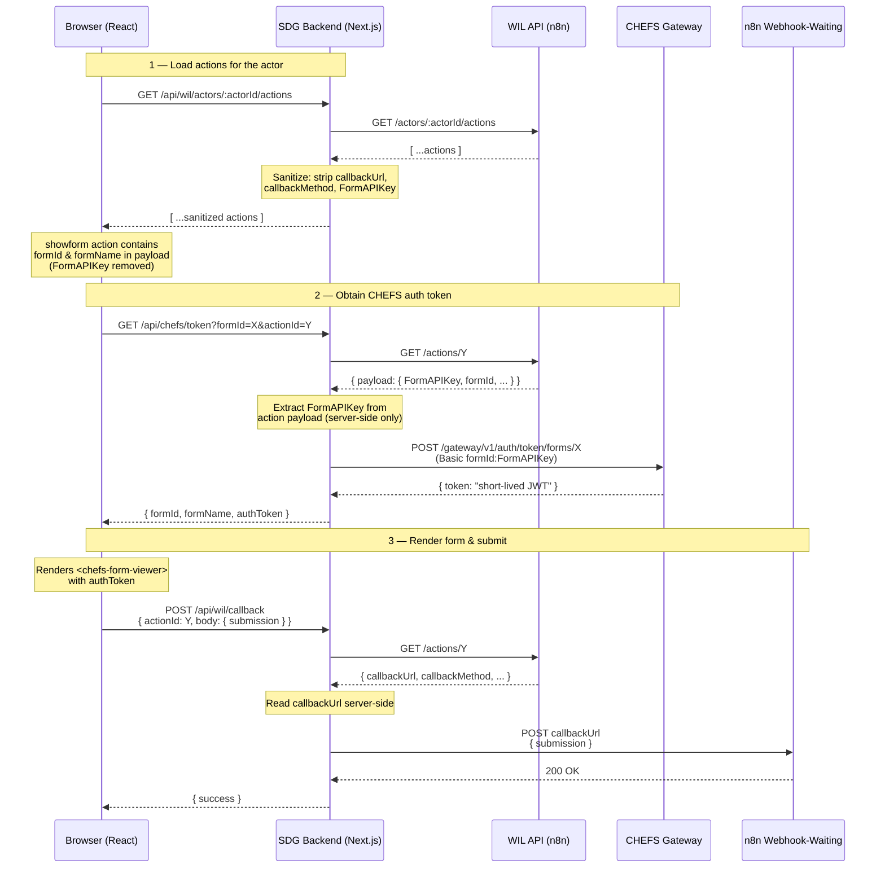

# SDG Mock App — Next.js

A Next.js application that serves as a demo frontend for the Workflow Interaction Layer (WIL) and CHEFS form rendering. Runs on port **8081**.

## Architecture

### Forms for Triggering Workflow (chefs-config.json)


### ShowForm Action Flow (WIL-driven)



> The frontend never sees CHEFS API keys. The backend reads them from `chefs-config.json` (Forms panel) or from the action's payload in the WIL database (`showform` actions), exchanges them for short-lived JWTs via the CHEFS gateway, and returns only the JWT to the browser. The `<chefs-form-viewer>` web component handles automatic token refresh.

## Security — Sensitive Data Never Reaches the Browser

The SDG backend proxy is designed so that secrets and internal URLs stay server-side. Two categories of data are protected:

### CHEFS Form API Keys

When a `showform` action is created by an n8n workflow, the action payload stored in the WIL database may contain a `FormAPIKey` used to obtain CHEFS auth tokens. The `GET /api/wil/actors/:actorId/actions` proxy strips `FormAPIKey` (and `formApiKey`) from every action payload before returning the response to the browser. The key is only ever read server-side when the backend exchanges it for a short-lived JWT via the CHEFS gateway.

### Callback URLs

Action callback URLs contain signed n8n webhook-waiting URLs (e.g. `http://host/webhook-waiting/:id?signature=...`). Exposing these to the frontend would allow anyone with browser DevTools to replay or tamper with workflow callbacks.

The proxy strips `callbackUrl`, `callbackMethod`, and `callbackPayloadSpec` from every action returned to the browser. When the frontend needs to trigger a callback (approval, form submission, etc.) it sends only the `actionId` to `POST /api/wil/callback`. The backend fetches the full action from the WIL API server-side, reads the callback details, and forwards the request — the browser never sees or sends the actual URL.

**In summary, the frontend only receives:**

| Field         | Exposed? | Notes                                      |
| ------------- | -------- | ------------------------------------------ |
| `id`          | ✅       | Action identifier, used for callbacks      |
| `actionType`  | ✅       | e.g. `showform`, `getapproval`             |
| `payload`     | ✅       | Sanitized — `FormAPIKey` removed           |
| `status`      | ✅       | `pending`, `in_progress`, `completed`, etc |
| `priority`    | ✅       | `normal` or `critical`                     |
| `callbackUrl` | ❌       | Stripped by proxy                          |
| `FormAPIKey`  | ❌       | Stripped from payload by proxy             |

## Pages

### 1. SDG Demo Dashboard — `/`

Three-panel layout:

- **Forms** — Lists CHEFS forms available for the current actor (from `chefs-config.json`). Click "Fill Form" to open a modal with the CHEFS form viewer.
- **Messages** — Workflow messages for the actor.
- **Action Requests** — Pending actions. `showform` actions show a "Fill Form" button that opens the form in a modal; on submit the response is sent to the action's callback URL and the action is marked completed.

### 2. CHEFS Form Preview — `/check-form-rendering`

Standalone page for testing CHEFS form rendering outside the dashboard.

```
http://localhost:8081/check-form-rendering?form-id=FORM_ID&auth-token=AUTH_TOKEN
```

## Setup

### 1. Install dependencies

```bash
pnpm install
```

### 2. Configure environment variables

Copy the example and fill in your values:

```bash
cp .env.example .env
```

| Variable         | Description                                                                    | Default                                |
| ---------------- | ------------------------------------------------------------------------------ | -------------------------------------- |
| `N8N_TARGET`     | n8n instance URL (server-side proxy)                                           | `http://localhost:5678`                |
| `CHEFS_BASE_URL` | CHEFS API base URL (used by both API routes and the form viewer web component) | `https://submit.digital.gov.bc.ca/app` |
| `X_N8N_API_KEY`  | WIL API key (server-side only)                                                 | —                                      |
| `X_TENANT_ID`    | WIL tenant ID (server-side only)                                               | —                                      |

### 3. Configure CHEFS forms

Copy the example config and add your form IDs and API keys:

```bash
cp src/app/api/chefs/chefs-config-example.json src/app/api/chefs/chefs-config.json
```

Edit `chefs-config.json`:

```json
{
  "forms": [
    {
      "formId": "your-chefs-form-uuid",
      "formName": "Human-readable form name",
      "apiKey": "", // Your CHEF form API key goes here
      "allowedActors": ["*"],
      "callbackWebhookUrl": "http://localhost:5678/webhook/your-webhook"
    }
  ]
}
```

| Field                | Description                                                                                       |
| -------------------- | ------------------------------------------------------------------------------------------------- |
| `formId`             | The CHEFS form UUID                                                                               |
| `formName`           | Display name shown in the Forms panel                                                             |
| `apiKey`             | CHEFS API key for this form (never sent to the browser)                                           |
| `allowedActors`      | Actor IDs that can see this form. Use `["*"]` for everyone                                        |
| `callbackWebhookUrl` | Optional n8n webhook URL to POST submission data to after form submit. Leave empty (`""`) to skip |

This file is gitignored since it contains secrets.

### 4. Run

```bash
pnpm dev
```

## API Endpoints

### WIL Proxy (existing)

| Method | Path                                         | Description                                               |
| ------ | -------------------------------------------- | --------------------------------------------------------- |
| GET    | `/api/wil/actors/:actorId/messages`          | List messages for actor                                   |
| GET    | `/api/wil/actors/:actorId/actions`           | List actions for actor                                    |
| PATCH  | `/api/wil/actors/:actorId/actions/:actionId` | Update action status                                      |
| POST   | `/api/wil/callback`                          | Forward callback to n8n (accepts `actionId`, not the URL) |

### CHEFS Integration (new)

| Method | Path                                   | Description                                                  |
| ------ | -------------------------------------- | ------------------------------------------------------------ |
| GET    | `/api/chefs/actors/:actorId/forms`     | List forms available for actor                               |
| GET    | `/api/chefs/token?formId=X`            | Get short-lived JWT for a form (from config)                 |
| GET    | `/api/chefs/token?formId=X&actionId=Y` | Get short-lived JWT for a form (API key from action payload) |
| POST   | `/api/chefs/submissions`               | Forward form submission to configured webhook                |

The app also proxies `/rest/*`, `/webhook/*`, and `/webhook-waiting/*` requests to the n8n instance.
