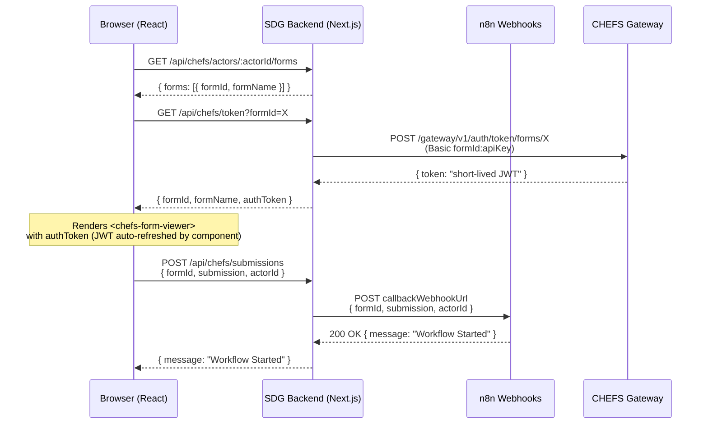
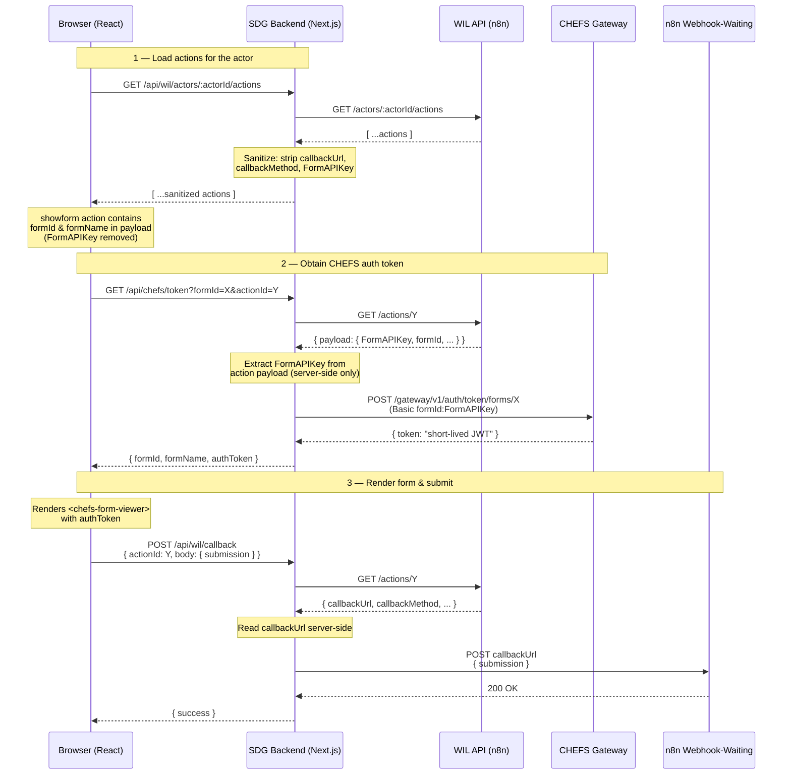
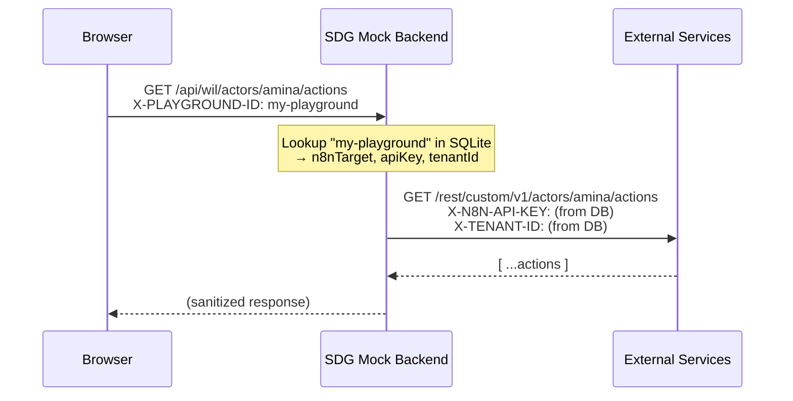

# SDG Mock App — Multi-Tenant Testing Platform

A Next.js application that serves as a demo frontend for the Workflow Interaction Layer (WIL) and CHEFS form rendering. Runs on port **8081**.

This app exists to help teams test the SDG ↔ CHEFS ↔ n8n integration without deploying a full SDG frontend. It is not part of the production SDG architecture — it is a standalone testing tool.

## How the Real SDG Integration Works

In a production-like setup the data flow is straightforward:

```
SDG Frontend  →  SDG Backend  →  WIL API (n8n)  +  CHEFS API
```

The SDG backend talks to the WIL API for workflow actions/messages and to the CHEFS API for form rendering and submissions. No playgrounds, no SQLite database, no `X-PLAYGROUND-ID` header — those concepts are specific to this mock app.

## Why Playgrounds Exist (Mock App Only)

To let multiple testers exercise the integration simultaneously without stepping on each other, this mock app introduces the concept of **playgrounds**. Each playground is an isolated configuration that stores its own:

- n8n target URL and WIL API key
- WIL tenant ID
- CHEFS base URL
- CHEFS form entries (form IDs, API keys, callback webhook URLs)

This means two testers can point at different n8n instances (or the same instance with different tenants) and manage their own set of CHEFS forms independently.

Playgrounds are stored in a local SQLite database (`data/playgrounds.db`) and are purely a mock-app concern. The real SDG integration does not use playgrounds.

## Architecture

### Forms for Triggering Workflow (chefs-config)



### ShowForm Action Flow (WIL-driven)



> The frontend never sees CHEFS API keys. The backend reads them from the playground's form configuration (or from the action's payload for `showform` actions), exchanges them for short-lived JWTs via the CHEFS gateway, and returns only the JWT to the browser. The `<chefs-form-viewer>` web component handles automatic token refresh.

### Form Pre-Fill via FormPreFillData

When an n8n workflow creates a `showform` action, it can include a `FormPreFillData` object in the action payload to pre-populate form fields. This is useful for passing data from earlier workflow steps (previous submissions, database lookups, computed values) into the form as defaults.

**Data flow:**

1. n8n workflow creates action with `payload.FormPreFillData = { fieldKey: value, ... }`
2. SDG backend strips `FormAPIKey` but passes `FormPreFillData` through to the browser (it's not sensitive)
3. `ActionsPanel` extracts `payload.FormPreFillData` (or `payload.formPreFillData`) from the action
4. When the user clicks "Fill Form", `ChefsFormModal` receives `prefillData` as a prop
5. `ChefsFormViewer` waits for the `formio:ready` event, then calls `setSubmission(prefillData)` on the `<chefs-form-viewer>` web component
6. The form renders with the specified fields pre-populated

**Example action payload from n8n:**

```json
{
  "formId": "abc123-def456",
  "FormName": "Intake Form",
  "FormAPIKey": "<your-form-api-key>",
  "FormPreFillData": {
    "applicantName": "Alice Smith",
    "email": "alice@example.com",
    "department": "Engineering"
  }
}
```

**Notes:**

- Keys in `FormPreFillData` must match the CHEFS form field **API names** (the `key` property in the form.io schema)
- If `FormSubmissionId` is also present, the form loads that existing submission instead — `FormPreFillData` is ignored
- Both `FormPreFillData` (PascalCase) and `formPreFillData` (camelCase) are accepted

## Security — Sensitive Data Never Reaches the Browser

The SDG backend proxy is designed so that secrets and internal URLs stay server-side. Two categories of data are protected:

### CHEFS Form API Keys

When a `showform` action is created by an n8n workflow, the action payload stored in the WIL database may contain a `FormAPIKey` used to obtain CHEFS auth tokens. The `GET /api/wil/actors/:actorId/actions` proxy strips `FormAPIKey` (and `formApiKey`) from every action payload before returning the response to the browser. The key is only ever read server-side when the backend exchanges it for a short-lived JWT via the CHEFS gateway.

### Callback URLs

Action callback URLs contain signed n8n webhook-waiting URLs (e.g. `http://host/webhook-waiting/:id?signature=...`). Exposing these to the frontend would allow anyone with browser DevTools to replay or tamper with workflow callbacks.

The proxy strips `callbackUrl`, `callbackMethod`, and `callbackPayloadSpec` from every action returned to the browser. When the frontend needs to trigger a callback (approval, form submission, etc.) it sends only the `actionId` to `POST /api/wil/callback`. The backend fetches the full action from the WIL API server-side, reads the callback details, and forwards the request — the browser never sees or sends the actual URL.

**In summary, the frontend only receives:**

| Field         | Exposed? | Notes                                      |
| ------------- | -------- | ------------------------------------------ |
| `id`          | ✅       | Action identifier, used for callbacks      |
| `actionType`  | ✅       | e.g. `showform`, `getapproval`             |
| `payload`     | ✅       | Sanitized — `FormAPIKey` removed           |
| `status`      | ✅       | `pending`, `in_progress`, `completed`, etc |
| `priority`    | ✅       | `normal` or `critical`                     |
| `callbackUrl` | ❌       | Stripped by proxy                          |
| `FormAPIKey`  | ❌       | Stripped from payload by proxy             |

## Pages

### 1. Landing Page — `/`

Prompts for a tester name (stored in localStorage), then shows the list of playgrounds owned by that tester. From here you can create, import, clone, or delete playgrounds.

### 2. Playground Configuration — `/playground/:name/configuration`

Edit a playground's connection settings (n8n target, API key, tenant ID, CHEFS base URL) and manage its CHEFS form entries. You can also export the configuration as JSON or test the n8n connection.

### 3. Playground User Test Dashboard — `/playground/:name/user-test`

Three-panel layout for testing the integration as a specific actor:

- **Forms** — Lists CHEFS forms configured in this playground. Click "Fill Form" to open a modal with the CHEFS form viewer.
- **Messages** — Workflow messages for the actor.
- **Action Requests** — Pending actions. `showform` actions show a "Fill Form" button that opens the form in a modal; on submit the response is sent to the action's callback URL and the action is marked completed.

### 4. Admin Dashboard — `/admin`

Read-only overview of all playgrounds across all testers, grouped by owner. Useful for seeing who has what configured.

### 5. CHEFS Form Preview — `/check-form-rendering`

Standalone page for testing CHEFS form rendering outside the dashboard.

```
http://localhost:8081/check-form-rendering?form-id=FORM_ID&auth-token=AUTH_TOKEN
```

## Setup

### 1. Install dependencies

```bash
pnpm install
```

### 2. Run

```bash
pnpm dev
```

That's it. All configuration (n8n credentials, CHEFS forms, etc.) is managed through the UI via playgrounds. The SQLite database is created automatically at `data/playgrounds.db` on first run.

### Optional: Override the database path

Set the `PLAYGROUND_DB_PATH` environment variable to store the SQLite database somewhere other than the default:

```bash
PLAYGROUND_DB_PATH=/path/to/playgrounds.db pnpm dev
```

## How Playgrounds Work

When you open the app, you enter a tester name. This scopes the playground list to your name. Each playground you create stores a complete set of credentials and form configurations in the SQLite database.

When you navigate to a playground's User Test dashboard, the frontend sets an `X-PLAYGROUND-ID` header on all API calls to `/api/wil/*` and `/api/chefs/*`. The backend reads this header, looks up the playground's credentials from the database, and uses them to proxy requests to the correct n8n instance and CHEFS gateway.



This is a mock-app-only mechanism. In a real SDG deployment, the backend would read its credentials from environment variables or a secrets manager — not from a SQLite database with a playground header.

## API Endpoints

### WIL Proxy

These endpoints proxy requests to the n8n WIL API using the playground's credentials (resolved from the `X-PLAYGROUND-ID` header).

| Method | Path                                         | Description                                               |
| ------ | -------------------------------------------- | --------------------------------------------------------- |
| GET    | `/api/wil/actors/:actorId/messages`          | List messages for actor                                   |
| GET    | `/api/wil/actors/:actorId/actions`           | List actions for actor (sanitized)                        |
| PATCH  | `/api/wil/actors/:actorId/actions/:actionId` | Update action status                                      |
| POST   | `/api/wil/callback`                          | Forward callback to n8n (accepts `actionId`, not the URL) |

### CHEFS Integration

These endpoints handle CHEFS form listing, token exchange, and submission forwarding. They also use the `X-PLAYGROUND-ID` header to resolve form configurations and CHEFS base URL.

| Method | Path                                   | Description                                                  |
| ------ | -------------------------------------- | ------------------------------------------------------------ |
| GET    | `/api/chefs/actors/:actorId/forms`     | List forms available for actor                               |
| GET    | `/api/chefs/token?formId=X`            | Get short-lived JWT for a form (from playground config)      |
| GET    | `/api/chefs/token?formId=X&actionId=Y` | Get short-lived JWT for a form (API key from action payload) |
| POST   | `/api/chefs/submissions`               | Forward form submission to configured webhook                |

### Playground Management (Mock App Only)

These endpoints manage the playground database. They are not part of the SDG integration — they exist only to support multi-tenant testing.

| Method | Path                                     | Description                               |
| ------ | ---------------------------------------- | ----------------------------------------- |
| GET    | `/api/playgrounds?owner=<name>`          | List playgrounds for a tester             |
| POST   | `/api/playgrounds`                       | Create a new playground                   |
| GET    | `/api/playgrounds/:name`                 | Get full playground detail (with secrets) |
| PUT    | `/api/playgrounds/:name`                 | Update playground configuration           |
| DELETE | `/api/playgrounds/:name`                 | Delete a playground                       |
| POST   | `/api/playgrounds/:name/clone`           | Clone a playground under a new name       |
| GET    | `/api/playgrounds/:name/export`          | Export playground config as JSON          |
| POST   | `/api/playgrounds/import`                | Import a playground from exported JSON    |
| POST   | `/api/playgrounds/:name/test-connection` | Test connectivity to the n8n instance     |
| GET    | `/api/admin/playgrounds`                 | List all playgrounds (admin view)         |

## Database Schema (Mock App Only)

The SQLite database has two tables:

**playgrounds** — One row per playground, storing connection credentials.

| Column           | Description                       |
| ---------------- | --------------------------------- |
| `name`           | Unique playground identifier (PK) |
| `owner`          | Tester name who created it        |
| `n8n_target`     | n8n instance URL                  |
| `x_n8n_api_key`  | WIL API key                       |
| `x_tenant_id`    | WIL tenant ID                     |
| `chefs_base_url` | CHEFS API base URL                |
| `created_at`     | Creation timestamp                |
| `updated_at`     | Last update timestamp             |

**playground_forms** — CHEFS form entries, linked to a playground via foreign key with cascade delete.

| Column                 | Description                                    |
| ---------------------- | ---------------------------------------------- |
| `id`                   | Auto-increment PK                              |
| `playground_name`      | FK → playgrounds.name                          |
| `form_id`              | CHEFS form UUID                                |
| `form_name`            | Display name                                   |
| `api_key`              | CHEFS API key for this form                    |
| `allowed_actors`       | JSON array of actor IDs (`["*"]` for everyone) |
| `callback_webhook_url` | n8n webhook URL for form submissions           |
