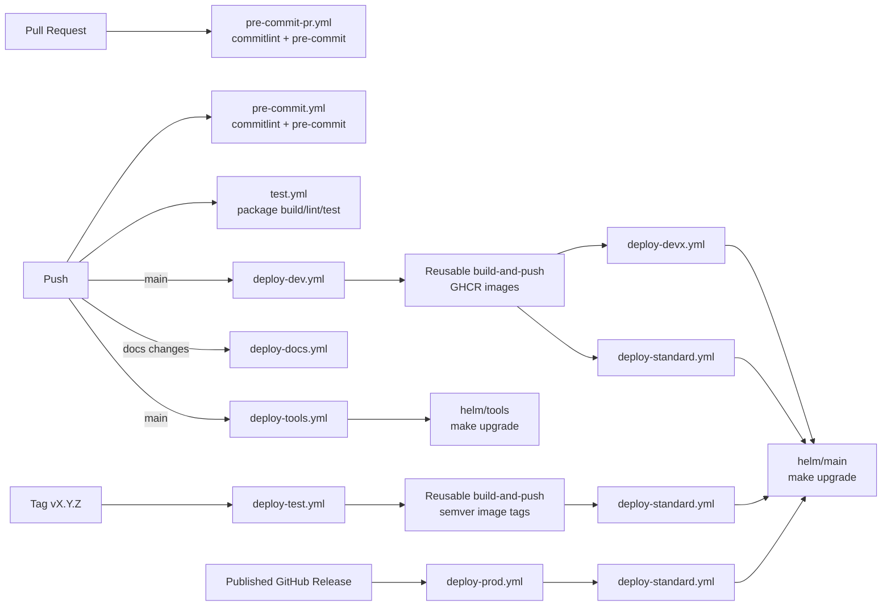

# CI/CD Overview

This repository uses GitHub Actions as the control plane for delivery and Helm on OpenShift as the deployment mechanism.

At a high level, the delivery model is intentionally simple:

- `push` and `pull_request` events enforce engineering hygiene.
- `main` is the integration branch and promotes commit-SHA images into dev environments.
- semantic version tags promote versioned images into test.
- published GitHub releases promote approved versions into prod.
- Helm overlays encode environment, namespace, and cluster-specific runtime differences.

## Delivery Principles

- **Artifact-first promotion:** environments are promoted by image tag, not by changing Helm chart versions.
- **Reusable deployment primitives:** `_build-and-push.yml` and `_deploy.yml` centralize the implementation used by higher-level workflows.
- **Environment-driven deployment:** OpenShift target namespaces and credentials are resolved from GitHub Environments, not hard-coded in the top-level workflows.
- **Overlay-based runtime behavior:** Helm loads `values.yaml` plus `values-<namespace>-<cluster>.yaml` to express per-environment differences.
- **OpenShift-native runtime model:** workflows authenticate with `oc-login`, deploy Helm charts, and expose services through `Route` resources.

For the Gold vs GoldDR continuity model and automatic user routing behavior, see [Gold And GoldDR Failover Model](../platform/gold-dr-failover.md).

## Pipeline Families

| Pipeline family     | Purpose                                               | Primary workflows                                                                                               |
| ------------------- | ----------------------------------------------------- | --------------------------------------------------------------------------------------------------------------- |
| CI quality gates    | Enforce commit quality and package-level validation   | `pre-commit.yml`, `pre-commit-pr.yml`, `test.yml`                                                               |
| Application CD      | Build images and deploy platform workloads            | `deploy-dev.yml`, `deploy-test.yml`, `deploy-prod.yml`, `deploy-standard.yml`, `deploy-devx.yml`, `_deploy.yml` |
| Supporting delivery | Publish docs and operate platform-adjacent components | `deploy-docs.yml`, `deploy-tools.yml`, `release-tag-changelog.yml`, `sysdig-terraform.yml`, `zap-scan.yml`      |

## Key Architectural Implications

- The repository currently treats CI and CD as separate workflows. In practice, promotion governance depends on branch protection and release discipline rather than a single end-to-end pipeline run.
- PR validation is hygiene-focused today. Package build and unit test execution are push-based, not PR-based.
- The deployment model already supports both primary and DR clusters through paired Helm overlays such as `gold` and `golddr`.
- Operational capabilities such as docs publishing, Sysdig Terraform, ZAP scanning, and tools namespace deployment are part of the platform delivery surface and should be considered in release planning.
