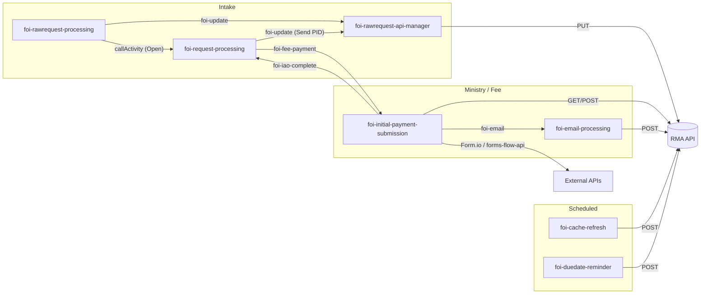

# Camunda Workflow → RMA API Calls

**Direction:** Camunda BPMN → `request-management-api` (RMA)
**BPMN location:** `apps/forms-flow-ai/forms-flow-bpm/src/main/resources/processes/`

This document maps each listed workflow to the RMA endpoints it reaches, the BPMN task that triggers the call, the payload shape, and any child workflow invoked along the way.

---

## Conventions

| Item                     | Value                                                                                                                                                                            |
| ------------------------ | -------------------------------------------------------------------------------------------------------------------------------------------------------------------------------- |
| **Base URL**             | `${foiApiUrl}` = env `FOI_REQ_MANAGEMENT_API_URL`                                                                                                                                |
| **API prefix**           | `${foiApiUrl}/api`                                                                                                                                                               |
| **Auth**                 | Every direct RMA call is preceded by a **Get Token** service task (`POST` Keycloak `client_credentials`). The RMA call uses `Authorization: Bearer ${accessToken}`.              |
| **Retry**                | On non-HTTP-200, workflows retry up to **3 times** (1-minute timer between attempts), then raise a BPMN error.                                                                   |
| **Indirect calls**       | Some tasks do not call RMA directly; they correlate a Camunda message that starts another workflow which performs the HTTP call. Those rows list the **Called Workflow** column. |
| **Listener-based calls** | Tasks **Create Submission** and **Update Form Submission** use Java execution listeners to call Form.io and forms-flow-api (not RMA). Marked as `— (not RMA)` in the table.      |

---

## Master mapping table

| Workflow Name                         | Task Name                                           | RMA URL                                                                                                    | HTTP | API Payload                                                                                                                                                                                                                                                                                                           | Called Workflow                       | Comments                                                                                                                                                                                                                                                                 |
| ------------------------------------- | --------------------------------------------------- | ---------------------------------------------------------------------------------------------------------- | ---- | --------------------------------------------------------------------------------------------------------------------------------------------------------------------------------------------------------------------------------------------------------------------------------------------------------------------- | ------------------------------------- | ------------------------------------------------------------------------------------------------------------------------------------------------------------------------------------------------------------------------------------------------------------------------ |
| `foi-rawrequest-processing.bpmn`      | **Send PID**                                        | `${foiApiUrl}/api/foirawrequestbpm/addwfinstanceid/${id}`                                                  | PUT  | `rawReqPayload = { "wfinstanceid": execution.getVariable("pid"), "notes": "Workflow ID update" }` — see [Raw request payloads](#raw-request-payloads) (_Send PID_)                                                                                                                                                    | `foi-rawrequest-api-manager.bpmn`     | Correlates message `foi-update` with `category = "foi-rawrequest-update"`. The api-manager workflow performs the actual HTTP call.                                                                                                                                       |
| `foi-rawrequest-processing.bpmn`      | **Intake Analyst** (task listener — `assignment`)   | `${foiApiUrl}/api/foirawrequestbpm/addwfinstanceid/${id}`                                                  | PUT  | `rawReqPayload = { "wfinstanceid": task.execution.getVariable("pid"), "status": "Intake in Progress", "notes": "Status update" }` — see [Raw request payloads](#raw-request-payloads) (_Intake assigned_)                                                                                                             | `foi-rawrequest-api-manager.bpmn`     | Fired when an assignee is set on the Intake task.                                                                                                                                                                                                                        |
| `foi-rawrequest-processing.bpmn`      | **Intake Analyst** (task listener — `complete`)     | `${foiApiUrl}/api/foirawrequestbpm/addwfinstanceid/${id}`                                                  | PUT  | `rawReqPayload = { "wfinstanceid": task.execution.getVariable("pid"), "status": "Archived", "notes": "Status update" }` — see [Raw request payloads](#raw-request-payloads) (_Intake completed_)                                                                                                                      | `foi-rawrequest-api-manager.bpmn`     | Fired when the Intake task is completed.                                                                                                                                                                                                                                 |
| `foi-rawrequest-processing.bpmn`      | **FOI Request Processing** (call activity)          | —                                                                                                          | —    | —                                                                                                                                                                                                                                                                                                                     | `foi-request-processing.bpmn`         | Invoked when raw request status is **Open**. Passes `foiRequestMetaData`, `rawRequestPID`, `rawRequestID`, `foiApiUrl`. No RMA call at this step.                                                                                                                        |
| `foi-rawrequest-api-manager.bpmn`     | **Update FOI RawRequest**                           | `${foiApiUrl}/api/foirawrequestbpm/addwfinstanceid/${id}`                                                  | PUT  | `${rawReqPayload}` see [Raw request payloads](#raw-request-payloads)                                                                                                                                                                                                                                                  | —                                     | Started by message `foi-update` when `category == "foi-rawrequest-update"`. Backend handler: `rawrequestservice.updateworkflowinstancewithstatus`.                                                                                                                       |
| `foi-rawrequest-api-manager.bpmn`     | **Update FOI Request**                              | `${foiApiUrl}/api/foirequests/${foiRequestID}`                                                             | PUT  | `reqPayload = { "wfinstanceId": execution.getVariable("pid")};` — see [FOI request payload](#foi-request-payload)                                                                                                                                                                                                     | —                                     | Started by message `foi-update` when `category == "foi-request-update"`. Backend handler: `requestservice.updaterequest` → `FOIRequest.updateWFInstance`.                                                                                                                |
| `foi-request-processing.bpmn`         | **Send PID**                                        | `${foiApiUrl}/api/foirequests/${foiRequestID}`                                                             | PUT  | `reqPayload = { "wfinstanceId": execution.getVariable("pid")};` — see [FOI request payload](#foi-request-payload)                                                                                                                                                                                                     | `foi-rawrequest-api-manager.bpmn`     | Correlates message `foi-update` with `category = "foi-request-update"`. Persists ministry subprocess Camunda PID on the FOI request.                                                                                                                                     |
| `foi-request-processing.bpmn`         | **IAO Team** — boundary _Correnspodence_            | —                                                                                                          | —    | —                                                                                                                                                                                                                                                                                                                     | `foi-initial-payment-submission.bpmn` | On message `foi-iao-correnspodence` (status ≠ Closed), correlates `foi-fee-payment` with `servicekey = "correspondence"`. Starts fee/email flow; no direct RMA call here. # pragma: allowlist secret                                                                     |
| `foi-request-processing.bpmn`         | **IAO Team** — boundary _Complete_ (On Hold branch) | —                                                                                                          | —    | —                                                                                                                                                                                                                                                                                                                     | `foi-initial-payment-submission.bpmn` | When status becomes **On Hold** (not sync, not offline payment), correlates `foi-fee-payment`. Starts payment workflow.                                                                                                                                                  |
| `foi-initial-payment-submission.bpmn` | **Invoke Payment Details API**                      | `${foiApiUrl}/api/foirequests/${foiRequestID}/ministryrequest/${ministryRequestID}/payonline`              | GET  | None                                                                                                                                                                                                                                                                                                                  | —                                     | Process id: `foi-fee-processing`. Started by message `foi-fee-payment`. Loads request data for the payment form. Maps `axisRequestId`, `fee`, `fileNumber`, `email`, `isofflinepayment` from response. Sets `paymentFormName` to `payfeeonline` or `payoutstandingform`. |
| `foi-initial-payment-submission.bpmn` | **Create Submission**                               | — (not RMA)                                                                                                | —    | Form.io: `{ "data": { ...Camunda execution variables } }` — see [Create Submission](#create-submission-externalsubmissionlistener)                                                                                                                                                                                    | —                                     | Execution listener: `ExternalSubmissionListener`. Runs when `balanceDue_f > 0`. Creates Form.io submission and forms-flow application record. Sets `formUrl`, `formId`, `submissionId`, `applicationId` used by **Invoke Save API**.                                     |
| `foi-initial-payment-submission.bpmn` | **Invoke Save API** (create payment link)           | `${foiApiUrl}/api/foipayment/${foiRequestID}/ministryrequest/${ministryRequestID}`                         | POST | `saveDataPayload = { "paymenturl": execution.getVariable('foiwebUrl') + "/public/form/" + execution.getVariable('formId') + "/submission/" + execution.getVariable('submissionId') + "/edit", "paymentexpirydate": execution.getVariable('paymentExpiryDate') };` — see [Payment save payload](#payment-save-payload) | —                                     | Runs after **Create Submission** (when balance due). Saves payment URL and expiry date.                                                                                                                                                                                  |
| `foi-initial-payment-submission.bpmn` | **Update Form Submission**                          | — (not RMA)                                                                                                | —    | Form.io JSON Patch — see [Update Form Submission](#update-form-submission-bpmformdatapipelinelistener)                                                                                                                                                                                                                | —                                     | Execution listener: `BPMFormDataPipelineListener`. Triggered on message `foi-manage-payment` (_Payment Update Received_). PATCHes Form.io submission with current `status` and `paymentstatus` Camunda variables before PAID / CANCELLED / EXPIRED branching.            |
| `foi-initial-payment-submission.bpmn` | **Invoke Save API** (cancel payment)                | `${foiApiUrl}/api/foipayment/${foiRequestID}/ministryrequest/${ministryRequestID}/cancel`                  | POST | `${saveDataPayload}`                                                                                                                                                                                                                                                                                                  | —                                     | Triggered when `paymentstatus == "CANCELLED"` (message `foi-manage-payment`). Payload may be empty or reuse prior `saveDataPayload`.                                                                                                                                     |
| `foi-initial-payment-submission.bpmn` | **Post Expiry Notification**                        | `${foiApiUrl}/api/foinotifications/${foiRequestID}/ministryrequest/${ministryRequestID}/payment/expiry`    | POST | None                                                                                                                                                                                                                                                                                                                  | —                                     | Triggered when `paymentstatus == "EXPIRED"`. Creates payment-expiry notification event in RMA.                                                                                                                                                                           |
| `foi-initial-payment-submission.bpmn` | **Notify Payment**                                  | `${foiApiUrl}/api/foiemail/${foiRequestID}/ministryrequest/${ministryRequestID}/${servicekey}`             | POST | (built in email workflow)                                                                                                                                                                                                                                                                                             | `foi-email-processing.bpmn`           | After save API succeeds. Correlates `foi-email` with `servicekey`: `correspondence`, `payoutstanding`, or `payonline` depending on context.                                                                                                                              |
| `foi-initial-payment-submission.bpmn` | **Notify Payment Confirmation**                     | `${foiApiUrl}/api/foiemail/${foiRequestID}/ministryrequest/${ministryRequestID}/${servicekey}`             | POST | (built in email workflow)                                                                                                                                                                                                                                                                                             | `foi-email-processing.bpmn`           | After payment is **PAID** and workflow status is synced. Correlates `foi-email` with `servicekey`: `outstanding-payment-receipt` or `fee-estimate-payment-receipt`.                                                                                                      |
| `foi-email-processing.bpmn`           | **Invoke Email Notification API**                   | `${foiApiUrl}/api/foiemail/${foiRequestID}/ministryrequest/${ministryRequestID}/${servicekey}`             | POST | `saveDataPayload` — see [Email payload](#email-payload)                                                                                                                                                                                                                                                               | —                                     | Started by message `foi-email`. Sends applicant email via RMA. `servicekey` examples: `correspondence`, `payonline`, `payoutstanding`, `outstanding-payment-receipt`, `fee-estimate-payment-receipt`.                                                                    |
| `foi-email-processing.bpmn`           | **Invoke Email Ack API**                            | `${foiApiUrl}/api/foiemail/${foiRequestID}/ministryrequest/${ministryRequestID}/${servicekey}/acknowledge` | POST | None                                                                                                                                                                                                                                                                                                                  | —                                     | Runs after successful send when `isIMAPEnabled == 'True'` (10 s delay via link event). Acknowledges email delivery in RMA. Skipped when IMAP is disabled — process ends after send API.                                                                                  |
| `foi-cache-refresh.bpmn`              | **Invoke Cache Refresh API**                        | `${foiApiUrl}/api/foiflow/cache/refresh`                                                                   | POST | None (empty body)                                                                                                                                                                                                                                                                                                     | —                                     | Process id: `cache_refresh`. Timer: daily at 13:00 UTC (`0 0 13 * * ?`). Refreshes all master-data cache keys.                                                                                                                                                           |
| `foi-duedate-reminder.bpmn`           | **Invoke Reminder API**                             | `${foiApiUrl}/api/foinotifications/reminder`                                                               | POST | None                                                                                                                                                                                                                                                                                                                  | —                                     | Process id: `due_reminder_notifications`. Timer: daily at 13:00 UTC. Posts due-date reminder events for eligible requests.                                                                                                                                               |

---

## Payload reference

### Raw request payloads

Built in `foi-rawrequest-processing.bpmn` and passed as JSON string in `rawReqPayload`:

| Trigger              | JavaScript (BPMN script)                                                                                          |
| -------------------- | ----------------------------------------------------------------------------------------------------------------- |
| **Send PID**         | `{ "wfinstanceid": execution.getVariable("pid"), "notes": "Workflow ID update" }`                                 |
| **Intake assigned**  | `{ "wfinstanceid": task.execution.getVariable("pid"), "status": "Intake in Progress", "notes": "Status update" }` |
| **Intake completed** | `{ "wfinstanceid": task.execution.getVariable("pid"), "status": "Archived", "notes": "Status update" }`           |

> **Note:** The RMA PUT handler reads `wfinstanceid` and `notes` only. The `status` field in the BPMN payload is **not applied** by the API.

### FOI request payload

Built in `foi-request-processing.bpmn` (_Send PID_):

```javascript
reqPayload = {
  wfinstanceId: execution.getVariable('pid'),
};
```

### Payment save payload

Built in `foi-initial-payment-submission.bpmn` (_Invoke Save API_ — create path):

```javascript
saveDataPayload = {
  paymenturl:
    execution.getVariable('foiwebUrl') +
    '/public/form/' +
    execution.getVariable('formId') +
    '/submission/' +
    execution.getVariable('submissionId') +
    '/edit',
  paymentexpirydate: execution.getVariable('paymentExpiryDate'),
};
```

### Email payload

Built at start of `foi-email-processing.bpmn` (_apply settings_ on message `foi-email`):

```javascript
var saveDataPayload = {};
if (
  execution.getVariable('servicekey') == 'correspondence' ||
  templatename == 'PAYOUTSTANDING' ||
  templatename == 'PAYONLINE'
) {
  saveDataPayload = {
    templateName: execution.getVariable('templateName'),
    applicantCorrespondenceId: execution.getVariable('applicantCorrespondenceId'),
  };
}
```

Default payload is `{}` for payment-notification `servicekey` values (`payonline`, `payoutstanding`, receipt templates).

### Create Submission (`ExternalSubmissionListener`)

BPMN task **Create Submission** in `foi-initial-payment-submission.bpmn` registers this listener on `event="start"`. Form name comes from `${paymentFormName}` (`payfeeonline` or `payoutstandingform`).

The listener performs **three HTTP calls** (none to RMA):

| Step                  | Method | URL                                       | Payload                                                                                                        |
| --------------------- | ------ | ----------------------------------------- | -------------------------------------------------------------------------------------------------------------- |
| 1. Resolve form       | GET    | `${FORMIO_URL}/${paymentFormName}`        | None — reads `_id` as form ID                                                                                  |
| 2. Create submission  | POST   | `${FORMIO_URL}/form/{formId}/submission`  | `{ "data": { ...all Camunda execution variables } }` via `FormSubmissionService.createFormSubmissionData()`    |
| 3. Create application | POST   | `${FORMSFLOW_API_URL}/application/create` | `{ "formUrl", "formId", "submissionId", "processInstanceId" }` — expects HTTP **201**; retries once on failure |

**Variables set:** `formUrl` (submission URL including ID), `applicationId`, plus BPMN outputs `formId` and `submissionId` parsed from `formUrl`.

```java
// ExternalSubmissionListener — submission body shape (FormSubmissionService)
data.put("data", bpmVariables);  // entire execution variable map
```

### Update Form Submission (`BPMFormDataPipelineListener`)

BPMN task **Update Form Submission** registers this listener on `event="start"` with `fields = ["status","paymentstatus"]`.

| Item        | Value                                                              |
| ----------- | ------------------------------------------------------------------ |
| **Method**  | PATCH                                                              |
| **URL**     | `${formUrl}` — Form.io submission URL set by **Create Submission** |
| **Payload** | JSON Patch array — one entry per field in `fields`                 |

```javascript
// Effective payload (FormElement builds op/path/value per field)
[
  { op: 'replace', path: '/data/status', value: '<execution variable status>' },
  { op: 'replace', path: '/data/paymentstatus', value: '<execution variable paymentstatus>' },
];
```

Expects HTTP **200**. If `formUrl` is blank, the listener logs an error and returns without calling Form.io.

---

## Workflow invocation map

Workflows that do not call RMA directly but start another workflow via Camunda message correlation or call activity:



| Parent workflow                       | Trigger / task                                 | Message or mechanism | Child workflow                        |
| ------------------------------------- | ---------------------------------------------- | -------------------- | ------------------------------------- |
| `foi-rawrequest-processing.bpmn`      | Send PID, Intake Analyst listeners             | `foi-update`         | `foi-rawrequest-api-manager.bpmn`     |
| `foi-rawrequest-processing.bpmn`      | FOI Request Processing (Open)                  | call activity        | `foi-request-processing.bpmn`         |
| `foi-request-processing.bpmn`         | Send PID                                       | `foi-update`         | `foi-rawrequest-api-manager.bpmn`     |
| `foi-request-processing.bpmn`         | IAO Team — Correnspodence / Complete (On Hold) | `foi-fee-payment`    | `foi-initial-payment-submission.bpmn` |
| `foi-initial-payment-submission.bpmn` | Notify Payment / Notify Payment Confirmation   | `foi-email`          | `foi-email-processing.bpmn`           |
| `foi-initial-payment-submission.bpmn` | Sync FOI Status in WF                          | `foi-iao-complete`   | `foi-request-processing.bpmn`         |

---

## Per-workflow summary

| BPMN file                             | Direct RMA endpoints                                             | Indirect (via child workflow)                                                                                               |
| ------------------------------------- | ---------------------------------------------------------------- | --------------------------------------------------------------------------------------------------------------------------- |
| `foi-rawrequest-processing.bpmn`      | —                                                                | PUT `foirawrequestbpm/addwfinstanceid/{id}` via api-manager                                                                 |
| `foi-rawrequest-api-manager.bpmn`     | PUT wfinstanceid, PUT foirequests                                | —                                                                                                                           |
| `foi-request-processing.bpmn`         | —                                                                | PUT foirequests via api-manager; fee/email via payment + email workflows                                                    |
| `foi-initial-payment-submission.bpmn` | GET payonline, POST foipayment, POST cancel, POST payment/expiry | POST foiemail via email workflow; Form.io + forms-flow-api via **Create Submission** / **Update Form Submission** listeners |
| `foi-email-processing.bpmn`           | POST foiemail, POST acknowledge                                  | —                                                                                                                           |
| `foi-cache-refresh.bpmn`              | POST cache/refresh                                               | —                                                                                                                           |
| `foi-duedate-reminder.bpmn`           | POST notifications/reminder                                      | —                                                                                                                           |

---

## Non-RMA HTTP calls (for awareness)

These tasks in `foi-initial-payment-submission.bpmn` invoke external services via Java execution listeners or the HTTP connector, not RMA.

### Create Submission — `ExternalSubmissionListener`

| Item         | Value                                                                            |
| ------------ | -------------------------------------------------------------------------------- |
| **Listener** | `org.camunda.bpm.extension.hooks.listeners.execution.ExternalSubmissionListener` |
| **When**     | After **Invoke Payment Details API**, when `balanceDue_f > 0`                    |
| **Targets**  | Form.io (`FORMIO_URL`), forms-flow API (`FORMSFLOW_API_URL`)                     |
| **Detail**   | [Create Submission payload](#create-submission-externalsubmissionlistener)       |

### Update Form Submission — `BPMFormDataPipelineListener`

| Item         | Value                                                                                 |
| ------------ | ------------------------------------------------------------------------------------- |
| **Listener** | `org.camunda.bpm.extension.hooks.listeners.BPMFormDataPipelineListener`               |
| **When**     | On message `foi-manage-payment` (_Payment Update Received_)                           |
| **Target**   | Form.io submission at `${formUrl}`                                                    |
| **Detail**   | [Update Form Submission payload](#update-form-submission-bpmformdatapipelinelistener) |

### Sync FOI Status in WF — Camunda Engine REST

| Item        | Value                                                                                                                                                                                                                                                                                               |
| ----------- | --------------------------------------------------------------------------------------------------------------------------------------------------------------------------------------------------------------------------------------------------------------------------------------------------- |
| **URL**     | `${foiwfUrl}/message` (`FORMSFLOW_WF_URL`)                                                                                                                                                                                                                                                          |
| **Method**  | POST                                                                                                                                                                                                                                                                                                |
| **When**    | After payment status **PAID**                                                                                                                                                                                                                                                                       |
| **Purpose** | Posts `foi-iao-complete` to sync ministry workflow state without a UI save                                                                                                                                                                                                                          |
| **Payload** | `var foistatuspayload = { "messageName" : "foi-iao-complete", "localCorrelationKeys" : { "id" : {"value" : execution.getVariable("fileNumber") , "type": "String"} }, "processVariables" : { "foiRequestMetaData" : {"value" : execution.getVariable("foiRequestMetaData") , "type": "String"} } }` |

---

_Generated from BPMN definitions in `forms-flow-bpm/src/main/resources/processes/`._
