# FOI Integration — Complete Swimlane Diagram

End-to-end flow for a **typical new FOI request**, including **Backend → Camunda** and **Camunda → Backend** calls, **reopen branches**, and **all RMA → Camunda message names** from Phase 4 onward.
Payload **variable names** appear in the diagram; field definitions are in the sections linked below.

**See also (in this document):**

- Take me to [Swimlane diagram](#swimlane-diagram)
- Take me to [RMA → Camunda message catalog](#rma-to-camunda-message-catalog)
- Take me to [BPMN internal message correlations](#bpmn-internal-message-correlations)
- Take me to [Variable reference tables](#variable-reference-tables)

---

## Swimlane diagram

Legend: `**[payloadVar]`\*\* = main JSON / Camunda variable name sent on that step.

**Camunda → Backend pattern:** Every HTTP call from BPMN (`MGR`, `FEE`, `EM`) is always **three steps**: (1) process ready → (2) **POST Keycloak token** → (3) **Bearer API call** to RMA. Same structure as steps 8→9→10 in Phase 1.

**Form.io integration:** Fee BPMN calls Form.io via `ExternalSubmissionListener` (Create Submission) and `BPMFormDataPipelineListener` (Update Form Submission) — not via RMA.

```mermaid
sequenceDiagram
    autonumber
    box rgba(230,245,255,0.3) Client / UI
        participant UI as FOI Flow / Online Form
    end
    box rgba(255,243,224,0.3) request-management-api/ FOI Backend
        participant RMA as request-management-api
    end
    box rgba(232,245,233,0.3) Auth
        participant KC as Keycloak
    end
    box rgba(243,229,245,0.3) Camunda Platform
        participant ENG as Camunda Engine REST
        participant RAW as foi-request BPMN<br/>(rawrequest-processing)
        participant MGR as api-manager BPMN<br/>(rawrequest-api-manager)
        participant MIN as foi-request-processing BPMN
        participant FEE as foi-fee-processing BPMN
        participant EM as foi-email-processing BPMN
    end
    box rgba(255,249,196,0.3) Forms / Form.io
        participant FOR as Form.io / forms-flow<br/>(form submission API)
    end

    Note over UI,EM: ── PHASE 1: Create raw request & start workflow ──

    UI->>RMA: POST /api/foirawrequests<br/>[request body from form]
    RMA->>KC: POST token (BPM_CLIENT_ID credentials)
    KC-->>RMA: access_token
    RMA->>ENG: POST /process-definition/key/foi-request/start<br/>[startProcessVariables]
    ENG->>RAW: New instance → sets pid

    RAW->>ENG: Internal correlate foi-update
    Note over RAW,ENG: rawReqPayload {wfinstanceid, notes}<br/>+ category=foi-rawrequest-update
    ENG->>MGR: Start api-manager process

    MGR->>KC: POST token (KEYCLOAK_CLIENTID credentials)<br/>grant_type=client_credentials
    KC-->>MGR: accessToken
    MGR->>RMA: PUT /api/foirawrequestbpm/addwfinstanceid/{id}<br/>[rawReqPayload]
    Note over RMA: DB: FOIRawRequests.wfinstanceid = pid

    Note over UI,EM: ── PHASE 2: Intake processing ──

    UI->>RMA: POST /api/foirawrequest/{id}<br/>[request body — intake save]

    alt Normal intake claim
        RMA->>ENG: POST /message<br/>messageName=foi-intake-assignment<br/>[intakeClaimMessage{assignedto}]
    else Reopen — raw request was previously Closed
        RMA->>ENG: POST /message<br/>messageName=foi-intake-reopen<br/>[intakeReopenMessage{assignedto}]
        Note over RMA,ENG: __hasreopened(rawrequest) = true<br/>Claim boundary OR Pre-Closure SLA catch (Event_0wrm0sw)
    end
    ENG->>RAW: Claim / reopen intake user task

    RAW->>ENG: Task assigned → internal foi-update
    Note over RAW,ENG: rawReqPayload <br/>{wfinstanceid, status=Intake in progress, notes}<br/>+ category=foi-rawrequest-update
    ENG->>MGR: Start api-manager (foi-rawrequest-update)

    MGR->>KC: POST token (KEYCLOAK_CLIENTID credentials)<br/>grant_type=client_credentials
    KC-->>MGR: accessToken
    MGR->>RMA: PUT /api/foirawrequestbpm/addwfinstanceid/{id}<br/>[rawReqPayload]

    UI->>RMA: POST /api/foirawrequest/{id}<br/>[request body — intake outcome: Open / Closed / Redirect]
    RMA->>ENG: POST /message<br/>messageName=foi-intake-complete<br/>[intakeCompleteMessage{id, status, assignedgroup, assignedto}]
    ENG->>RAW: Complete boundary → sets rawRequestStatus from foiRequestMetaData

    alt status == Open
        Note over RAW: Gateway_1ssge0e → continues to Phase 3
    else status == Closed
        RAW->>RAW: intake_closure_sla_days = 1 · event-based gateway (Gateway_17vkox8)
        Note over RAW: Waits concurrently for Reopen message OR Pre-Closure SLA daily timer

        alt Pre-Closure SLA timer fires (Event_03aj013 · daily 22:00)
            RAW->>RAW: increment intake_closure_sla_days
            alt intake_closure_sla_days > 5
                RAW->>RAW: End process (Event_043z2u1) — Closed at Intake
            else intake_closure_sla_days <= 5
                RAW->>RAW: Loop back to event-based gateway
            end
        else Reopen — status returns to Intake in Progress (within SLA window)
            UI->>RMA: POST /api/foirawrequest/{id}<br/>[request body — intake save]
            RMA->>ENG: POST /message<br/>messageName=foi-intake-reopen<br/>[intakeReopenMessage{assignedto}]
            Note over RMA,ENG: __hasreopened(rawrequest) = true
            ENG->>RAW: Reopen catch event (Event_0wrm0sw) → Intake Analyst task
            Note over RAW: Return to claim / assign flow above
        end
    else status == Redirect
        Note over RAW: Receive task Redirect — workflow waits (foi-redirect)
    end

    Note over UI,EM: ── PHASE 3: Open request (create ministry requests) ──

    UI->>RMA: POST /api/foirequests<br/>[request body — open + ministries]
    RMA->>ENG: POST /message<br/>messageName=foi-intake-complete<br/>[intakeCompleteMessage{id, status, ministries[], assignedgroup, assignedto}]
    Note over ENG,RAW: processVariables.foiRequestMetaData<br/>includes ministries[]

    RAW->>ENG: Task complete → internal foi-update
    Note over RAW,ENG: .setVariables(task.execution.variables)<br/>+ rawReqPayload {wfinstanceid, status=Archived, notes}<br/>+ category=foi-rawrequest-update
    ENG->>MGR: Start api-manager (foi-rawrequest-update)

    MGR->>KC: POST token (KEYCLOAK_CLIENTID credentials)<br/>grant_type=client_credentials
    KC-->>MGR: accessToken
    MGR->>RMA: PUT /api/foirawrequestbpm/addwfinstanceid/{id}<br/>[rawReqPayload]

    RAW->>MIN: Call Activity foi-request-processing
    Note over RAW,MIN: Passes in: foiRequestMetaData, pid→rawRequestPID,<br/>id→rawRequestID, foiApiUrl

    MIN->>ENG: Internal correlate foi-update
    Note over MIN,ENG: .setVariables(execution.variables)<br/>+ reqPayload {wfinstanceId: pid}<br/>+ category=foi-request-update
    ENG->>MGR: Start api-manager (foi-request-update)

    MGR->>KC: POST token (KEYCLOAK_CLIENTID credentials)<br/>grant_type=client_credentials
    KC-->>MGR: accessToken
    MGR->>RMA: PUT /api/foirequests/{foiRequestID}<br/>[reqPayload]
    Note over RMA: DB: FOIRequests.wfinstanceid = ministry pid

    Note over UI,EM: ── PHASE 4: Opened request — ministry subprocess (MIN) ──

    Note over RMA,MIN: RMA routes: POST .../ministryrequest/{id} (IAO)<br/>POST .../ministry (ministry) · assignee APIs

    Note over MIN: 4a — Open (single IAO user task Activity_0cj09ml)

    UI->>RMA: IAO save-in-place at Open
    RMA->>ENG: POST /message · <br/>messageName=foi-iao-open-assignment<br/>[openedClaimMessage{filenumber, previousstatus, status,<br/> assignedgroup, assignedto, ministryRequestID,<br/> isPaymentActive, paymentExpiryDate, axisRequestId,<br/> issync, isofflinepayment}]
    ENG->>MIN: Claim boundary on Open IAO task

    UI->>RMA: IAO complete Open → Call For Records (or Closed)
    RMA->>ENG: POST /message ·<br/>messageName=foi-iao-open-complete<br/>[openedCompleteMessage{filenumber, previousstatus, status,<br/> assignedgroup, assignedto, ministryRequestID,<br/> isPaymentActive, paymentExpiryDate, axisRequestId,<br/> issync, isofflinepayment}]
    ENG->>MIN: Complete boundary on Open IAO task
    Note over MIN: Sets status, minTaskName, iaoTaskName<br/>Completes Open-phase task

    alt status == Call For Records
        Note over MIN: Parallel gateway Gateway_0wfu2wz<br/>IAO Team + Ministry Coordinator run in parallel
        par IAO Team (Activity_0jdrlcz)
            Note over MIN: Boundaries: Claim · Complete · Correspondence
            UI->>RMA: IAO save (no status change)
            RMA->>ENG: foi-iao-assignment → Claim boundary<br/>[iaoClaimMessage{filenumber, previousstatus, status, assignedgroup, assignedto, assignedministrygroup, <br/>ministryRequestID, isPaymentActive, paymentExpiryDate, axisRequestId, issync, isofflinepayment}]
            UI->>RMA: IAO status transition
            RMA->>ENG: foi-iao-complete → Complete boundary<br/>[iaoCompleteMessage{filenumber, previousstatus, status, assignedgroup, assignedto, assignedministrygroup, <br/>ministryRequestID, isPaymentActive, paymentExpiryDate, axisRequestId, issync, isofflinepayment}]
            Note over MIN: On Hold → internal foi-fee-payment<br/>Leave On Hold + active payment → foi-manage-payment CANCELLED<br/>Closed → complete ministry task + join Pre-Closure SLA
            UI->>RMA: Communication Log tab<br/>POST /foiflow/applicantcorrespondence/...
            RMA->>ENG: foi-iao-correnspodence → Correspondence boundary<br/>[correspondenceMessage{filenumber, status, ministryid, paymentexpirydate, <br/>axisrequestid, applicantcorrespondenceid, templatename}]
            Note over MIN: Typically On Hold templates<br/>→ internal foi-fee-payment + servicekey=correspondence
        and Ministry Coordinator (Activity_085uygz)
            Note over MIN: Boundaries: Claim · Complete (no Correspondence)
            UI->>RMA: Ministry save-in-place
            RMA->>ENG: foi-ministry-assignment → Claim boundary[ministryClaimMessage{filenumber, previousstatus, status, assignedGroup, assignedTo, <br/>assignedministrygroup, ministryRequestID, isPaymentActive, paymentExpiryDate, axisRequestId, issync, isofflinepayment}]
            UI->>RMA: Ministry status transition
            RMA->>ENG: foi-ministry-complete → Complete boundary[ministryCompleteMessage{filenumber, previousstatus, status, assignedGroup, assignedTo, <br/>assignedministrygroup, ministryRequestID, isPaymentActive, paymentExpiryDate, axisRequestId, issync, isofflinepayment}]
            Note over MIN: Closed → complete IAO + ministry tasks<br/>→ join Pre-Closure SLA
        end
    else status == Closed (from Open)
        MIN->>MIN: Join Pre-Closure SLA (Gateway_0m8um6n)
    end

    Note over MIN: 4b — Pre-Closure SLA · End · Reopen (when Closed)

    MIN->>MIN: closure_sla_days = 1 · event-based gateway (Gateway_0c9r9wb)
    Note over MIN: Waits concurrently for Reopen message OR Pre-Closure SLA daily timer

    alt Pre-Closure SLA timer fires (Event_14uk8xb · daily 22:00)
        MIN->>MIN: increment closure_sla_days
        alt closure_sla_days > 5
            MIN->>MIN: End subprocess (Event_0pwci99)
        else closure_sla_days <= 5
            MIN->>MIN: Loop back to event-based gateway
        end
    else Reopen message received (Event_0a37bnf)
        RMA->>ENG: POST /message · <br/>messageName=foi-iao-reopen<br/>[reopenMessage{filenumber, previousstatus, status, assignedGroup, assignedTo, assignedministrygroup, <br/>ministryRequestID, isPaymentActive, paymentExpiryDate, axisRequestId, issync, isofflinepayment}]
        ENG->>MIN: Reopen catch event
        alt reopened status == Open
            MIN->>MIN: Return to Open IAO task (Activity_0cj09ml)
        else reopened to processing state (e.g. CFR)
            Note over MIN: Parallel gateway Gateway_0ezgrjz<br/>recreate IAO Team + Ministry Coordinator
        end
    end

    Note over UI,EM: ── PHASE 5: Payment workflow (foi-fee-processing) ──
    Note over MIN,FEE: **Entry** (BPMN internal — not from RMA):<br/>① Correspondence boundary — Communication Log → On Hold<br/>② Complete boundary — status change to On Hold (Fee Estimate / Response)

    alt Initial payment — Fee Estimate → On Hold
        Note over FEE: prevStatus ≠ Response · form payfeeonline<br/>email servicekey: payonline or correspondence
    else Outstanding payment — Response → On Hold
        Note over FEE: prevStatus = Response · form payoutstandingform<br/>email servicekey: payoutstanding
    end

    MIN->>ENG: correlate foi-fee-payment<br/>.setVariables(execution.variables)
    ENG->>FEE: Start foi-fee-processing · feeflow=ONGOING

    FEE->>KC: POST token → accessToken
    FEE->>RMA: GET .../payonline
    RMA-->>FEE: balanceDue, email, axisRequestId, fileNumber, paymentstatus, email, isofflinepayment

    opt balanceDue > 0
        FEE->>FOR: Create Submission (Form.io)<br/>ExternalSubmissionListener · ${paymentFormName}
        FOR-->>FEE: formId, submissionId
        FEE->>KC: POST token → accessToken
        FEE->>RMA: POST /foipayment/...<br/>[saveDataPayload {paymenturl, paymentexpirydate}]
        FEE->>ENG: correlate foi-email · Notify Payment<br/>servicekey:correspondence/payoutstanding/payonline
        ENG->>EM: Applicant payment-link email
        EM->>KC: POST token → accessToken
        EM->>RMA: POST /foiemail/.../{servicekey}<br/>[saveDataPayload {templateName, applicantCorrespondenceId}]
    end

    Note over FEE: Await foi-manage-payment OR daily expiry check<br/>(paymentExpiryDate · ~20 calendar days)

    Note over UI,EM: ── PHASE 6: Payment outcome (foi-manage-payment) ──

    alt PAID — applicant pays via Form.io payment form
        UI->>RMA: PUT .../payments/{payment_id}
        RMA->>ENG: POST /message. <br/>messageName=foi-manage-payment<br/>paymentstatus=PAID<br/>[feeEventMessage{ idNumber, status, assignedGroup, assignedTo,<br/>assignedministrygroup, ministryRequestID, foiRequestID, nextStateName}]
    else CANCELLED — manual status change leaving On Hold
        UI->>RMA: IAO complete (leave On Hold)
        Note over MIN: Complete boundary → internal foi-manage-payment CANCELLED
        MIN->>ENG: correlate foi-manage-payment
        Note over MIN,ENG: Passes in: feeflow, paymentstatus,axisRequestId, status, foiRequestID, ministryRequestID
    else EXPIRED — payment link past expiry (~20 days)
        Note over FEE: Daily timer · elapsed days from paymentExpiryDate
        FEE->>FEE: paymentstatus = EXPIRED
    end

    ENG->>FEE: Payment Update Received
    FEE->>FOR: Update Form Submission · status, paymentstatus

    alt paymentstatus == PAID
        FEE->>KC: POST token → accessToken
        FEE->>ENG: Sync FOI Status · foi-iao-complete [foistatuspayload]
        FEE->>ENG: correlate foi-email · payment receipt
        ENG->>EM: outstanding-payment-receipt | fee-estimate-payment-receipt
    else paymentstatus == CANCELLED
        FEE->>KC: POST token → accessToken
        FEE->>RMA: POST /foipayment/.../cancel<br/>[saveDataPayload {paymenturl, paymentexpirydate}]
    else paymentstatus == EXPIRED
        FEE->>KC: POST token → accessToken
        FEE->>RMA: POST /foinotifications/.../payment/expiry
        Note over RMA: No body — creates expiry notification event
    end
```



---

## RMA to Camunda message catalog

Messages sent by **request-management-api** via `POST {BPM_ENGINE_REST_URL}/message` (unless noted).
Enum source: `bpmservice.MessageType` · selection: `workflowservice.__messagename()`.

| Enum / code name    | Camunda `messageName`     | Sent by RMA? | Trigger (API / condition)                                                                                                                                  | Payload variable                                    |
| ------------------- | ------------------------- | ------------ | ---------------------------------------------------------------------------------------------------------------------------------------------------------- | --------------------------------------------------- |
| `intakeclaim`       | `foi-intake-assignment`   | Yes          | `POST /foirawrequest/{id}` — Intake in Progress, not reopened                                                                                              | `**intakeClaimMessage`\*\*                          |
| `intakereopen`      | `foi-intake-reopen`       | Yes          | `POST /foirawrequest/{id}` — Intake in Progress, **reopened from Closed**                                                                                  | `**intakeReopenMessage`\*\*                         |
| `intakecomplete`    | `foi-intake-complete`     | Yes          | `POST /foirequests` (Open + ministries); `POST /foirawrequest/{id}` — **Closed**, **Redirect**, or other non–Intake-in-Progress statuses                   | `**intakeCompleteMessage`\*\*                       |
| `iaoopenclaim`      | `foi-iao-open-assignment` | Yes          | `POST .../ministryrequest/{id}` — **save at Open**                                                                                                         | `**openedClaimMessage`\*\*                          |
| `iaoopencomplete`   | `foi-iao-open-complete`   | Yes          | `POST .../ministryrequest/{id}` — **complete Open** (e.g. → Call For Records)                                                                              | `**openedCompleteMessage`\*\*                       |
| `iaoclaim`          | `foi-iao-assignment`      | Yes          | IAO **save-in-place** after Open                                                                                                                           | `**iaoClaimMessage`\*\*                             |
| `iaocomplete`       | `foi-iao-complete`        | Yes          | IAO **status transition**                                                                                                                                  | `**iaoCompleteMessage`\*\*                          |
| `iaoreopen`         | `foi-iao-reopen`          | Yes          | Ministry **reopened from Closed**, or complete after reopen                                                                                                | `**reopenMessage`\*\*                               |
| `iaocorrenspodence` | `foi-iao-correnspodence`  | Yes          | `POST /foiflow/applicantcorrespondence/{requestid}/{ministryrequestid}` — **IAO boundary** on user task; typically **On Hold** (fee estimate / pay online) | `**correspondenceMessage`\*\*                       |
| `ministryclaim`     | `foi-ministry-assignment` | Yes          | `POST .../ministry` — **save-in-place**                                                                                                                    | `**ministryClaimMessage`\*\*                        |
| `ministrycomplete`  | `foi-ministry-complete`   | Yes          | `POST .../ministry` — **status transition**                                                                                                                | `**ministryCompleteMessage`\*\*                     |
| `feepayment`        | `foi-fee-payment`         | **No**       | MIN BPMN **after** `foi-iao-correnspodence` boundary or `foi-iao-complete` → On Hold                                                                       | — (BPMN internal)                                   |
| `managepayment`     | `foi-manage-payment`      | Yes          | `PUT .../payments/{id}` PAID; sanction / correspondence **CANCELLED**                                                                                      | `**feeEventMessage`\*\*                             |
| —                   | `foi-update`              | **No**       | RAW/MIN task listeners — start api-manager                                                                                                                 | `rawReqPayload` or `reqPayload` + `category`        |
| —                   | `foi-email`               | **No**       | FEE Notify Payment / Notify Payment Confirmation                                                                                                           | `.setVariables(execution.variables)` + `servicekey` |

### Message selection (opened requests)

| Previous / current context          | User type | Activity       | `messageName`                                                                                            |
| ----------------------------------- | --------- | -------------- | -------------------------------------------------------------------------------------------------------- |
| Status = **Open**, not processing   | IAO       | save           | `foi-iao-open-assignment`                                                                                |
| Status = **Open**, not processing   | IAO       | complete       | `foi-iao-open-complete`                                                                                  |
| Status = **Reopen**                 | IAO       | either         | `foi-iao-reopen`                                                                                         |
| After Open                          | IAO       | save           | `foi-iao-assignment`                                                                                     |
| After Open                          | IAO       | complete       | `foi-iao-complete`                                                                                       |
| Ministry states                     | ministry  | save           | `foi-ministry-assignment`                                                                                |
| Ministry states                     | ministry  | complete       | `foi-ministry-complete`                                                                                  |
| Reopened from **Closed** (ministry) | IAO       | complete       | `foi-iao-reopen` (overrides complete message)                                                            |
| Applicant correspondence (IAO)      | IAO       | boundary event | `foi-iao-correnspodence` — `POST /foiflow/applicantcorrespondence/...`, often when moving to **On Hold** |

### Reopen detection

| Scope             | Condition                                                                         | Message                                                                               |
| ----------------- | --------------------------------------------------------------------------------- | ------------------------------------------------------------------------------------- |
| Raw (intake)      | Last two states: new ≠ old, old = **Closed**                                      | `foi-intake-reopen` instead of `foi-intake-assignment`                                |
| Raw (intake)      | **Closed** at intake → Pre-Closure SLA window; user returns to Intake in Progress | Same `foi-intake-reopen` — caught at `Event_0wrm0sw` (returns to Intake Analyst task) |
| Ministry (opened) | Same state-history check on ministry request                                      | `foi-iao-reopen` on complete, or when previous status = Reopen                        |

---

## BPMN internal message correlations

These messages are **not sent by RMA**. They are raised inside BPMN via `RuntimeService.createMessageCorrelation(...)` from task listeners, boundary events, or intermediate throw events.

Source BPMN: `foi-rawrequest-processing.bpmn`, `foi-request-processing.bpmn`, `foi-initial-payment-submission.bpmn` (`foi-fee-processing`).

### Internal message catalog

| Camunda `messageName` | BPMN process                | Producer (element)                                  | Trigger / condition                                                                                                | Variables passed on correlate                                                                                                                                | Starts / affects                                                               |
| --------------------- | --------------------------- | --------------------------------------------------- | ------------------------------------------------------------------------------------------------------------------ | ------------------------------------------------------------------------------------------------------------------------------------------------------------ | ------------------------------------------------------------------------------ |
| `foi-update`          | `foi-rawrequest-processing` | `Event_1nxaaj2` Send PID                            | Process start                                                                                                      | `.setVariables(execution.variables)` · `rawReqPayload` `{wfinstanceid, notes}` · `category=foi-rawrequest-update`                                            | `foi-rawrequest-api-manager` → PUT `addwfinstanceid`                           |
| `foi-update`          | `foi-rawrequest-processing` | Intake Analyst task · `assignment`                  | Intake task claimed                                                                                                | Same pattern · `rawReqPayload` includes `status=Intake in Progress`                                                                                          | api-manager → PUT `addwfinstanceid`                                            |
| `foi-update`          | `foi-rawrequest-processing` | Intake Analyst task · `complete`                    | Intake task completed via `foi-intake-complete` boundary (Open → Archived note; Closed/Redirect → gateway routing) | Same pattern · `rawReqPayload` includes `status=Archived`                                                                                                    | api-manager → PUT `addwfinstanceid`                                            |
| `foi-update`          | `foi-request-processing`    | Start script                                        | MIN subprocess started (per ministry)                                                                              | `.setVariables(execution.variables)` · `reqPayload` `{wfinstanceId: pid}` · `category=foi-request-update`                                                    | api-manager → PUT `foirequests`                                                |
| `foi-fee-payment`     | `foi-request-processing`    | `Event_1tvpamu` Complete boundary · IAO Team        | RMA `foi-iao-complete` and `status == On Hold` · `issync == false` · `isofflinepayment == false`                   | `.setVariables(execution.variables)` · sets `applicantCorrespondenceId=0`, `templateName=""` before correlate · `feeflow=ONGOING` after                      | `foi-fee-processing` subprocess                                                |
| `foi-fee-payment`     | `foi-request-processing`    | `correnspodance` Correspondence boundary · IAO Team | RMA `foi-iao-correnspodence` · `status != Closed`                                                                  | `.setVariables(execution.variables)` · `servicekey=correspondence` · `feeflow=ONGOING` after                                                                 | `foi-fee-processing` subprocess (Communication Log path)                       |
| `foi-manage-payment`  | `foi-request-processing`    | `Event_1tvpamu` Complete boundary · IAO Team        | Leave **On Hold** while `feeflow==ONGOING` and `isPaymentActive` · `issync == false`                               | `.processInstanceVariableEquals("axisRequestId", …)` · `paymentstatus=CANCELLED` · `status` · `foiRequestID` · `ministryRequestID`                           | Existing fee workflow instance                                                 |
| `foi-manage-payment`  | `foi-fee-processing`        | `Event_05bv4ti` Payment Update Received             | RMA `PUT .../payments/{id}` (**PAID**) or RMA/ministry cancel paths (**CANCELLED**)                                | `correlationKeys.axisRequestId` (from RMA) or variables set by MIN boundary                                                                                  | Fee workflow continues → Update Form Submission                                |
| `foi-email`           | `foi-fee-processing`        | `Event_1y2hfyk` Notify Payment                      | After payment link saved to RMA                                                                                    | `.setVariables(execution.variables)` · `servicekey`: `correspondence` if correspondence path · `payoutstanding` if `prevStatus==Response` · else `payonline` | `foi-email-processing` → applicant payment-link email                          |
| `foi-email`           | `foi-fee-processing`        | `Event_0q2irqu` Notify Payment Confirmation         | After **PAID** path · Sync FOI Status                                                                              | `.setVariables(execution.variables)` · `servicekey`: `outstanding-payment-receipt` if Response/outstanding · else `fee-estimate-payment-receipt`             | `foi-email-processing` → payment receipt email                                 |
| `foi-iao-complete`    | `foi-fee-processing` → MIN  | `Activity_1ka6mqq` Sync FOI Status                  | `paymentstatus == PAID`                                                                                            | `foistatuspayload`: `localCorrelationKeys.id=fileNumber` · `processVariables.foiRequestMetaData` (status may = `nextStateName`)                              | MIN IAO Team Complete boundary — updates ministry WF state (Camunda → Camunda) |

All `foi-update` and most fee/email correlations use `.setVariables(execution.variables)` so inherited scope (`foiApiUrl`, `foiRequestID`, `ministryRequestID`, `axisRequestId`, etc.) is available to the target process.

### Call activity — RAW → MIN (not a message)

| Direction | BPMN element                           | Variables passed in                                                               |
| --------- | -------------------------------------- | --------------------------------------------------------------------------------- |
| RAW → MIN | Call Activity `foi-request-processing` | `foiRequestMetaData`, `pid` → `rawRequestPID`, `id` → `rawRequestID`, `foiApiUrl` |

### Boundary events — side effects (before internal correlate)

These boundaries parse `foiRequestMetaData` and set execution variables; some also complete tasks without sending a new message.

| Boundary       | Attached to                             | Triggered by (RMA message) | Key variables set                                                                                  | Internal message raised                                               |
| -------------- | --------------------------------------- | -------------------------- | -------------------------------------------------------------------------------------------------- | --------------------------------------------------------------------- |
| Claim          | Open IAO task `Activity_0cj09ml`        | `foi-iao-open-assignment`  | Reassigns `assignedGroup` / `assignedTo`                                                           | —                                                                     |
| Complete       | Open IAO task `Activity_0cj09ml`        | `foi-iao-open-complete`    | `status`, `minTaskName`, `iaoTaskName` · completes Open task                                       | — (forks to CFR parallel or Closed)                                   |
| Claim          | IAO Team `Activity_0jdrlcz`             | `foi-iao-assignment`       | Reassigns group / assignee on IAO task                                                             | —                                                                     |
| Complete       | IAO Team `Activity_0jdrlcz`             | `foi-iao-complete`         | `status`, `ministryRequestID`, `axisRequestId`, `minTaskName` · if Closed: completes ministry task | `foi-fee-payment` (→ On Hold) or `foi-manage-payment` (leave On Hold) |
| Correspondence | IAO Team `Activity_0jdrlcz`             | `foi-iao-correnspodence`   | `status`, `ministryRequestID`, `axisRequestId`, `applicantCorrespondenceId`, `templateName`        | `foi-fee-payment` + `servicekey=correspondence`                       |
| Claim          | Ministry Coordinator `Activity_085uygz` | `foi-ministry-assignment`  | Reassigns group / assignee on ministry task                                                        | —                                                                     |
| Complete       | Ministry Coordinator `Activity_085uygz` | `foi-ministry-complete`    | `status`, `minTaskName` · if Closed: completes IAO + ministry tasks                                | — (joins Pre-Closure SLA)                                             |

### Payment workflow — internal entry and outcomes

| Stage                   | Type      | Detail                                                                                                           |
| ----------------------- | --------- | ---------------------------------------------------------------------------------------------------------------- |
| **Initial payment**     | Entry     | Fee Estimate → On Hold via Complete boundary · form `payfeeonline` · email `payonline` or `correspondence`       |
| **Outstanding payment** | Entry     | Response → On Hold via Complete or Correspondence boundary · form `payoutstandingform` · email `payoutstanding`  |
| **Link generation**     | FEE steps | GET payonline → Form.io Create Submission → POST `/foipayment` → `foi-email` Notify Payment                      |
| **PAID**                | Outcome   | Applicant pays via Form.io · RMA `foi-manage-payment` → Update Form Submission → Sync FOI Status → receipt email |
| **CANCELLED**           | Outcome   | IAO leaves On Hold (MIN boundary) or RMA cancel · Update Form Submission → POST `/foipayment/.../cancel`         |
| **EXPIRED**             | Outcome   | Daily timer vs `paymentExpiryDate` (~20 days) · POST `/foinotifications/.../payment/expiry`                      |

### Parallel tasks and closure (no message — workflow structure)

| Event                    | BPMN element      | Process                     | When                          | Effect                                                            |
| ------------------------ | ----------------- | --------------------------- | ----------------------------- | ----------------------------------------------------------------- |
| Pre-Closure SLA (intake) | `Event_03aj013`   | `foi-rawrequest-processing` | After **Closed** at intake    | Daily timer (22:00); `intake_closure_sla_days` increments (max 5) |
| End (intake closed)      | `Event_043z2u1`   | `foi-rawrequest-processing` | `intake_closure_sla_days > 5` | Raw workflow ends — Closed at Intake                              |
| Reopen (intake)          | `Event_0wrm0sw`   | `foi-rawrequest-processing` | RMA `foi-intake-reopen`       | Returns to Intake Analyst task                                    |
| Parallel fork            | `Gateway_0wfu2wz` | `foi-request-processing`    | Open → **Call For Records**   | IAO Team + Ministry Coordinator run in parallel                   |
| Parallel fork            | `Gateway_0ezgrjz` | `foi-request-processing`    | **Reopen** to non-Open status | Recreates IAO Team + Ministry Coordinator                         |
| Pre-Closure SLA          | `Event_14uk8xb`   | `foi-request-processing`    | After **Closed** (ministry)   | Daily timer; `closure_sla_days` increments (max 5)                |
| End                      | `Event_0pwci99`   | `foi-request-processing`    | `closure_sla_days > 5`        | Ministry subprocess ends                                          |
| Reopen                   | `Event_0a37bnf`   | `foi-request-processing`    | RMA `foi-iao-reopen`          | Returns to Open task or parallel CFR tasks                        |

---

## Variable reference tables

### Auth tokens

| Variable           | Used in             | Fields / value                      | Set by                                             |
| ------------------ | ------------------- | ----------------------------------- | -------------------------------------------------- |
| `access_token`     | RMA → Camunda calls | OAuth2 bearer token                 | Keycloak response to BPM credentials               |
| `accessToken`      | Camunda → RMA calls | OAuth2 bearer token                 | Keycloak response to KEYCLOAK_CLIENTID credentials |
| Token request body | Both directions     | `grant_type` = `client_credentials` | HTTP connector / bpmservice                        |

**Camunda → Backend token request (every MGR / FEE / EM API call):**

| Item    | Value                                                                                                                     |
| ------- | ------------------------------------------------------------------------------------------------------------------------- |
| Method  | `POST`                                                                                                                    |
| URL     | `{KEYCLOAK_URL}/auth/realms/{KEYCLOAK_URL_REALM}/protocol/openid-connect/token`                                           |
| Headers | `Content-Type: application/x-www-form-urlencoded`, `Authorization: Basic base64(KEYCLOAK_CLIENTID:KEYCLOAK_CLIENTSECRET)` |
| Body    | `grant_type=client_credentials`                                                                                           |
| Then    | `Authorization: Bearer {accessToken}` on the RMA API call                                                                 |

---

### `startProcessVariables`

**Camunda:** `POST /process-definition/key/foi-request/start`
**Triggered by:** `POST /api/foirawrequests`, sync recreate

| Field           | Type    | Source                         | Description                              |
| --------------- | ------- | ------------------------------ | ---------------------------------------- |
| `id`            | Integer | Raw request DB id              | Primary correlation key for raw workflow |
| `assignedGroup` | String  | Form / intake assignee group   | Camunda candidate group hint             |
| `assignedTo`    | String  | Form / intake assignee user id | Optional direct assignee                 |

---

### `rawReqPayload`

**Backend:** `PUT /api/foirawrequestbpm/addwfinstanceid/{id}`
**Triggered by:** `foi-rawrequest-processing.bpmn` → `foi-update` (category `foi-rawrequest-update`)

| Field          | Type          | When sent                                 | Backend uses?                                              |
| -------------- | ------------- | ----------------------------------------- | ---------------------------------------------------------- |
| `wfinstanceid` | String (UUID) | Process start, task assign, task complete | **Yes** — saved to `FOIRawRequests.wfinstanceid`           |
| `notes`        | String        | All variants                              | **Yes** — audit note on raw request                        |
| `status`       | String        | Task assign / complete                    | **No** — sent by BPMN but API ignores; DB status unchanged |

**Example (process start):**

```json
{ "wfinstanceid": "<camunda-pid>", "notes": "Workflow ID update" }
```

---

### `reqPayload`

**Backend:** `PUT /api/foirequests/{foiRequestID}`
**Triggered by:** `foi-request-processing.bpmn` → `foi-update` (category `foi-request-update`)

| Field          | Type          | Source                    | Description                         |
| -------------- | ------------- | ------------------------- | ----------------------------------- |
| `wfinstanceId` | String (UUID) | Ministry subprocess `pid` | Saved to `FOIRequests.wfinstanceid` |

**Example:**

```json
{ "wfinstanceId": "<ministry-process-pid>" }
```

---

### `intakeClaimMessage` / `intakeReopenMessage`

**Camunda:** `POST /message`
**Triggered by:** `POST /api/foirawrequest/{id}` (Intake in Progress)

| Payload alias               | `messageName`           | When                                 |
| --------------------------- | ----------------------- | ------------------------------------ |
| `**intakeClaimMessage`\*\*  | `foi-intake-assignment` | Normal intake claim                  |
| `**intakeReopenMessage`\*\* | `foi-intake-reopen`     | Raw request **reopened from Closed** |

| Field               | Location in message                 | Source                             |
| ------------------- | ----------------------------------- | ---------------------------------- |
| `processInstanceId` | Top-level                           | Raw request `wfinstanceid` from DB |
| `messageName`       | Top-level                           | See table above                    |
| `assignedTo`        | `processVariables.assignedTo.value` | Request body `assignedTo`          |

---

### `intakeCompleteMessage`

**Camunda:** `POST /message` — `foi-intake-complete`
**Triggered by:** `POST /api/foirequests` (Open + ministries); `POST /api/foirawrequest/{id}` when status is **Closed**, **Redirect**, or other non–Intake-in-Progress outcomes

| Field                | Location                             | Description                                   |
| -------------------- | ------------------------------------ | --------------------------------------------- |
| `processInstanceId`  | Top-level                            | Raw workflow instance id                      |
| `messageName`        | Top-level                            | `foi-intake-complete`                         |
| `foiRequestMetaData` | `processVariables` — JSON **string** | See `**foiRequestMetaData` (intake)\*\* table |

#### `foiRequestMetaData` (intake — inside `intakeCompleteMessage`)

| Field           | Type   | Description                              |
| --------------- | ------ | ---------------------------------------- |
| `id`            | Number | Raw request id                           |
| `status`        | String | `"Open"` on open transition              |
| `ministries`    | Array  | Ministry request objects created on open |
| `assignedGroup` | String | IAO group                                |
| `assignedTo`    | String | IAO assignee                             |

---

### Opened / ministry / reopen messages (RMA → Camunda)

**Triggered by:** `POST /api/foirequests/.../ministryrequest/...` (IAO or ministry routes)

Two payload shapes depending on **activity** (save vs complete):

#### Claim / save-in-place (`*-assignment` messages)

Payload aliases: `**openedClaimMessage`**, `**iaoClaimMessage`**, `**ministryClaimMessage**`

| `messageName`             | User     | When             |
| ------------------------- | -------- | ---------------- |
| `foi-iao-open-assignment` | IAO      | Save at **Open** |
| `foi-iao-assignment`      | IAO      | Save after Open  |
| `foi-ministry-assignment` | ministry | Save-in-place    |

| Field               | Location                                                |
| ------------------- | ------------------------------------------------------- |
| `processInstanceId` | Top-level (ministry wf instance or file correlation id) |
| `messageName`       | Top-level                                               |
| `assignedTo`        | `processVariables.assignedTo.value`                     |

#### Complete / reopen / correspondence (`*-complete`, `foi-iao-reopen`, `foi-iao-correnspodence`)

Payload aliases: `**openedCompleteMessage`**, `**iaoCompleteMessage`**, `**ministryCompleteMessage**`, `**reopenMessage**`, `**correspondenceMessage**`

| `messageName`            | User     | When                                                                                                       |
| ------------------------ | -------- | ---------------------------------------------------------------------------------------------------------- |
| `foi-iao-open-complete`  | IAO      | Complete **Open** (e.g. → Call For Records)                                                                |
| `foi-iao-complete`       | IAO      | Status transition (incl. → **On Hold** via Complete boundary)                                              |
| `foi-ministry-complete`  | ministry | Status transition                                                                                          |
| `foi-iao-reopen`         | IAO      | **Reopen** from Closed, or complete after reopen                                                           |
| `foi-iao-correnspodence` | IAO      | `**POST /foiflow/applicantcorrespondence/...`\*\* — boundary on IAO Team task; typically On Hold templates |

| Field                     | Location                                  |
| ------------------------- | ----------------------------------------- |
| `messageName`             | Top-level                                 |
| `processInstanceId`       | Top-level — ministry workflow instance id |
| `localCorrelationKeys.id` | File number                               |
| `foiRequestMetaData`      | `processVariables` — JSON **string**      |

#### `foiRequestMetaData` (opened — inside complete / reopen messages)

| Field                   | Type    | Description                           |
| ----------------------- | ------- | ------------------------------------- |
| `id`                    | String  | File number                           |
| `previousstatus`        | String  | Prior ministry status                 |
| `status`                | String  | Current ministry status               |
| `assignedGroup`         | String  | IAO or ministry group                 |
| `assignedTo`            | String  | Assignee user id                      |
| `assignedministrygroup` | String  | Ministry team group                   |
| `ministryRequestID`     | Number  | Ministry request primary key          |
| `isPaymentActive`       | Boolean | Active CFR/application payment exists |
| `paymentExpiryDate`     | String  | Payment link expiry                   |
| `axisRequestId`         | String  | AXIS correlation id                   |
| `issync`                | Boolean | `true` when from sync API             |
| `isofflinepayment`      | Boolean | Offline payment flag                  |

---

### `feeEventMessage`

**Camunda:** `POST /message` — `foi-manage-payment`
**Triggered by:** Payment PUT, CFR sanction, correspondence (cancel)

| Field                           | Location                             | Description                                |
| ------------------------------- | ------------------------------------ | ------------------------------------------ |
| `messageName`                   | Top-level                            | `foi-manage-payment`                       |
| `correlationKeys.axisRequestId` | Correlation                          | Links to payment workflow instance         |
| `paymentstatus`                 | `processVariables`                   | `"PAID"` or `"CANCELLED"`                  |
| `foiRequestMetaData`            | `processVariables` — JSON **string** | See `**foiRequestMetaData` (fee)\*\* table |

#### `foiRequestMetaData` (fee — inside `feeEventMessage`)

| Field                   | Type   | Description                            |
| ----------------------- | ------ | -------------------------------------- |
| `id`                    | String | File / id number                       |
| `status`                | String | Current request state                  |
| `assignedGroup`         | String | IAO group                              |
| `assignedTo`            | String | IAO assignee                           |
| `assignedministrygroup` | String | Ministry group                         |
| `ministryRequestID`     | Number | Ministry request id                    |
| `foiRequestID`          | Number | Parent FOI request id                  |
| `nextStateName`         | String | Target state after payment (PAID flow) |

---

### `correspondenceMessage`

**Camunda:** `POST /message` — `foi-iao-correnspodence`
**Triggered by:** `POST /api/foiflow/applicantcorrespondence/...`

| Field                     | Location                             | Description                   |
| ------------------------- | ------------------------------------ | ----------------------------- |
| `messageName`             | Top-level                            | `foi-iao-correnspodence`      |
| `processInstanceId`       | Top-level                            | Ministry workflow instance id |
| `localCorrelationKeys.id` | Correlation                          | File number                   |
| `foiRequestMetaData`      | `processVariables` — JSON **string** | See table below               |

#### `foiRequestMetaData` (correspondence)

| Field                       | Type   | Description                             |
| --------------------------- | ------ | --------------------------------------- |
| `id`                        | String | File number                             |
| `status`                    | String | Current state                           |
| `ministryRequestID`         | Number | Ministry request id                     |
| `paymentExpiryDate`         | String | From correspondence template attributes |
| `axisRequestId`             | String | AXIS id                                 |
| `applicantcorrespondenceid` | Number | Saved correspondence log id             |
| `templatename`              | String | Template name (spaces removed)          |

---

### `saveDataPayload` (payment)

**Backend:** `POST /api/foipayment/{foiRequestID}/ministryrequest/{ministryRequestID}` (create) or `.../cancel` (cancel)
**Triggered by:** `foi-fee-processing.bpmn` — create after Form.io submission; cancel when `paymentstatus == CANCELLED`

| Field               | Type   | Source                                                            | Description            |
| ------------------- | ------ | ----------------------------------------------------------------- | ---------------------- |
| `paymenturl`        | String | `{foiwebUrl}/public/form/{formId}/submission/{submissionId}/edit` | Applicant payment link |
| `paymentexpirydate` | Date   | Camunda variable `paymentExpiryDate`                              | Link expiry date       |

**Cancel path:** same `**saveDataPayload`\*\* variable and fields (`paymenturl`, `paymentexpirydate`), `POST .../foipayment/.../cancel` — after Update Form Submission when `foi-manage-payment` sets `paymentstatus=CANCELLED`.

---

### `saveDataPayload` (email)

**Backend:** `POST /api/foiemail/.../{servicekey}`
**Triggered by:** `foi-email-processing.bpmn`

| Field                       | Type   | When present                                    | Description                       |
| --------------------------- | ------ | ----------------------------------------------- | --------------------------------- |
| _(empty object)_            | —      | Most service keys                               | `{}` — no body fields required    |
| `templateName`              | String | `correspondence`, `PAYOUTSTANDING`, `PAYONLINE` | Email template                    |
| `applicantCorrespondenceId` | Number | Same as above                                   | Links email to correspondence log |

**Common `servicekey` values:** `correspondence`, `payonline`, `payoutstanding`, `outstanding-payment-receipt`, `fee-estimate-payment-receipt`

**Acknowledge call:** `POST .../acknowledge` — no payload body.

---

### `foistatuspayload`

**Camunda internal:** `POST {BPM_ENGINE_REST_URL}/message`
**Triggered by:** `foi-fee-processing.bpmn` after payment (sync ministry WF state)

| Field                     | Location           | Description                                           |
| ------------------------- | ------------------ | ----------------------------------------------------- |
| `messageName`             | Top-level          | Typically `foi-iao-complete`                          |
| `localCorrelationKeys.id` | Correlation        | `fileNumber`                                          |
| `foiRequestMetaData`      | `processVariables` | Updated metadata (status may reflect `nextStateName`) |

> This is **Camunda → Camunda**, not a backend API call. Included because it closes the payment loop before the UI sees the updated state.

---

### Camunda process variables (passed between BPMN, not HTTP bodies)

| Variable            | Set by                           | Used by                              | Description                   |
| ------------------- | -------------------------------- | ------------------------------------ | ----------------------------- |
| `pid`               | Engine on start                  | RAW, MIN subprocesses                | Camunda process instance UUID |
| `id`                | startProcessVariables            | RAW, api-manager URL path            | Raw request id                |
| `foiRequestID`      | Open / ministry flow             | Fee, email, notification URLs        | Parent FOI request id         |
| `ministryRequestID` | Open / ministry flow             | Fee, email, notification URLs        | Ministry request id           |
| `foiApiUrl`         | Env `FOI_REQ_MANAGEMENT_API_URL` | All HTTP connector tasks             | Backend base URL              |
| `foiwebUrl`         | Env `FORMSFLOW_WEB_URL`          | Fee BPMN                             | Builds `paymenturl`           |
| `axisRequestId`     | Request metadata                 | Payment correlation                  | Links fee workflow to request |
| `fileNumber`        | Ministry metadata                | Opened message correlation           | Ministry file number          |
| `category`          | BPMN script                      | api-manager gateway                  | `foi-rawrequest-update`       |
| `servicekey`        | Fee / correspondence scripts     | Email URL path segment               | Email type routing            |
| `formId`            | Create Submission (Form.io)      | Fee save API, Update Form Submission | Form.io form id               |
| `submissionId`      | Create Submission (Form.io)      | Fee save API, Update Form Submission | Form.io submission id         |
| `paymentFormName`   | GET payonline listener           | Create Submission                    | `payfeeonline`                |
| `formioURL`         | Fee BPMN start                   | ExternalSubmissionListener           | Form.io API base URL          |

---

### Form.io integration (fee BPMN only)

| Step                   | BPMN task          | Listener                      | Direction     | Details                                                                              |
| ---------------------- | ------------------ | ----------------------------- | ------------- | ------------------------------------------------------------------------------------ |
| Create Submission      | `Activity_0k05bsn` | `ExternalSubmissionListener`  | FEE → Form.io | Creates payment form submission; outputs `formId`, `submissionId`                    |
| Update Form Submission | `Activity_1mkqp7n` | `BPMFormDataPipelineListener` | FEE → Form.io | After `foi-manage-payment`; updates `status`, `paymentstatus` on existing submission |

Env vars on fee process start: `FORMIO_URL`, `FORMIO_ROOT_EMAIL`, `FORMIO_ROOT_PASSWORD`, `FORMSFLOW_WEB_URL` (`foiwebUrl`).

---

## Scheduled jobs (not in main swimlane)

These Camunda processes also call the backend using the same **Get Token → API** pattern:

| Process                     | Steps          | Backend call                          | Payload variable                     |
| --------------------------- | -------------- | ------------------------------------- | ------------------------------------ |
| `foi-cache-refresh.bpmn`    | KC token → RMA | `POST /api/foiflow/cache/refresh`     | Optional `{ "key": "..." }` or empty |
| `foi-duedate-reminder.bpmn` | KC token → RMA | `POST /api/foinotifications/reminder` | None                                 |
