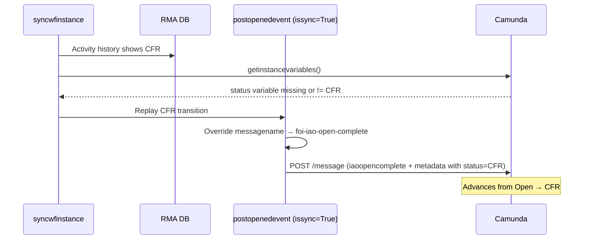

# workflowservice → Camunda Mapping

**Source files:**

| Layer         | File                                                                                  |
| ------------- | ------------------------------------------------------------------------------------- |
| Orchestration | `request_api/services/workflowservice.py`                                             |
| HTTP client   | `request_api/services/external/bpmservice.py`                                         |
| Callers       | `request_api/services/requestservice.py`, `request_api/services/rawrequestservice.py` |

---

## Call chain

```
REST /api/*  →  rawrequestservice / requestservice  →  workflowservice  →  bpmservice  →  Camunda
```

- **MessageType** — enum in `bpmservice.py` (`MessageType`)
- **Message payload** — data passed to `bpmservice.__post_message()` (or start variables for `createinstance`, which does not use `/message`)
- All message-based calls resolve to `POST {BPM_ENGINE_REST_URL}/message`

---

## Master mapping table

| workflowservice.py            | MessageType                                                                                                                                                                                                                                                                                                                                                                                                                                                                                                    | Message payload                                                                                                                                                                                                                                                                                                                                                                                                                                                                                                                      | Comments                                                                                                                                                                                                                                                                                                                                                                                                                                                                                                                                                                                            |
| ----------------------------- | -------------------------------------------------------------------------------------------------------------------------------------------------------------------------------------------------------------------------------------------------------------------------------------------------------------------------------------------------------------------------------------------------------------------------------------------------------------------------------------------------------------- | ------------------------------------------------------------------------------------------------------------------------------------------------------------------------------------------------------------------------------------------------------------------------------------------------------------------------------------------------------------------------------------------------------------------------------------------------------------------------------------------------------------------------------------ | --------------------------------------------------------------------------------------------------------------------------------------------------------------------------------------------------------------------------------------------------------------------------------------------------------------------------------------------------------------------------------------------------------------------------------------------------------------------------------------------------------------------------------------------------------------------------------------------------- |
| **createinstance()**          | None                                                                                                                                                                                                                                                                                                                                                                                                                                                                                                           | `{'id': foiRawRequestId, 'assignedGroup': assignedGroup, 'assignedTo': assignedTo}`                                                                                                                                                                                                                                                                                                                                                                                                                                                  | `POST /process-definition/key/{definitionkey}/start` — not a `/message` call. `definitionkey` is resolved from the Redis channel (`foi-rawrequest` → `foi-request` via `_geProcessDefinitionKey_`). Variables are wrapped as Camunda `Integer` (`id`) and `String` (`assignedGroup`, `assignedTo`). Called from `rawrequestservice.saverawrequest()` on new raw request; also from `syncwfinstance()` when no raw PID exists. Redis publish is the fallback if Camunda fails.                                                                                                                       |
| **postunopenedevent()**       | **`intakeclaim`** (`foi-intake-assignment`) or **`intakereopen`** (`foi-intake-reopen`) when `status == "Intake in Progress"` from `"Closed"`; **`intakecomplete`** (`foi-intake-complete`) for all other statuses                                                                                                                                                                                                                                                                                             | **Claim / reopen** (`bpmservice().unopenedsave`): `{ processInstanceId, messageName, processVariables: { assignedTo } }` — `assignedTo` from `requestsschema`. **Complete** (`bpmservice().unopenedcomplete`): `{ processInstanceId, messageName: "foi-intake-complete", processVariables: { foiRequestMetaData } }` where `foiRequestMetaData` is JSON: `{ id, status, assignedGroup, assignedTo }` or, when `status == "Open"`, `{ id, status, ministries, assignedGroup, assignedTo }`.                                           | Skips if `wfinstanceid` is null/empty. `intakereopen` vs `intakeclaim` is chosen by `__hasreopened(id, "rawrequest")`. Called from `rawrequestservice.posteventtoworkflow()` (intake save/assignee) and `requestservice.postopeneventtoworkflow()` (open → FOI). `bpmservice().reopenevent()` delegates to `bpmservice().unopenedcomplete()`.                                                                                                                                                                                                                                                       |
| **postopenedevent()**         | Dynamic via `__messagename()` **`iaoopenclaim`** / **`iaoopencomplete`** (old status Open, not processing: isProcessing==False); **`iaoreopen`** (old status Reopen or ministryrequest reopened on complete); **`ministryclaim`** / **`ministrycomplete`** (ministry user); **`iaoclaim`** / **`iaocomplete`** (IAO user) — see [Opened-request message selection](#opened-request-message-selection). Sync overrides: **`iaoopencomplete`** (stuck Open → CFR); **`iaoreopen`** (Camunda `status == Closed`). | **Complete** (`bpmservice().openedcomplete` / `bpmservice().reopenevent`): `{ messageName, processInstanceId, localCorrelationKeys: { id: filenumber }, processVariables: { foiRequestMetaData } }`. **Claim** (`bpmservice().unopenedsave`): `{ processInstanceId, messageName, processVariables: { assignedTo } }`. `foiRequestMetaData` JSON: `{ id, previousstatus, status, assignedGroup, assignedTo, assignedministrygroup, ministryRequestID, isPaymentActive, paymentExpiryDate, axisRequestId, issync, isofflinepayment }`. | Iterates `data["ministries"]` for the matching `ministryRequestID`. `activity` is `complete` vs `save` from `__getministryactivity()` (status change vs same-status save). `usertype` is `iao` or `ministry` from caller / `__getusertype()`. `issync=True` during `syncwfinstance()` reconciliation. Called from `requestservice.posteventtoworkflow()`. See [Sync override: stuck Open → CFR](#sync-override-stuck-open--cfr).                                                                                                                                                                    |
| **postfeeevent()**            | **`managepayment`** (`foi-manage-payment`)                                                                                                                                                                                                                                                                                                                                                                                                                                                                     | `{ messageName: "foi-manage-payment", correlationKeys: { axisRequestId }, processVariables: { foiRequestMetaData, paymentstatus } }`. `foiRequestMetaData` JSON: `{ id, status, assignedGroup, assignedTo, assignedministrygroup, ministryRequestID, foiRequestID, nextStateName }`. `paymentstatus`: `"PAID"` or `"CANCELLED"`.                                                                                                                                                                                                     | Correlates by `axisRequestId`, not `processInstanceId`. `MessageType.feepayment` exists in the enum but is unused; all fee events use `managepayment`. Called from `requestservice.postfeeeventtoworkflow()` (payment PUT, CFR sanction).                                                                                                                                                                                                                                                                                                                                                           |
| **postcorrenspodenceevent()** | **`iaocorrenspodence`** (`foi-iao-correnspodence`)                                                                                                                                                                                                                                                                                                                                                                                                                                                             | `{ messageName: "foi-iao-correnspodence", processInstanceId, localCorrelationKeys: { id: filenumber }, processVariables: { foiRequestMetaData } }`. `foiRequestMetaData` JSON: `{ id, status, ministryRequestID, paymentExpiryDate, axisRequestId, applicantcorrespondenceid, templatename }` (`templatename` has spaces removed).                                                                                                                                                                                                   | Called from `requestservice.postcorrespondenceeventtoworkflow()` after `syncwfinstance("ministryrequest", ..., isallactivity=True)`. Applicant correspondence POST may also send a fee `CANCELLED` event separately.                                                                                                                                                                                                                                                                                                                                                                                |
| **syncwfinstance()**          | None directly — may invoke **`createinstance`**, **`intakecomplete`**, or opened messages above                                                                                                                                                                                                                                                                                                                                                                                                                | N/A for `__post_message` itself. Uses Camunda search (`searchinstancebyvariable`) and `getinstancevariables` to reconcile PIDs.                                                                                                                                                                                                                                                                                                                                                                                                      | **Raw request:** if Camunda PID missing → `createinstance`; if RMA PID missing/mismatched → `FOIRawRequest.updateworkflowinstance_n`. **Ministry request:** if ministry PID missing → `postunopenedevent(..., Open, ministries)`; if mismatched → `FOIRequest.updateWFInstance`. **State sync:** `__sync_state_transition()` replays transitions via `postopenedevent(..., issync=True)`. `requesttype`: `"rawrequest"` or `"ministryrequest"`. Exposed at `POST /foiworkflow/{requesttype}/{requestid}/sync`. See [syncwfinstance() reconciliation detail](#syncwfinstance-reconciliation-detail). |

---

## MessageType enum reference

Defined in `request_api/services/external/bpmservice.py`.

| Enum member         | Camunda `messageName`                    |
| ------------------- | ---------------------------------------- |
| `intakeclaim`       | `foi-intake-assignment`                  |
| `intakecomplete`    | `foi-intake-complete`                    |
| `intakereopen`      | `foi-intake-reopen`                      |
| `iaoopenclaim`      | `foi-iao-open-assignment`                |
| `iaoopencomplete`   | `foi-iao-open-complete`                  |
| `iaoclaim`          | `foi-iao-assignment`                     |
| `iaocomplete`       | `foi-iao-complete`                       |
| `iaoreopen`         | `foi-iao-reopen`                         |
| `ministryclaim`     | `foi-ministry-assignment`                |
| `ministrycomplete`  | `foi-ministry-complete`                  |
| `feepayment`        | `foi-fee-payment` _(defined but unused)_ |
| `managepayment`     | `foi-manage-payment`                     |
| `iaocorrenspodence` | `foi-iao-correnspodence`                 |

---

## Opened-request message selection

Logic: `workflowservice.__messagename()` in `workflowservice.py`.

Used by `postopenedevent()` when `issync=False` (normal user saves).

| Condition                                              | MessageType        | Camunda `messageName`     |
| ------------------------------------------------------ | ------------------ | ------------------------- |
| Old status = Open, not processing, activity = save     | `iaoopenclaim`     | `foi-iao-open-assignment` |
| Old status = Open, not processing, activity = complete | `iaoopencomplete`  | `foi-iao-open-complete`   |
| Old status = Reopen                                    | `iaoreopen`        | `foi-iao-reopen`          |
| Ministry user, activity = save                         | `ministryclaim`    | `foi-ministry-assignment` |
| Ministry user, activity = complete                     | `ministrycomplete` | `foi-ministry-complete`   |
| IAO user, activity = save                              | `iaoclaim`         | `foi-iao-assignment`      |
| IAO user, activity = complete                          | `iaocomplete`      | `foi-iao-complete`        |

**Supporting logic:**

- `activity` — `complete` if status changed; `save` if same status (assignee-only save).
- `usertype` — `iao` or `ministry`; ministry states include Fee Estimate, Harms Assessment, Deduplication, Records Review, Ministry Sign Off (`__getusertype()`).
- On complete, if ministry was reopened from Closed → `iaoreopen` via `reopenevent()` instead of `openedcomplete()`.

---

## Sync override: stuck Open → CFR

This section documents the sync-only behaviour in `postopenedevent()` when `issync=True`. It applies during workflow reconciliation (`syncwfinstance()` / `POST /foiworkflow/{requesttype}/{requestid}/sync`), not during normal UI saves.

### The problem

RMA (database) and Camunda can drift out of sync:

| System      | State                                                                                                      |
| ----------- | ---------------------------------------------------------------------------------------------------------- |
| **RMA DB**  | Request is already at **Call For Records** (CFR)                                                           |
| **Camunda** | Still in the **Open** phase — the `status` process variable is **missing** or **not** `"Call For Records"` |

The DB has moved on, but Camunda never received the message that completes the Open step. The in-code comment labels this **"Stuck in Open"**.

### How sync detects it

`__sync_state_transition()` reads Camunda variables first:

```python
# SP: Stuck in Open -> Move from Open to CFR
if _variables not in (None, []) and "status" not in _variables:
    for entry in _activity_itr_desc:
        if entry["status"] == OpenedEvent.callforrecords.value and ...:
            self.__sync_complete_event(requestid, wfinstanceid, entry)
            break
```

If Camunda has **no `status` variable**, the code scans ministry activity history for a CFR entry and replays it via `__sync_complete_event()` → `postopenedevent(..., issync=True)`.

### The override inside postopenedevent()

During sync, message type would normally come from `__messagename()`. That logic does not always pick the right Camunda message for this scenario, so there is an explicit override:

```python
if issync == True:
    _variables = bpmservice().getinstancevariables(wfinstanceid)
    if ministry["status"] == OpenedEvent.callforrecords.value and (
        ("status" not in _variables)
        or (_variables not in (None, []) and "status" in _variables
            and _variables["status"]["value"] != OpenedEvent.callforrecords.value)
    ):
        messagename = MessageType.iaoopencomplete.value
    elif _variables not in (None, []) and ("status" in _variables
          and _variables["status"]["value"] == StateName.closed.value):
        return bpmservice().reopenevent(wfinstanceid, metadata, MessageType.iaoreopen.value)
    else:
        return bpmservice().openedcomplete(wfinstanceid, filenumber, metadata, messagename)
```

**Override condition (all must be true):**

1. `issync == True`
2. DB status for this ministry is **`"Call For Records"`**
3. Camunda either has **no `status` variable**, or its `status` is **not** `"Call For Records"`

**Result:** force `messagename = foi-iao-open-complete` (`MessageType.iaoopencomplete`).

### Why iaoopencomplete specifically?

In normal (non-sync) flow, when a request transitions **out of Open**, `__messagename()` returns `iaoopencomplete` for an IAO **complete** action from Open:

```python
if status == UnopenedEvent.open.value and isprocessing == False:
    return MessageType.iaoopencomplete.value if activity == Activity.complete.value else MessageType.iaoopenclaim.value
```

That message tells Camunda to **finish the IAO Open task and advance the workflow** — the first step after Open in the BPMN is typically CFR.

During sync, `oldstatus` and `activity` are derived from version history (`__getprevioustatusbyversion`, `activity = complete` always), so `__messagename()` might return something else (e.g. `iaocomplete`). The override ensures Camunda still receives the **Open-completion** message needed to catch up to CFR.

### Sync flow diagram



### Second sync override: Closed in Camunda

If during sync Camunda's `status` variable is **`Closed`** while RMA has moved on, `postopenedevent()` sends **`iaoreopen`** (`foi-iao-reopen`) via `reopenevent()` instead of using `__messagename()`.

### Summary

> The DB says this request is at Call For Records, but Camunda is still stuck in Open. During sync, do not rely on the normal message picker — explicitly send `foi-iao-open-complete` so Camunda can complete the Open step and move to CFR.

---

## syncwfinstance() reconciliation detail

`syncwfinstance(requesttype, requestid, isallactivity=False)` orchestrates PID and state reconciliation without calling `__post_message` directly.

### Raw request (`requesttype == "rawrequest"`)

1. Load workflow metadata from `FOIRawRequest`.
2. Search Camunda for PID by `id` variable (`ProcessDefinitionKey.rawrequest` → `foi-request`).
3. **If Camunda PID missing** → `createinstance()` with `{ id, assignedGroup, assignedTo }`.
4. **If RMA PID missing or mismatched** → `FOIRawRequest.updateworkflowinstance_n()` with Camunda PID.

### Ministry request (`requesttype == "ministryrequest"`)

1. Run raw-request sync first (ministry workflow depends on raw PID).
2. Load FOI request metadata; search Camunda by `foiRequestID` + `rawRequestPID` (`foi-request-processing`).
3. **If ministry Camunda PID missing** → `postunopenedevent(..., status=Open, ministries)` to trigger `foi-intake-complete` and spawn processing instances.
4. **If RMA ministry PID missing or mismatched** → `FOIRequest.updateWFInstance()`.
5. **State transition sync** → `__sync_state_transition()` replays historical transitions via `postopenedevent(..., issync=True)`.

### \_\_sync_state_transition() behaviour

| Step                       | Condition                                                        | Action                                                                                 |
| -------------------------- | ---------------------------------------------------------------- | -------------------------------------------------------------------------------------- |
| Stuck Open → CFR           | Camunda has no `status` variable; history contains CFR           | Replay CFR via `postopenedevent(issync=True)` → may trigger `iaoopencomplete` override |
| Status mismatch (save)     | `activity == save` and Camunda `status` ≠ current DB status      | Replay current state                                                                   |
| Status mismatch (complete) | `activity == complete` and Camunda `status` ≠ previous DB status | Replay previous state                                                                  |

`isallactivity=True` replays the full activity history (used by correspondence sync); `False` skips the current entry and only reconciles prior transitions.

---

## Caller reference

| Caller                                               | workflowservice method                                                      | Trigger                          |
| ---------------------------------------------------- | --------------------------------------------------------------------------- | -------------------------------- |
| `rawrequestservice.saverawrequest()`                 | `createinstance()`                                                          | New raw request from online form |
| `rawrequestservice.posteventtoworkflow()`            | `syncwfinstance("rawrequest")` + `postunopenedevent()`                      | Intake save / assignee update    |
| `requestservice.postopeneventtoworkflow()`           | `syncwfinstance("rawrequest")` + `postunopenedevent(..., Open, ministries)` | Open raw request → FOI           |
| `requestservice.posteventtoworkflow()`               | `syncwfinstance("ministryrequest")` + `postopenedevent()`                   | IAO / ministry version save      |
| `requestservice.postfeeeventtoworkflow()`            | `postfeeevent()`                                                            | Payment complete / CFR sanction  |
| `requestservice.postcorrespondenceeventtoworkflow()` | `syncwfinstance(..., isallactivity=True)` + `postcorrenspodenceevent()`     | Applicant correspondence         |
| `foiworkflow` resource                               | `syncwfinstance(..., isallactivity=True)`                                   | Manual reconcile endpoint        |

---

### Migration note

As part of integrating the `request-management-api` with the common workflow platform, the Camunda-specific integration in `bpmservice.py` should be mirrored in a new `commonworkflowservice.py`. That service would expose the same operations currently used by `workflowservice.py` — process instance creation, message posting, variable lookup, and instance search — but target the common workflow platform APIs instead of Camunda Engine REST. Keeping workflowservice.py as the orchestration layer and swapping only the underlying client (from `bpmservice` to `commonworkflowservice`) will preserve existing business logic around message selection, sync overrides, and payload construction while the BPMN workflows are migrated off Camunda.
