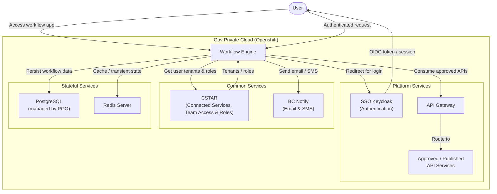

# High-Level Architecture

## Components

| Component           | Purpose                                                             |
| ------------------- | ------------------------------------------------------------------- |
| **Workflow Engine** | Hosts Node-RED based workflows; entry point for authenticated users |
| **SSO Keycloak**    | Authenticates users on login (deployed on Openshift)                |
| **CSTAR**           | Common service providing user tenants and roles for authorization   |
| **PostgreSQL**      | Persistent workflow data store, managed by PGO                      |
| **Redis Server**    | Caching and transient workflow state                                |
| **BC Notify**       | Common service used by workflow nodes for Email and SMS             |
| **API Gateway**     | Gateway fronting approved/published API services on Openshift       |
