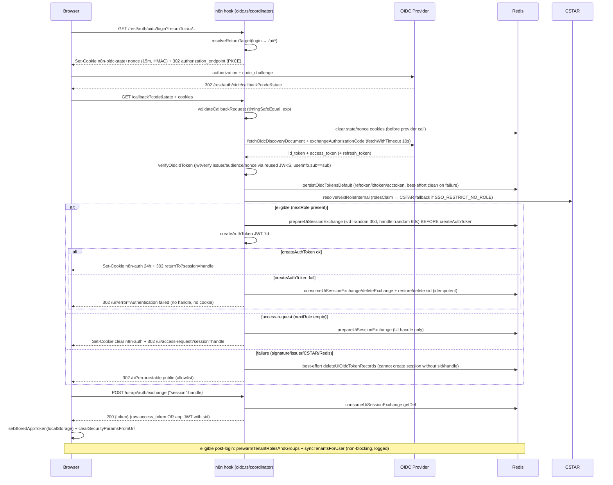
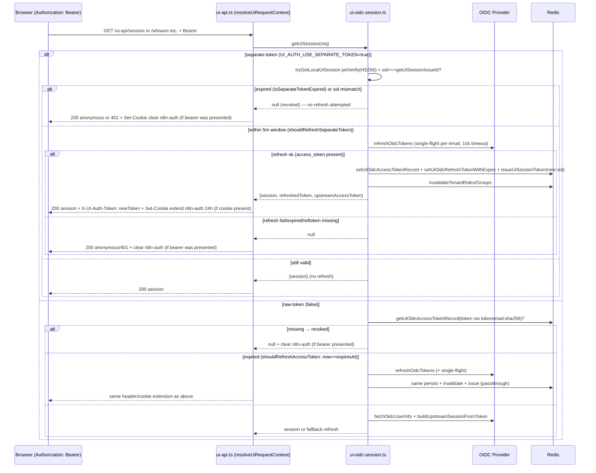

# User AuthN & AuthZ — common-hosted-workflow Summary

> **Scope:** Cross-cutting summary of the hardened unified OIDC boundary. **Canonical detail** lives in `docs/external-hooks/oidc.md`, `docs/platform/authentication-and-authorization.md`, and `docs/external-ui/tenant-roles-in-session.md` (all reconciled `2026-08-31` for ..). This file is the short map; for env tables and exact `jose`/`CSTAR` calls, follow those docs.
> **Related tasks:** `.wip/tasks/20260831-181251-dual-session-auth-boundary-review.md` (..), supersedes `.wip/tasks/20260831-095023-oidc-unified-flow-hardening.md`
> **How to read line cites:** `path:line` cites are pinned to the `2026-08-31` worktree for audit; where line churn is likely, prefer `symbol` + `path` (e.g. `resolveUiRequestContext` in `external-hooks/src/api/routes/ui-api.ts`) over a brittle line number.

> **Document layers:** (1) **Stable contracts** — endpoint method, credential accepted, authorizer, public error shape, revocation semantics. (2) **Configuration-dependent behavior** — issuer requirement, `UI_AUTH_USE_SEPARATE_TOKEN` mode, `OIDC_PROVIDER_TIMEOUT_MS`, `FEATURES_ENABLED`, `SSO_RESTRICT_NO_ROLE`. (3) **Implementation notes** — Redis keys, TTL values, single-use `getDel`, compensating `DEL`s, JWKS reuse. (4) **Known limitations / deferred decisions** — see §5.

## 0. Overview — Trust boundaries first

One browser authorization establishes **two** artifacts, with strict credential separation:

- **Every valid OIDC identity** (`email` from verified `id_token` or `preferred_username` fallback) receives an **external UI session** — bearer in `localStorage["external-ui.auth-token"]` + validated server state in Redis. In raw mode the bearer is the upstream `access_token`; in separate mode it is an app JWT `HS256` (`ui-auth-token.ts` `createUiAuthToken`, TTL `min(8h, upstream)`).
- **Only an eligible, enabled n8n identity** (resolved `nextRole ∈ {global:owner, global:admin, global:member}` via `resolveNextRoleInternal`) additionally receives **`n8n-auth`** (`HttpOnly` `Secure` when `https` `SameSite=Lax` `Path=/`, cookie 24h sliding `cookie.ts` `getAuthCookieOptions`, JWT 7d `n8n-oidc.ts` `createAuthToken`). The two artifacts are **not interchangeable**: UI bearer never authenticates `GET /rest/auth/oidc/*` (those use cookie or handle), `n8n-auth` never authenticates `/ui-api/*` (those use `Authorization: Bearer` via `requireUiRequestContextMiddleware`).

Ineligible/disabled identities keep identity (for access-request) but receive **no** n8n-derived capabilities; `canRequestAccess` is their only permission (`permissions.ts` `canRequestAccess`).

Single callback owns completion: `GET /rest/auth/oidc/callback` (`oidc.ts` `buildOidcRouter` / `handleCallback`). Legacy `GET /ui-api/auth/callback` and `OIDC_FRONTEND_HOOK_MODE` were removed (`docs/external-hooks/oidc.md:36`). Aliases `GET /ui-api/auth/login` → `302 /rest/auth/oidc/login` and `GET /ui-api/auth/logout` → `302 /rest/auth/oidc/logout` remain **redirect-only, no session, no identity trust** until `2026-09-30` (`ui-api.ts` `/auth/login` + `/auth/logout`).

Browser navigation `/login|/signin → /ui` and logout click interception are unconditional redirect-only via `GET /assets/oidc-frontend-hook.js` (`Cache-Control: public, max-age=3600` via `bootstrap/assets.ts`).

### 0.0 Reading the matrix without source

| Question                                                     | Answer location                                                                                                                                                                 | What to cite to callers                                                                                                                                                                       |
| ------------------------------------------------------------ | ------------------------------------------------------------------------------------------------------------------------------------------------------------------------------- | --------------------------------------------------------------------------------------------------------------------------------------------------------------------------------------------- |
| Which credential does `GET /rest/auth/oidc/login` accept?    | `oidc.ts` `GET /login` — accepts optional `n8n-auth` cookie (fast-path `302 /`) and creates `n8n-oidc-state/nonce` cookies; no bearer                                           | Cookie authorizer is `authService.resolveJwt` (n8n DB + JWT hash)                                                                                                                             |
| Which credential does `POST /ui-api/auth/exchange` accept?   | `ui-api.ts` `POST /exchange` — accepts JSON `{"session": handle}` (one-time `session:<handle>` via `getDel`)                                                                    | No bearer; authorizer is `consumeUiSessionExchange` (Redis)                                                                                                                                   |
| Which credential does `/ui-api/*` accept and who authorizes? | `ui-api.ts` `requireUiRequestContextMiddleware` → `resolveUiRequestContext` → `getUiSession`                                                                                    | `Authorization: Bearer` only; separate mode → `jwtVerify` + `sid` (`getUiSessionIssueId`), raw mode → `tokenemail:sha256(token)` + `fetchOidcUserInfo`; then `computePermissions`/`checkRole` |
| Which credential does CSTAR receive?                         | `session.upstreamAccessToken` (server-side, `getUiOidcAccessTokenByEmail` or `refreshAccessToken`) — never the UI bearer in separate-token mode (, `ui-api.test.ts` regression) | CSTAR authorizer is the upstream OIDC `access_token` as Bearer                                                                                                                                |
| Which credential does `GET /rest/auth/oidc/logout` accept?   | `oidc.ts` `GET /logout` — accepts consumed `logout` handle **or** valid `n8n-auth` cookie; `?email=` is ignored                                                                 | Handle via `consumeUiLogoutHandle` (`getDel`), cookie via `authService.resolveJwt`; revocation is `deleteUiOidcTokens` before discovery                                                       |

For full TTL/config/alias/public-error/race wording see §0.1 next.

### Sequence diagrams — login, refresh/expiry, account switching/role loss, logout





```mermaid
sequenceDiagram
  participant B as Browser
  participant N as oidc.ts callback
  participant R as Redis

  Note over B,R: Account switching: browser holds n8n-auth for A, finishes callback for B
  B->>N: GET /callback for B@example.com (holds cookie n8n-auth=A)
  alt B eligible
    N->>R: prepareUiSessionExchange sid B + handle B
    N-->>B: Set-Cookie n8n-auth=B (overwrite) + 302 returnTo?session=handleB
  else B ineligible (access-request)
    N->>R: prepareUiSessionExchange sid B + handle B
    N-->>B: Set-Cookie clear n8n-auth + 302 /ui/access-request?session=handleB terminates A)
    Note over B,R: Prior A session (sid A) is a different email key; B's callback does not touch A's Redis keys — asymmetry removed by cookie clear
  end
  B->>N: POST /exchange handleB → bearer B
  Note over B,R: Role loss: existing A eligible→ineligible on next login
  B->>N: GET /callback for A now ineligible
  N->>R: setUserDisabled(true) preserve slug + clear n8n-auth
  N->>R: issue UI-only handle A' + sid A' (new sid overwrites, revoking prior JWTs)
  N-->>B: clear n8n-auth + /ui/access-request?session=handle A'
```

```mermaid
sequenceDiagram
  participant B as Browser (Bearer)
  participant U as ui-api.ts
  participant O as oidc.ts
  participant R as Redis
  participant P as Provider

  B->>U: POST /auth/logout-prepare + Bearer + {returnTo}
  U->>U: getUiSession → 401 if invalid
  U->>R: setUiLogoutHandle(logout:handle 60s, email, returnTo validated)
  U-->>B: 200 {logoutUrl: /rest/auth/oidc/logout?logout=handle}
  B->>B: clearStoredAppToken (localStorage)
  B->>O: GET /logout?logout=handle (+ optional n8n-auth cookie)
  O->>R: consumeUiLogoutHandle getDel (single-use; unknown → warn + local redirect)
  O->>O: resolve identity: handle.email OR authService.resolveJwt(cookie); ?email= ignored
  O->>O: clearCookie n8n-auth always
  O->>R: deleteUiOidcTokens(email) — deletes reftoken/idtoken/acctoken/tokenemail/sessionIssueId/tenantroles/groups BEFORE fetchOidcDiscoveryDocument
  alt id_token && end_session_endpoint present
    O->>P: fetchOidcDiscoveryDocument (bounded)
    O-->>B: 302 end_session?post_logout_redirect_uri=returnTo&signedOut=1&id_token_hint
  else
    O-->>B: 302 returnTo?signedOut=1
  end
  B->>B: consumeSignedOutMarker clears localStorage + history
  Note over B,R: Bearer replay after logout: sid mismatch / tokenemail miss → revoked → 401
```

---

## 0.1 Dual-Session Contract Matrix

> **Purpose :** Single authoritative lifecycle showing identity source, credential type, validation authority, authorization source, refresh owner, revocation event, and cross-artifact behavior for `n8n-auth` (HttpOnly cookie) and UI bearer (raw-token vs separate-token/app-JWT). Negative and cross-path outcomes are normative; see §0.1.E. Endpoint methods and TTLs are verified against `external-hooks/src/api/routes/oidc.ts:77`, `external-hooks/src/api/routes/ui-api.ts:167`, `external-hooks/src/api/helpers/ui-oidc-session.ts:291`, `external-hooks/src/api/helpers/ui-oidc-store.ts:113`, `external-hooks/src/api/helpers/ui-auth-token.ts:12`, `external-hooks/src/api/helpers/cookie.ts:56`.

### A. Artifact Contract — Issuer, Consumer, TTL, Refresh Owner, Revocation Path

Every row names an issuer (who mints), consumer (who validates), TTL, refresh owner (who extends), and revocation path (how it becomes invalid). TTLs are enforced server-side (Redis `PX` or JWT `exp`); browser storage is not authoritative.

| Artifact                                                                                                                                 | Issuer                                                                                                                                           | Consumer                                                                                                                                                                                           | TTL                                                                                                                                                                   | Refresh Owner                                                                                                                                                                                                                                                                                                                                                                   | Revocation Path                                                                                                                                                                                                                                                                                                                                                                                                                                                    |
| ---------------------------------------------------------------------------------------------------------------------------------------- | ------------------------------------------------------------------------------------------------------------------------------------------------ | -------------------------------------------------------------------------------------------------------------------------------------------------------------------------------------------------- | --------------------------------------------------------------------------------------------------------------------------------------------------------------------- | ------------------------------------------------------------------------------------------------------------------------------------------------------------------------------------------------------------------------------------------------------------------------------------------------------------------------------------------------------------------------------- | ------------------------------------------------------------------------------------------------------------------------------------------------------------------------------------------------------------------------------------------------------------------------------------------------------------------------------------------------------------------------------------------------------------------------------------------------------------------ | -------------------------------------------------------------------------------------------------------------------------------------------------------------------------------------------------------------------------------------------------------------------------------------------------------------------------- | ------------------------------------------------------------------------------------------------------------------------------------------------------------------------------------------------------------------------------------------------------------------------------------------------ | -------- | ---------------------------------- | --------------------------------------------- | ---------- |
| `n8n-oidc-state` + `n8n-oidc-nonce` (`HttpOnly Secure SameSite=Lax Path=/` signed HMAC `external-hooks/src/api/helpers/n8n-oidc.ts:102`) | `GET /rest/auth/oidc/login` `oidc.ts:77` via `oidc-provider.ts:157`                                                                              | `GET /rest/auth/oidc/callback` `oidc.ts:126` `validateCallbackRequest:335`                                                                                                                         | cookie 15m `cookie.ts:56`, payload `exp` 900s `n8n-oidc.ts:93`                                                                                                        | none (single-use)                                                                                                                                                                                                                                                                                                                                                               | `clearCookie` on callback `oidc.ts:134` (before provider call), expiry, HMAC failure, length-mismatch `n8n-oidc.ts:120`                                                                                                                                                                                                                                                                                                                                            |
| `n8n-auth` (`HttpOnly Secure SameSite=Lax Path=/`, JWT `external-hooks/src/api/helpers/n8n-oidc.ts:142`)                                 | `oidc-login-coordinator.ts:649` `createAuthToken` called only for `eligible` outcomes                                                            | `authService.resolveJwt` on every n8n cookie-authenticated request; UI-linked endpoints read via `req.cookies['n8n-auth']` `oidc.ts:185`, `ui-api.ts:73`                                           | cookie 24h sliding `cookie.ts:66` (`getAuthCookieOptions`), JWT 7d inside (`n8n-oidc.ts:142`) — cookie is browser TTL, JWT is `n8n` validation TTL                    | `ui-api.ts:38` **linked**: `GET /ui-api/session:167` and `createUiRequestContextMiddleware:146` — if `refreshedToken` present and cookie exists → `extendN8nAuthCookie:73` re-sets same token with 24h `maxAge` sliding; otherwise no refresh                                                                                                                                   | `GET /rest/auth/oidc/logout` `oidc.ts:193,200` `invalidateToken` + `clearCookie` always; **linked clear** `ui-api.ts:38,87,157,222` — if `!resolved && getBearerToken(req)` (OIDC expired/revoked, `isRefreshTokenExpired` `ui-oidc-session.ts:152`) → `clearN8nAuthCookie:50`; n8n `setUserDisabled(true)` also denies subsequent `resolveJwt` (disabled-user enforcement is `n8n` DB, not cookie). `Secure` derived via `cookie.ts:9` fails closed in production |
| UI bearer — **raw-token mode** (`UI_AUTH_USE_SEPARATE_TOKEN=false` `config.ts:42`) — upstream OIDC `access_token`                        | OIDC provider token endpoint `oidc-provider.ts:184`                                                                                              | `ui-oidc-session.ts:262` `resolveUpstreamUiSession` — `getUiOidcAccessTokenRecord(token)` `store.ts:248` (`tokenemail:sha256(token)` `store.ts:79`) + `fetchOidcUserInfo` `ui-oidc-session.ts:104` | provider `expires_in` (`resolveAccessTokenExpiresAt` `ui-auth-token.ts:8`), reverse record TTL `max(exp-now+5m,5m)` `store.ts:238`, forward `acctoken:<email>` no TTL | `ui-oidc-session.ts:152,262` `refreshSessionByEmail` → `refreshOidcTokens:229` (`grant_type=refresh_token`) if `shouldRefreshAccessToken` (`now>=expiresAt` `ui-auth-token.ts:12`) or `buildUpstreamSessionFromToken` fails; persists `setUiOidcAccessTokenRecord` + `setUiOidcRefreshTokenWithExpiry` + `issueUiSessionToken` passthrough, `X-UI-Auth-Token` header propagated | `deleteUiOidcTokens(email)` `store.ts:255` deletes `reftoken,idtoken,acctoken,tokenemail,sessionIssueId,tenantroles/groups` (called from `oidc.ts:213` logout **before** discovery); reverse record deletion on overwrite `store.ts:231`; `isRefreshTokenExpired` → refresh not attempted                                                                                                                                                                          |
| UI bearer — **separate-token mode** (`UI_AUTH_USE_SEPARATE_TOKEN=true`) — app JWT `HS256` (`ui-auth-token.ts:63`)                        | `external-hooks/src/api/helpers/ui-auth-token.ts:35` `createUiAuthToken` called from `prepareUiSessionExchange:194` via `coordinator.ts:199,639` | `ui-oidc-session.ts:224` `resolveLocalUiSession` → `jwtVerify(HS256, UI_AUTH_JWT_SECRET                                                                                                            |                                                                                                                                                                       | N8N_USER_MANAGEMENT_JWT_SECRET)` `ui-oidc-session.ts:76` (`iss=chwf-ui-api` `aud=chwf-ui` `config.ts:38`), then `sid===getUiSessionIssueId(email)` `ui-oidc-session.ts:87`                                                                                                                                                                                                      | `min(8h, upstream expires_in)` `ui-auth-token.ts:45` (`UI_AUTH_JWT_TTL_MS 8h` vs `upstreamExpiresAt`); cookie-like bearer in `localStorage["external-ui.auth-token"]` `axios.ts:18`                                                                                                                                                                                                                                                                                | Same `refreshSessionByEmail:152` owner but gated by `shouldRefreshSeparateToken` (`0<exp-now<=5m` `ui-auth-token.ts:16`) and `isSeparateTokenExpired` (`now>=exp` `25`) → fully expired never refreshed; refreshed via same `refreshOidcTokens` path, re-issues JWT with current `sessionIssueId` `ui-oidc-session.ts:199` | `setUiSessionIssueId` 30d single-slot per email `store.ts:147`; mismatch (`payload.sid !== currentSessionId`) → null `ui-oidc-session.ts:88`; `JWTExpired` caught `ui-oidc-session.ts:233` → null without refresh; `deleteUiOidcTokens` deletes `sessionIssueId` thus revokes all JWTs for email |
| `session` exchange handle (`chwf:ui-oidc:session:<handle>` `store.ts:113`)                                                               | `coordinator.ts` `prepareUiSessionExchange` (eligible + access-request, `UI_SESSION_EXCHANGE_TTL_MS` 60s)                                        | `POST /ui-api/auth/exchange` (`ui-api.ts` `POST /auth/exchange` + `consumeUiSessionExchange` `getDel` single-use)                                                                                  | 60s `UI_SESSION_EXCHANGE_TTL_MS`                                                                                                                                      | none (single-use)                                                                                                                                                                                                                                                                                                                                                               | `getDel` consumption, expiry, or `createAuthToken` failure cleanup `consumeUiSessionExchange`/`deleteUiSessionExchange` (idempotent)                                                                                                                                                                                                                                                                                                                               |
| `logout` handle (`chwf:ui-oidc:logout:<handle>` `store.ts:127`)                                                                          | `POST /ui-api/auth/logout-prepare` (`ui-api.ts` `POST /auth/logout-prepare` + `setUiLogoutHandle` 60s)                                           | `GET /rest/auth/oidc/logout` (`oidc.ts` `consumeUiLogoutHandle` `getDel` single-use)                                                                                                               | 60s                                                                                                                                                                   | none                                                                                                                                                                                                                                                                                                                                                                            | `getDel` single-use; email normalized `normalizeUiIdentityEmail`                                                                                                                                                                                                                                                                                                                                                                                                   |
| App `sid` (`chwf:ui-oidc:sessionissue:<email>` `store.ts:147`)                                                                           | `prepareUiSessionExchange:194` `random(16).base64url`                                                                                            | `tryGetLocalUiSession:87` `sid` equality check                                                                                                                                                     | 30d `store.ts:149` (`REFRESH_TOKEN_MAX_TTL_MS`)                                                                                                                       | overwritten on each new login/exchange `coordinator.ts:201` (single active session per email)                                                                                                                                                                                                                                                                                   | `deleteUiOidcTokens` `store.ts:255`, or overwrite by new `sid` invalidates prior JWTs                                                                                                                                                                                                                                                                                                                                                                              |
| `refresh_token` record (`chwf:ui-oidc:reftoken:<email>` JSON `{token,expiresAt}` `store.ts:165`)                                         | OIDC provider `refresh_token` grant                                                                                                              | `refreshSessionByEmail:152` `getUiOidcRefreshTokenRecord`                                                                                                                                          | `min(refresh_expires_in,30d)` `store.ts:175` max 30d `store.ts:30,42` TTL `Math.min(remaining,30d)`                                                                   | `refreshOidcTokens` rotation `ui-oidc-session.ts:184` (`setUiOidcRefreshTokenWithExpiry` with new `refresh_token` if returned)                                                                                                                                                                                                                                                  | `deleteUiOidcTokens`, expiry (`isRefreshTokenExpired` `ui-auth-token.ts:30`), or replacement                                                                                                                                                                                                                                                                                                                                                                       |
| `id_token` (`chwf:ui-oidc:idtoken:<email>` `store.ts:216`)                                                                               | OIDC provider `id_token`                                                                                                                         | `oidc.ts:212` logout (`getUiOidcIdToken` → `id_token_hint`)                                                                                                                                        | JWT `exp-now` or 24h default `store.ts:220` `ID_TOKEN_DEFAULT_TTL_MS`                                                                                                 | refreshed if provider returns new `id_token` on refresh `ui-oidc-session.ts:190`                                                                                                                                                                                                                                                                                                | `deleteUiOidcTokens`                                                                                                                                                                                                                                                                                                                                                                                                                                               |
| `access_token` forward (`chwf:ui-oidc:acctoken:<email>` `store.ts:229`) + reverse (`tokenemail:sha256(token)` `store.ts:79`)             | OIDC provider `access_token`                                                                                                                     | raw-mode `getUiOidcAccessTokenRecord` gates trust `ui-oidc-session.ts:263`; `tenant.service` via `refreshAccessToken` closure `ui-api.ts:112`                                                      | forward `SET` no TTL (email→current token); reverse `PX max(exp-now+5m,5m)` `store.ts:238`                                                                            | `setUiOidcAccessTokenRecord` overwrites previous reverse `store.ts:231` and sets new record with `expiresAt`                                                                                                                                                                                                                                                                    | `deleteUiOidcTokens` + single current access token (previous reverse deleted on overwrite)                                                                                                                                                                                                                                                                                                                                                                         |
| `tenantRoles/Groups` cache (`tenantroles/groups:<email>` `store.ts:273`)                                                                 | `tenant.service.ts:196` `prewarmTenantRolesAndGroups` + `tenant.service` session helpers                                                         | `ui-api.ts:119` `getTenantRolesForSession` / `getTenantGroupsForSession`                                                                                                                           | 1h `store.ts:32` `TENANT_ROLES_DEFAULT_TTL_MS`                                                                                                                        | invalidated on `refreshSessionByEmail:195` `invalidateTenantRoles/Groups`, deleted on logout `store.ts:262`                                                                                                                                                                                                                                                                     | expiry, invalidation, logout deletion                                                                                                                                                                                                                                                                                                                                                                                                                              |
| Discovery cache (in-memory `Map` `oidc-provider.ts:59`)                                                                                  | OIDC discovery `/.well-known/openid-configuration` `oidc-provider.ts:78`                                                                         | `fetchOidcDiscoveryDocument` consumers (login `oidc-provider.ts:157`, callback `coordinator.ts:347`, logout `oidc.ts:220`, session validation `ui-oidc-session.ts:110`)                            | 1h `oidc-provider.ts:60` key `issuer                                                                                                                                  | auth                                                                                                                                                                                                                                                                                                                                                                            | token                                                                                                                                                                                                                                                                                                                                                                                                                                                              | userinfo                                                                                                                                                                                                                                                                                                                   | jwks                                                                                                                                                                                                                                                                                             | clientId | redirectUri` `oidc-provider.ts:66` | `clearOidcDiscoveryCache` test-only or expiry | TTL expiry |

### B. Endpoint Inventory — Creates / Accepts / Refreshes / Extends / Clears (stable contract)

> **Stable contract** columns are `Method & Path` and `Credential` (what the endpoint accepts) and `Authorization Decision Point` (which system authorizes). TTLs and alias lifecycle are in Notes; config-dependent variants (raw vs separate) are marked. All `/ui-api/*` except `/session` and aliases require `requireUiRequestContextMiddleware` (401 if missing bearer).

| Method & Path                                                                                       | Credential (what the client presents)                                                                                                                                       | Operation                                                                                                                                                                                                                                                                                                                    | Authorization Decision Point                                                                                                                                                                                                                                                   | Notes (TTL / config / alias)                                                                                                                                                                                                                                                                                                                  |
| --------------------------------------------------------------------------------------------------- | --------------------------------------------------------------------------------------------------------------------------------------------------------------------------- | ---------------------------------------------------------------------------------------------------------------------------------------------------------------------------------------------------------------------------------------------------------------------------------------------------------------------------- | ------------------------------------------------------------------------------------------------------------------------------------------------------------------------------------------------------------------------------------------------------------------------------ | --------------------------------------------------------------------------------------------------------------------------------------------------------------------------------------------------------------------------------------------------------------------------------------------------------------------------------------------- | --- | ------------------------------------------------------------------------------------------------------------------------------------------- |
| `GET /rest/auth/oidc/login` (`oidc.ts` `buildOidcRouter`)                                           | reads optional `n8n-auth` cookie (accept) **+** creates `n8n-oidc-state` + `n8n-oidc-nonce` cookies (`HttpOnly` `Secure` `SameSite=Lax` 15m `getCookieOptions`, `exp` 900s) | **Create** state/nonce; **Accept** `n8n-auth` for fast-path `302 /` when no `returnTo`                                                                                                                                                                                                                                       | `authService.resolveJwt` (n8n DB + JWT hash) — cookie authorizer                                                                                                                                                                                                               | `returnTo` validated via `resolveReturnTarget('login')` (`return-target.ts` `createReturnTargetPolicy` trustedBase `UI_APP_BASE_URL                                                                                                                                                                                                           |     | N8N_BASE_URL`, `/ui/\*`prefix). Hostile`→`fallback`/ui/`never receives handle.`OIDC_ISSUER` required or router throws before serving login. |
| `GET /rest/auth/oidc/callback` (`oidc.ts` sole callback)                                            | accepts `code`+`state` query + `n8n-oidc-state`/`n8n-oidc-nonce` cookies; **creates** `n8n-auth` (eligible) + `session` exchange handle; **clears** state/nonce             | **Accept** signed cookies `verifySignedCookie` (`n8n-oidc.ts` `timingSafeEqual`); **Create** `n8n-auth` (`res.cookie` `getAuthCookieOptions`) + `setUiSessionExchange` (60s `getDel`) + `setUiSessionIssueId` (30d) + `setUiOidcTokens` via `oidc-login-coordinator.ts` `handleCallback`; **Clear** state/nonce pre-provider | `verifySignedCookie` (HMAC, exp, length), `verifyOidcIdToken` (`jwtVerify` with always-required `issuer`/`audience`/`nonce` via reused `jwksCache` + `fetchWithTimeout` 10s), `extractOidcIdentity` + single `resolveNextRoleInternal` (CSTAR fallback), last-owner protection | Atomic issuance: exchange **before** `createAuthToken`; `createAuthToken` failure → `consumeUiSessionExchange`/`deleteUiSessionExchange` + `sid` restore/delete . `access-request` path **always clears** `n8n-auth` (`authService.clearCookie`) at this shared boundary . Failures → `302 /ui?error=stable public` (allowlist, no raw leak). |
| `GET /rest/auth/oidc/logout` (`oidc.ts` canonical)                                                  | accepts `n8n-auth` cookie **or** `logout` handle (`?logout=handle` + optional `?returnTo`); **clears** `n8n-auth`; **deletes** Redis tokens                                 | **Accept** logout handle `consumeUiLogoutHandle` (`getDel` single-use, 60s) + `authService.resolveJwt` fallback; **Clear** `authService.clearCookie` always; **Delete** `deleteUiOidcTokens` **before** discovery (provider failure cannot block revocation)                                                                 | handle identity **or** valid `n8n` JWT; invalid cookie never falls back to `?email=`; `resolveReturnTarget('logout')` (`/ui/*`) + `appendQueryParam signedOut=1`                                                                                                               | If `!id_token` or no `end_session_endpoint` ⇒ local `302 returnTo`; else `302 end_session?post_logout_redirect_uri& id_token_hint`. `?email=` untrusted.                                                                                                                                                                                      |
| `POST /ui-api/auth/exchange` (`ui-api.ts` `authExchangeSchema` / `authExchangeResponseSchema`)      | accepts JSON `{"session": handle}` (`authExchangeSchema`), **not** query `?session=` — single-use                                                                           | **Accept** handle `consumeUiSessionExchange` (`getDel`); **Return** `{token}`                                                                                                                                                                                                                                                | `authExchangeSchema` validation; `401` if `getDel` null (replay/unknown)                                                                                                                                                                                                       | Method is **POST** (not `GET` — corrected ; sandbox/README/oidc.md now say POST). TTL 60s; exactly-one `session` appended via `appendSessionToReturnTo`.                                                                                                                                                                                      |
| `POST /ui-api/auth/logout-prepare` (`ui-api.ts` `authLogoutPrepareSchema`)                          | accepts `Authorization: Bearer` (UI bearer); **creates** `logout` handle                                                                                                    | **Accept** bearer via `getUiSession` (`ui-oidc-session.ts`); **Create** `setUiLogoutHandle` 60s (email normalized `store.ts` `normalizeUiIdentityEmail`) + validated `returnTo`                                                                                                                                              | `getUiSession` (separate/raw branches) → 401 if absent; `resolveReturnTarget('logout')` fallback                                                                                                                                                                               | Returns `{logoutUrl: /rest/auth/oidc/logout?logout=handle}`. `returnTo` ≤2048, `logout` alias never trusts caller identity.                                                                                                                                                                                                                   |
| `GET /ui-api/auth/login` (`ui-api.ts` deprecated alias)                                             |                                                                                                                                                                             | **Redirect-only** `302 ${N8N_BASE_URL}/rest/auth/oidc/login?returnTo`                                                                                                                                                                                                                                                        | none (no identity trust)                                                                                                                                                                                                                                                       | `returnTo` default `/ui/` via `appendQueryParam`; **removal target `2026-09-30`**; never establishes session.                                                                                                                                                                                                                                 |
| `GET /ui-api/auth/logout` (`ui-api.ts` deprecated alias)                                            |                                                                                                                                                                             | **Redirect-only** `302 ${N8N_BASE_URL}/rest/auth/oidc/logout?returnTo`                                                                                                                                                                                                                                                       | none (canonical logout derives identity from cookie/handle)                                                                                                                                                                                                                    | same `2026-09-30` window; `GET /rest/auth/oidc/*` remain canonical.                                                                                                                                                                                                                                                                           |
| `GET /ui-api/session` (`ui-api.ts` `buildSessionSummary`)                                           | accepts `Authorization: Bearer` (public endpoint, anonymous allowed)                                                                                                        | **Accept** bearer; **Refresh** `refreshSessionByEmail` if window (`shouldRefreshSeparateToken` 5m) or expired (`shouldRefreshAccessToken`/`isSeparateTokenExpired`); **Extend** `n8n-auth` if refresh, **Clear** `n8n-auth` if `!resolved && bearer`                                                                         | `getUiSession` (issuer/consumer per mode §A), then `loadUserContext` + `computePermissions` (`permissions.ts`) + `getTenantRoles/GroupsForSession` with `refreshAccessToken` closure                                                                                           | Always `200` with `buildSessionSummary`; anonymous `null` when no bearer; sets `X-UI-Auth-Token` on refresh. `n8n-auth` linked: extend on refresh, clear on expiry iff bearer presented.                                                                                                                                                      |
| `createUiRequestContextMiddleware` + `requireUiRequestContextMiddleware` (`ui-api.ts`)              | accepts `Bearer` on every `/ui-api/*`                                                                                                                                       | **Accept** bearer; **Refresh/Extend/Clear** same linked n8n lifecycle as `/session` (see §C)                                                                                                                                                                                                                                 | `resolveUiRequestContext` → `getUiSession` → `loadUserContext` → `serializeN8nUser` + `computePermissions`; `upstreamAccessToken` resolved server-side (never UI bearer in separate mode)                                                                                      | `requireUiRequestContext` → 401 if missing; attaches `req.session/req.context` + `X-UI-Auth-Token` header. `Open n8n` hidden for anonymous/disabled/role-less — server gate still is `n8n-auth`/`getUiSession`.                                                                                                                               |
| Protected `/ui-api/*` inventory (all require `Authorization: Bearer` via `requireUiRequestContext`) | per row                                                                                                                                                                     | per §2.4                                                                                                                                                                                                                                                                                                                     | per column                                                                                                                                                                                                                                                                     | credential separation §0.0 applies to all rows                                                                                                                                                                                                                                                                                                |
| `GET /ui-api/whoami`                                                                                | Bearer                                                                                                                                                                      |                                                                                                                                                                                                                                                                                                                              | `requireUiRequestContext` (401 only)                                                                                                                                                                                                                                           | `buildWhoamiResponse`                                                                                                                                                                                                                                                                                                                         |
| `GET /ui-api/workflows`                                                                             | Bearer                                                                                                                                                                      |                                                                                                                                                                                                                                                                                                                              | `require+canViewWorkflows` (`isEligible && workflow-share` via `computePermissions`)                                                                                                                                                                                           | `context.workflows`                                                                                                                                                                                                                                                                                                                           |
| `POST /ui-api/workflows/:id/share`                                                                  | Bearer                                                                                                                                                                      |                                                                                                                                                                                                                                                                                                                              | `require+canShareWorkflows` + `requireManagingContext` (`ui-workflow-sharing.ts` `!disabled && role`) + `ensureWorkflowShareableByCaller`                                                                                                                                      | `201`                                                                                                                                                                                                                                                                                                                                         |
| `DELETE /ui-api/workflows/:id/projects/:projectId`                                                  | Bearer                                                                                                                                                                      |                                                                                                                                                                                                                                                                                                                              | `require+canUnshareWorkflows` (`isAdmin`) + `canViewAllWorkflows`                                                                                                                                                                                                              | `200`                                                                                                                                                                                                                                                                                                                                         |
| `POST /ui-api/access-requests`                                                                      | Bearer                                                                                                                                                                      |                                                                                                                                                                                                                                                                                                                              | `require+canRequestAccess` (**only disabled/ineligible**, 403 otherwise)                                                                                                                                                                                                       | `201` / `409` if pending                                                                                                                                                                                                                                                                                                                      |
| `GET /ui-api/access-requests/my`                                                                    | Bearer                                                                                                                                                                      |                                                                                                                                                                                                                                                                                                                              | `require` (401 only)                                                                                                                                                                                                                                                           | own request only                                                                                                                                                                                                                                                                                                                              |
| `GET /ui-api/access-requests`                                                                       | Bearer                                                                                                                                                                      |                                                                                                                                                                                                                                                                                                                              | `require+checkRole(owner,admin)` (disabled fails)                                                                                                                                                                                                                              | `limit=50`                                                                                                                                                                                                                                                                                                                                    |
| `POST /ui-api/access-requests/:id/review`                                                           | Bearer                                                                                                                                                                      |                                                                                                                                                                                                                                                                                                                              | `require+checkRole(owner,admin)`                                                                                                                                                                                                                                               | `404/409` optimistic; approve → `global:member` + re-enable                                                                                                                                                                                                                                                                                   |
| `GET /ui-api/projects`                                                                              | Bearer (upstream CSTAR call uses `session.upstreamAccessToken`)                                                                                                             |                                                                                                                                                                                                                                                                                                                              | `require+canManageProject` (`isEligible && project`)                                                                                                                                                                                                                           | `listUserProjectTenants({ssoUserId,n8nUserId,upstreamAccessToken})` — \*\*Fixed: upstream token is server-side `session.upstreamAccessToken`/`getUiOidcAccessTokenByEmail`, not `getBearerToken(req)` app JWT. See `ui-api.test.ts` separate-token regression.                                                                                |
| `/ui-api/admin/*`                                                                                   | Bearer                                                                                                                                                                      |                                                                                                                                                                                                                                                                                                                              | `require+canManageProject+checkRole(owner,admin)`                                                                                                                                                                                                                              | `admin-projects.ts`                                                                                                                                                                                                                                                                                                                           |
| `/ui-api/wil/*`                                                                                     | Bearer (same upstream separation)                                                                                                                                           |                                                                                                                                                                                                                                                                                                                              | `require+canManageWil` (`isEligible && wil`) + actor gates `wil.ts` / `triggers.ts:35,55`                                                                                                                                                                                      | `wil.ts` also fixed to use `session.upstreamAccessToken` ; uses `tenantRoles/Groups` union                                                                                                                                                                                                                                                    |

### C. Cross-Artifact Behavior — May one artifact remain valid when the other fails? Where is invalidation authoritative?

| Trigger                                                                                                                                                                    | `n8n-auth` outcome                                                                                                                                                                                                                                                                                                                                   | UI bearer outcome                                                                                                                                                     | Authoritative invalidation point                                                                                                                                                                                                                                                                                         |
| -------------------------------------------------------------------------------------------------------------------------------------------------------------------------- | ---------------------------------------------------------------------------------------------------------------------------------------------------------------------------------------------------------------------------------------------------------------------------------------------------------------------------------------------------- | --------------------------------------------------------------------------------------------------------------------------------------------------------------------- | ------------------------------------------------------------------------------------------------------------------------------------------------------------------------------------------------------------------------------------------------------------------------------------------------------------------------ |
| **UI bearer refresh succeeds** (within 5m window separate, at/after expiry raw) `ui-oidc-session.ts:152,224,262`                                                           | **Extended** sliding 24h `extendN8nAuthCookie:73` if cookie present `ui-api.ts:154,221`                                                                                                                                                                                                                                                              | new `X-UI-Auth-Token` header `ui-api.ts:43` via `issueUiSessionToken:199`; old reverse record deleted `store.ts:231`                                                  | Redis `reftoken/idtoken/acctoken/sid` persistence; cookie extension is best-effort, not authoritative                                                                                                                                                                                                                    |
| **UI bearer fully expired** (separate `JWTExpired` `233` or `isSeparateTokenExpired:25`; raw `isRefreshTokenExpired` `159` after failed refresh) + request presents bearer | **Cleared** `clearN8nAuthCookie:50` via `shouldClearN8nCookieOnExpiry:87` (`!resolved && getBearerToken`) on `GET /session` `222` and `createUiRequestContextMiddleware:157`                                                                                                                                                                         | `null` session → `GET /session` returns anonymous `buildSessionSummary(null)` 200; protected routes `401 UnauthorizedResponse` `ui-api.ts:179`                        | Redis not yet deleted — session is rejected by JWT/sid check or `tokenemail` miss; authoritative is `getUiSession` rejecting; **but** `n8n` cookie clear is linked side-effect only when bearer was presented (anonymous without bearer never clears n8n-only session `ui-api.ts:91`)                                    |
| **UI bearer revoked** (`sid` mismatch `87` or raw `tokenemail` miss `263`)                                                                                                 | **Cleared** same linked path as expiry (if bearer presented)                                                                                                                                                                                                                                                                                         | same as expired: `null` → 401 on protected                                                                                                                            | `deleteUiOidcTokens` on logout `store.ts:255` deletes `sessionIssueId` (revokes separate JWT) and `acctoken/tokenemail` (revokes raw); overwrite of `sid` by re-login also revokes prior JWTs                                                                                                                            |
| **Refresh token expired** (`isRefreshTokenExpired` `30`)                                                                                                                   | **Cleared** via same linked path (refresh attempted but expired `159` → null)                                                                                                                                                                                                                                                                        | refresh not attempted, null                                                                                                                                           | `reftoken` Redis `expiresAt` capped 30d; authoritative miss of refresh record                                                                                                                                                                                                                                            |
| **Logout** `oidc.ts:157` + `ui-api.ts:203`                                                                                                                                 | **Always cleared** `authService.clearCookie` `200` even if no email; `invalidateToken` tried if cookie valid                                                                                                                                                                                                                                         | **Deleted from Redis** `deleteUiOidcTokens` **before** discovery `227` (provider failure cannot block revocation) deletes all email-keyed records including new `sid` | Canonical revocation is `deleteUiOidcTokens`; `signedOut=1` + `clearStoredAppToken` in browser `session-bootstrap.tsx:53`, `session-actions.ts:38`                                                                                                                                                                       |
| **Access-request callback** (`nextRole==''` new ineligible `coordinator.ts:460` or existing ineligible `540`)                                                              | **Always cleared** — controller `oidc.ts:145` `authService.clearCookie(res)` (fallback `res.clearCookie('n8n-auth')`) before `302 /ui/access-request?session=handle`; prior `n8n-auth` (same or cross-identity) is terminated in the same response that issues the UI-only handle `471,556`. **Fixed** — `oidc.ts:139-147`, `coordinator.ts:539-557` | UI-only handle issued `471,556` → `POST /exchange` → bearer with `canRequestAccess` only                                                                              | Authoritative termination is `clearCookie` on this shared callback boundary; DB `disabled=true` (`540`) preserves slug for audit but is not the gate — cookie clear prevents reuse even before DB propagation; `n8n` `authService.resolveJwt` still rejects if presented again when disabled, but cookie is already gone |
| **Anonymous (no bearer, possibly n8n-only)**                                                                                                                               | **Preserved** if valid `n8n-auth` exists (e.g., legacy n8n direct user) — `shouldClearN8nCookieOnExpiry` guard excludes anonymous without bearer `ui-api.ts:91`                                                                                                                                                                                      | `null` → `GET /session` returns anonymous summary 200; protected `401`                                                                                                | n8n cookie validated solely by `authService.resolveJwt`; UI bearer absence does not affect n8n session                                                                                                                                                                                                                   |

> **Rule:** `n8n-auth` and UI bearer are **not interchangeable**: UI bearer never authenticates `GET /rest/auth/oidc/*` (those use cookie or handle), `n8n-auth` never authenticates `/ui-api/*` (those use `Authorization: Bearer`). Authoritative invalidation for UI bearer is Redis (`sid`/`tokenemail`/`reftoken`); for `n8n-auth` is `authService` (DB disabled + JWT hash + cookie clear). Linked extension/clear in `ui-api.ts:38` is a **coupling convenience**, not the primary revocation gate.

### D. Identity × Operation Lifecycle Matrix

For both credential modes (**raw-token** = `UI_AUTH_USE_SEPARATE_TOKEN=false`, **separate-token** = `true`). `status` is OIDC/Bearer-proximate result, `redirect/cookie/storage/Redis` are observable browser + server outcomes.

| Identity                                                                                                                                  | `GET /login` → callback `eligible` path                                                                                                                             | callback `access-request` path                                                                                                                                                                                                                                                                                                    | `POST /exchange`                                                                                                                                                | `GET /ui-api/session` (valid bearer)                                                                                                                                                                       | `GET /ui-api/session` (expired/revoked bearer)                                                                                                                                                                                               | Protected `/ui-api/*` (authorization)                                                                                                                                                    | Refresh (separate: ≤5m window; raw: ≥expiry)                                                                                                                                                                                                                                       | Role change / re-eligible                                                                                                                                          | `POST /logout-prepare` + `GET /oidc/logout`                                                                                                                                                                                                                                             | Anonymous/no artifact                                                                                                            |
| ----------------------------------------------------------------------------------------------------------------------------------------- | ------------------------------------------------------------------------------------------------------------------------------------------------------------------- | --------------------------------------------------------------------------------------------------------------------------------------------------------------------------------------------------------------------------------------------------------------------------------------------------------------------------------- | --------------------------------------------------------------------------------------------------------------------------------------------------------------- | ---------------------------------------------------------------------------------------------------------------------------------------------------------------------------------------------------------- | -------------------------------------------------------------------------------------------------------------------------------------------------------------------------------------------------------------------------------------------- | ---------------------------------------------------------------------------------------------------------------------------------------------------------------------------------------- | ---------------------------------------------------------------------------------------------------------------------------------------------------------------------------------------------------------------------------------------------------------------------------------- | ------------------------------------------------------------------------------------------------------------------------------------------------------------------ | --------------------------------------------------------------------------------------------------------------------------------------------------------------------------------------------------------------------------------------------------------------------------------------- | -------------------------------------------------------------------------------------------------------------------------------- |
| **Eligible enabled** (`nextRole∈{owner,admin,member}`, `disabled=false`)                                                                  | `302 auth_endpoint` → `302 {returnTo}?session=handle` `coordinator:661,665` + `Set-Cookie: n8n-auth` `oidc.ts:141` + Redis tokens+sid+handle `store.ts:113,147,165` |                                                                                                                                                                                                                                                                                                                                   | `200 {token}` `ui-api.ts:249` + browser `localStorage` set `axios.ts:18` `getDel` handle `store.ts:120` (replay 401)                                            | `200 {session=eligible, permissions.*=true/false per role}` `buildSessionSummary`; `X-UI-Auth-Token` unchanged                                                                                             | `200 {session=null}` (anonymous) + **`Set-Cookie: clear n8n-auth`** if bearer was sent `ui-api.ts:222`; `localStorage` cleared by `bootstrap` on next load `session-bootstrap:53`                                                            | `200/201` per §2.4 when `permissions`/`role` guards pass; e.g. `GET /workflows` 403 unless `canViewWorkflows`, `POST /access-requests` 403 (eligible cannot request)                     | **Succeeds**: `200` with `X-UI-Auth-Token: newToken` + `Set-Cookie: extend n8n-auth` `ui-api.ts:38`; Redis `refresh_token` rotated if provider returned new one `ui-oidc-session:184`, old reverse deleted, `tenantRoles/Groups` invalidated `195`                                 | Callback re-eligible: `setUserDisabled(false)` `566`, `syncN8nUserRole` `35` may re-role; new `sid` overwrites old `sessionIssueId` so prior separate JWTs revoked | `POST 200 {logoutUrl}` bound to email `ui-api:272`; `GET 302 {returnTo}?signedOut=1` `oidc:178` or `302 end_session?post_logout_redirect_uri&id_token_hint` `233` + `clearCookie` + `deleteUiOidcTokens:213` deletes all Redis keys; browser `clearStoredAppToken` `session-actions:38` | For login: `302 /` if valid `n8n-auth` and no `returnTo` `oidc:79`; for session: `200 anonymous`                                 |
| **Ineligible** (`nextRole=''`, new user `coordinator:460`)                                                                                |                                                                                                                                                                     | `302 /ui/access-request?session=handle` **with `Set-Cookie: clear n8n-auth`** `oidc.ts:145` `authService.clearCookie` (terminates any prior cookie, same or cross-identity) + UI handle only; **no `createUserWithProject`** — no n8n row created `471`                                                                           | same `200 {token}` but token encodes `canRequestAccess:true` only `permissions:33`                                                                              | `200 {canRequestAccess:true, canView*=false, tenantRoles=[]}` `ui-workflow-query:54` early return; no n8n data                                                                                             | same anonymous+clear behavior as above (bearer-gated)                                                                                                                                                                                        | `GET /workflows` 403 `canViewWorkflows` false; `POST /access-requests` 201 (only allowed); `GET /access-requests` 403 `checkRole`                                                        | refresh behavior same per mode (subject to `refresh_token`); eligibility check does not re-run on refresh — tenant cache invalidated but global role re-derived only on next **login** callback, not refresh                                                                       | Next login with newly eligible role → `access-request` path is skipped, goes **eligible** provisioning `coordinator:479` (`count==0?owner:nextRole`)               | same logout; `access-request` identity still bound to Redis bearer until logout/revoked; prior `n8n-auth` already cleared on callback                                                                                                                                                   | `POST /exchange` with no handle 401; protected 401                                                                               |
| **Disabled** (`existing ineligible` `540`: `setUserDisabled(true)` preserves slug)                                                        |                                                                                                                                                                     | same as ineligible **plus DB disable**: `302 /ui/access-request?session=handle` + `Set-Cookie: clear n8n-auth` `oidc.ts:145` terminates stale cookie, `disabled=true` in DB `550`; subsequent `authService.resolveJwt` with that cookie would resolve a disabled user and be denied at integration boundary (cookie already gone) | same `200` but serialized user `{disabled:true, role:{slug:stale}}` `ui-oidc-session:39` → `permissions:25` `isEligibleEnabled=false` → `canRequestAccess:true` | same session summary with `disabled:true` ⇒ `permissions` deny all except `canRequestAccess`                                                                                                               | same                                                                                                                                                                                                                                         | **All `checkRole` fail** even with stored `owner` slug `ui-api:204` `disabled` guard → 403; `canRequestAccess` gates allow `POST /access-requests`, denies workflows                     | same as ineligible                                                                                                                                                                                                                                                                 | Re-eligible callback hits `setUserDisabled(false)` `566` before `eligible` issuance → dual session restored                                                        | same                                                                                                                                                                                                                                                                                    | 401/403 as above                                                                                                                 |
| **Re-eligible** (was disabled, now `nextRole` present)                                                                                    | `302 eligible` path `eligible` outcome `667` (same as first row) with `Set-Cookie: n8n-auth` + handle                                                               |                                                                                                                                                                                                                                                                                                                                   | `200`                                                                                                                                                           | `200 eligible` after bootstrap (role synced, disabled cleared)                                                                                                                                             |                                                                                                                                                                                                                                              | gains `canView/manage` per new role immediately after callback                                                                                                                           |                                                                                                                                                                                                                                                                                    | only path that flips ineligible→eligible; projects `ensurePersonalProjectTenantMapping` `577` + post-login prewarm+sync `runPostLoginTenantWork` non-blocking      |                                                                                                                                                                                                                                                                                         |                                                                                                                                  |
| **Expired** (UI bearer `exp` passed; separate JWT `exp` past `isSeparateTokenExpired` or raw `expiresAt` past `shouldRefreshAccessToken`) | login not blocked (login uses cookie, not bearer)                                                                                                                   |                                                                                                                                                                                                                                                                                                                                   | invalid handle 401 if expired                                                                                                                                   | `200 anonymous` + `clear n8n-auth` if bearer sent; otherwise `200 anonymous` with n8n cookie untouched                                                                                                     | **On next attempt:** `getUiSession` tries refresh `152`; if refresh succeeds → re-authenticated `200` with `X-UI-Auth-Token` + extend; if `refresh_token` missing/expired `159` or provider fails `216` → `null` → anonymous+clear per above | `401` `UnauthorizedResponse:179` (no valid session)                                                                                                                                      | separate: within window (`0<exp-now<=5m`) → attempt `refreshSessionByEmail` `251`; success → `200` extended, failure → `null` → `401` on next protected; raw: `now>=expiresAt` always attempts refresh `272` preferring refreshed `278`; expired with valid refresh still recovers | N/A                                                                                                                                                                | `POST /logout-prepare` requires valid bearer → `401` if expired before prepare; `GET /logout` via `n8n-auth` still works (invalidates Redis by email `213`) even if UI bearer expired                                                                                                   | `GET /session` anonymous can still `POST /exchange` if handle not yet used/consumed? No — exchange is single-use 60s independent |
| **Revoked** (logout or concurrent login overwrote `sid`/`tokenemail`)                                                                     |                                                                                                                                                                     |                                                                                                                                                                                                                                                                                                                                   | replayed handle `401` (`getDel` already consumed)                                                                                                               | separate: `jwtVerify` succeeds but `sid !== getUiSessionIssueId` `88` → `null` → `200 anonymous` + clear; raw: `getUiOidcAccessTokenRecord` miss `263` → `null` → same                                     | same as expired for clear semantics                                                                                                                                                                                                          | `401`                                                                                                                                                                                    | refresh `getUiOidcRefreshTokenRecord` `153` miss or `isRefreshTokenExpired` true → `null` `159` → `401` on next protected; logout already deleted `reftoken` so refresh impossible                                                                                                 | N/A (revocation is logout or `sid` overwrite; no re-eligible without new callback)                                                                                 | see **Logout** column already covers revocation; repeated `GET /logout?logout=handle` second use warns `unknown or already used` `169` then local `302` without touching identity                                                                                                       | anonymous remainder                                                                                                              |
| **Account-switched** (browser holds prior `n8n-auth` + finishes callback for different email)                                             | callback of identity B while `n8n-auth` for A present                                                                                                               | **Fixed :** `oidc.ts:145` `clearCookie` always runs on `access-request` — ineligible B **terminates** any prior `n8n-auth` (A’s token) in the same `302` that issues B’s UI handle; eligible B overwrites cookie with `authService.clear + Set-Cookie n8n-auth` `141`. No cross-identity cookie survives.                         | New B handle exchange succeeds for B                                                                                                                            | A’s session no longer reachable — Redis `sessionIssueId` for B is new single-slot (A’s records tied to A email remain until A logs out or TTL); browser bearer now holds B token, `GET /session` returns B | Same per identity                                                                                                                                                                                                                            | Protected decisions are by B email; A’s project data not exposed via B bearer (validated by `loadUserContext(B.email)`) — cross-identity leak is via **cookie**, now severed at callback | Refresh keyed by `session.email` correctly scoped (`reftoken:B.email`) so not cross-contaminated                                                                                                                                                                                   |                                                                                                                                                                    | Logout with A cookie OR B handle only revokes that identity's Redis; `access-request` already cleared cookie so asymmetry removed                                                                                                                                                       |                                                                                                                                  |
| **Anonymous** (no `n8n-auth`, no `Authorization: Bearer`)                                                                                 | `302 auth_endpoint` as normal (no fast-path)                                                                                                                        |                                                                                                                                                                                                                                                                                                                                   | `401` if random handle `ui-api:245`                                                                                                                             | `200 {session:null}` via `buildSessionSummary(null)` `ui-api:227` — **no cookie clear** `shouldClearN8nCookieOnExpiry` false `91`                                                                          |                                                                                                                                                                                                                                              | `401` via `requireUiRequestContext:179`                                                                                                                                                  | no refresh possible (no email)                                                                                                                                                                                                                                                     | N/A                                                                                                                                                                | `POST /logout-prepare` `401`; `GET /logout` with no email → `clearCookie` then `302 {returnTo}?signedOut=1` without Redis touch `202,206`                                                                                                                                               | `GET /ui-api/auth/login` alias redirects with 302; `Open n8n` should be hidden (defense-in-depth, not server gate) ``            |

### E. Negative & Cross-Path Scenarios (expected status, redirect, cookie, storage, Redis)

| #   | Scenario                                                                                                                                                                                          | Expected status / redirect                                                                                                                                                           | Cookie (`Set-Cookie`)                                                                     | Storage (`localStorage["external-ui.auth-token"]`)                                                                                                               | Redis                                                                                                                                                                                                                                                                                                                                                                                                                                             |
| --- | ------------------------------------------------------------------------------------------------------------------------------------------------------------------------------------------------- | ------------------------------------------------------------------------------------------------------------------------------------------------------------------------------------ | ----------------------------------------------------------------------------------------- | ---------------------------------------------------------------------------------------------------------------------------------------------------------------- | ------------------------------------------------------------------------------------------------------------------------------------------------------------------------------------------------------------------------------------------------------------------------------------------------------------------------------------------------------------------------------------------------------------------------------------------------- | ------------- | ------------------------------------------------------------------------ | --- | --- |
| N1  | Callback with `?error=...` or missing `code/state` or missing `n8n-oidc-state/nonce` `oidc:338,348,360`                                                                                           | `302 /ui?error=<stable>` `buildExternalUiErrorRedirect` `122`                                                                                                                        | `clear n8n-oidc-state/nonce` already attempted `134` (before error) — no `n8n-auth` set   | untouched                                                                                                                                                        | no new `sid`/handle; prior email records untouched; partial `reftoken` etc. only on success so no residue                                                                                                                                                                                                                                                                                                                                         |
| N2  | `verifySignedCookie` fails (HMAC `timingSafeEqual` `n8n-oidc:120`, wrong length, `exp` past `115`) or `nonce` missing `372`                                                                       | `302 /ui?error=Invalid state…` or `Missing or invalid nonce`                                                                                                                         | no `n8n-auth`; state/nonce already cleared before provider call `134`                     |                                                                                                                                                                  |                                                                                                                                                                                                                                                                                                                                                                                                                                                   |
| N3  | `id_token` missing / `jwks_uri` missing / signature fail / `issuer` mismatch `resolveOidcIssuer:267` / `nonce` mismatch `oidc-provider:296` / `sub` missing `353` / `userinfo.sub` mismatch `369` | `302 /ui?error=…` stable via `toPublicMessage` `coordinator:273` — never raw exception; hosted `Unknown provider` maps to generic                                                    | no `n8n-auth`                                                                             |                                                                                                                                                                  | `persistOidcTokens` never called; `sid`/handle not issued; Redis `reftoken` not written on failure path `392` — but **see N4** for partial write note                                                                                                                                                                                                                                                                                             |
| N4  | `persistOidcTokensDefault:145` `Promise.all` write failure (e.g. Redis down)                                                                                                                      | `302 /ui?error=Authentication failed` generic `392`                                                                                                                                  | no `n8n-auth`                                                                             |                                                                                                                                                                  | Best-effort compensating `deleteUiOidcTokenRecords(email)` (idempotent DEL) attempts to remove any partial `reftoken/idtoken/acctoken/tokenemail` (capped TTL, overwrite-safe); no handle/sid yet so no session consumable; next login overwrites. Original error preserved even if cleanup fails §1.3).                                                                                                                                          |
| N5  | CSTAR verification failure (`getUserTenantsStrict` or `getUserSharedServiceRolesStrict` throws) `coordinator:103,312`                                                                             | `302 /ui?error=Unable to verify CSTAR tenant roles during sign-in` `116,418` stable                                                                                                  | no `n8n-auth`                                                                             |                                                                                                                                                                  | tokens already persisted at `390` before role check; compensating `deleteUiOidcTokenRecords` not triggered here (eligibility failure is after persist, but before `sid`/handle); partial `reftoken/idtoken/acctoken` remain until logout/TTL but **cannot create a session** without `sid`+handle (separate) or `tokenemail`+handle (raw) — verified `: partial token persistence cannot create session`; no handle issued, next login overwrites |
| N6  | `createAuthToken` failure (JWT) `coordinator:649`                                                                                                                                                 | `302 /ui?error=Authentication failed` generic; **no redirect with handle**                                                                                                           | **no** `n8n-auth` written                                                                 |                                                                                                                                                                  | `prepareUiSessionExchange:194,202` wrote `sid`+`handle`; coordinator compensates via `consumeUiSessionExchange` (or `deleteUiSessionExchange` fallback, idempotent `GETDEL`/`DEL`) to delete handle so it is not consumable, and restores prior `sid` when it existed (preserving prior session) or deletes new `sid` when none existed (no prior session). Original error preserved even if cleanup fails; cleanup is idempotent                 |
| N7  | `POST /ui-api/auth/exchange` replay or unknown handle                                                                                                                                             | `401` `UnauthorizedResponse` `ui-api:245`                                                                                                                                            |                                                                                           | `clearStoredAppToken` on bootstrap error `session-bootstrap:93`                                                                                                  | handle already deleted by `getDel` on first consume                                                                                                                                                                                                                                                                                                                                                                                               |
| N8  | `POST /ui-api/auth/logout-prepare` with invalid/expired bearer                                                                                                                                    | `401` `ui-api:266`                                                                                                                                                                   |                                                                                           |                                                                                                                                                                  | no handle issued                                                                                                                                                                                                                                                                                                                                                                                                                                  |
| N9  | `GET /rest/auth/oidc/logout` with consumed/unknown handle `oidc:168`                                                                                                                              | `warn` log then local `302 {returnTo}?signedOut=1` `206` or upstream if `id_token` present but handle identity unknown ⇒ uses `requestedReturnTo` not bound identity                 | `clearCookie` always `200`                                                                | browser already cleared `localStorage` before `location.assign` `session-actions:38`                                                                             | no `deleteUiOidcTokens` if email unresolved `202` — warning; otherwise `deleteUiOidcTokens` then provider `end_session`                                                                                                                                                                                                                                                                                                                           |
| N10 | `GET /ui-api/session` anonymous or revoked/expired with bearer                                                                                                                                    | `200` with `null` summary `buildSessionSummary(null)` `ui-api:227` + `X-UI-Auth-Token` only on refresh success; **`Set-Cookie: clear n8n-auth`** iff bearer was present `ui-api:222` | `clear` iff `!resolved && getBearerToken` `87`; else untouched (anonymous without bearer) | `clearStoredAppToken` triggered by browser `signedOut` marker `53` or explicit `logout`; axios refresh header `X-UI-Auth-Token` propagates new bearer `axios:35` | refresh failure leaves `reftoken` for retry until expiry; success rotates tokens                                                                                                                                                                                                                                                                                                                                                                  |
| N11 | Protected `/ui-api/*` without bearer or with disabled/role-less n8n user                                                                                                                          | `401` `requireUiRequestContext:179` or `403` `checkPermission:144` / `checkRole:152` (disabled `!n8nUser                                                                             |                                                                                           | disabled                                                                                                                                                         |                                                                                                                                                                                                                                                                                                                                                                                                                                                   | !role` fails) | `clear` via middleware path if bearer present and expired (linked) `157` |     |     |
| N12 | Provider `refreshOidcTokens` failure or `no access_token` in refresh response `ui-oidc-session:167,170`                                                                                           | treated as `null` session `216` → `200 anonymous` on `/session`, `401` on protected                                                                                                  | `clear` if bearer present (linked)                                                        |                                                                                                                                                                  | `reftoken` preserved (not deleted) until expiry/logout; tenant cache not invalidated                                                                                                                                                                                                                                                                                                                                                              |

### F. Confirmed Discrepancies — Linked to Source & Test Coverage

Confirmed mechanics already captured as tasks in `.wip/tasks/20260831-181251-dual-session-auth-boundary-review.md` (Preliminary Findings / ..). This matrix does **not** change behavior; items are recorded with source, risk, and coverage status to satisfy acceptance criterion “record discrepancies as new uniquely numbered tasks before changing behavior.”

| #   | Discrepancy                                                                                                                                                                                                                                                                  | Source                                                                                                                                      | Risk                                                                        | Test coverage                                                                                                                                                                                                                                                                                                                                                                                                                 | Follow-up task                                                                                                          |
| --- | ---------------------------------------------------------------------------------------------------------------------------------------------------------------------------------------------------------------------------------------------------------------------------- | ------------------------------------------------------------------------------------------------------------------------------------------- | --------------------------------------------------------------------------- | ----------------------------------------------------------------------------------------------------------------------------------------------------------------------------------------------------------------------------------------------------------------------------------------------------------------------------------------------------------------------------------------------------------------------------- | ----------------------------------------------------------------------------------------------------------------------- |
| D1  | `access-request` callback does not clear pre-existing `n8n-auth` (same or cross-identity) → stale/cross-identity cookie                                                                                                                                                      | `oidc.ts:139-147`, `coordinator.ts:539-557`, `coordinator:460,550`                                                                          | P0 — prior eligible `n8n-auth` may remain usable after ineligible login     | `oidc.test.ts:456-481` covered ineligible-disabled but not same/different-cookie staleness — **Fixed** `oidc.ts:145` `authService.clearCookie` + new regression `oidc.test.ts` (§0.1.C/D/E covers same-user loss, cross-identity, disabled-user, no-cookie + integration seam `authService.resolveJwt` disabled rejection                                                                                                     | **Fixed**                                                                                                               |
| D2  | `GET /ui-api/projects` forwarded raw `getBearerToken(req)` to CSTAR; in separate-token mode that bearer is an app JWT, not the upstream `access_token`                                                                                                                       | `ui-api.ts` `resolveUiRequestContext` / `GET /projects` vs `project-tenant.service.ts` `upstreamAccessToken` / `ui-auth-token.ts`           | P0 — wrong credential representation upstream                               | `ui-api.test.ts` `GET /ui-api/projects` separates raw vs separate — \*\*Fixed: `session.upstreamAccessToken` (from store / `refreshAccessToken`) is forwarded; `wil.ts` `/tenants` likewise; regression asserts app JWT not equal upstream token; all upstream sites inventoried (`ui-api.ts`, `wil.ts`, `cstar.service.ts`, `tenant.service.ts` cache-aside)                                                                 | **Fixed**                                                                                                               |
| D3  | Manual OIDC endpoint mode could verify `id_token` without issuer constraint when `OIDC_ISSUER` empty and `discovery.issuer` absent — `issuer` `undefined` ⇒ `jwtVerify` without `issuer` check                                                                               | `oidc-provider.ts` `fetchOidcDiscoveryDocument` / `verifyOidcIdToken` + `n8n-oidc.ts` `validateN8nOidcConfig` + `oidc.ts` `buildOidcRouter` | P1 — signed token with unexpected `iss` could pass in manual mode           | `oidc-provider.test.ts` suite covers discovery mismatch, issuer-less manual, hostile `iss` — \*\*Fixed: `OIDC_ISSUER` mandatory in every mode (`validateN8nOidcConfig` + `fetchOidcDiscoveryDocument` throw), `verifyOidcIdToken` always sets `issuer` → rejects unexpected `iss`                                                                                                                                             | **Fixed**                                                                                                               |
| D4  | Unknown/route-level login/callback errors could place raw provider/internal text into `?error=` redirect vs claim “never leaks raw exception”                                                                                                                                | `oidc.ts` `toPublicRouteMessage` / `toPublicProviderErrorCode` + `coordinator.ts` `toPublicMessage` vs previous summary `§1.3`              | P1 — error boundary leaks                                                   | `oidc.test.ts` sanitizes hostile `error_description`/`redis://`/`postgres://` to generic — \*\*Fixed: allowlists `ALLOWED_OIDC_PROVIDER_ERROR_CODES` (19) + `STABLE_PUBLIC_ROUTE_MESSAGES` map to `Authentication failed` / `Invalid issuer` (see §1.3 `Public error boundaries`)                                                                                                                                             | **Fixed**                                                                                                               |
| D5  | Documented “atomic issuance” was limited: `sid` and `reftoken/idtoken/acctoken` could be written before later `handle`/`n8n-auth` failures; prior doc claimed broad rollback but cleanup removed only handle; sid mutation revoked prior session and partial tokens remained | `coordinator.ts` `persistOidcTokensDefault` / `prepareUiSessionExchange` + `store.ts` `sessionIssueId`/`reftoken`                           | P1 — partial token persistence without handle (not consumable but residual) | `oidc-login-coordinator.test.ts` — \*\*Fixed: `persistOidcTokensDefault` best-effort `deleteUiOidcTokenRecords` (idempotent), `prepareUiSessionExchange` restores prior `sid` or deletes new `sid`, eligible `createAuthToken` failure deletes handle + restores/deletes `sid`; idempotent + original error preserved; docs use exact scope (`§1.3 Atomic issuance`)                                                          | **Fixed**                                                                                                               |
| D6  | Sandbox `docs/development-setup/sandbox.md` said `GET /ui-api/auth/exchange` while route is `POST` (`ui-api.ts` `POST /exchange`)                                                                                                                                            | `sandbox.md:63` vs `ui-api.ts` `POST /auth/exchange` / `ui.ts` `authExchangeSchema`                                                         | P1 doc correctness                                                          |                                                                                                                                                                                                                                                                                                                                                                                                                               | **Fixed** (`sandbox.md` now says `POST /ui-api/auth/exchange` with body)                                                |
| D7  | Summary line references to `ui-api.ts` drifted (login alias, session, middleware, projects) due to worktree edits at task creation (`docs/external-hooks/oidc.md`, `ui-api.ts`, `ui-api.test.ts` were modified)                                                              | `user-authn-authz-summary.md` vs `ui-api.ts` `GET /auth/login` / `GET /session` / `createUiRequestContextMiddleware`                        | P1 — doc drift                                                              |                                                                                                                                                                                                                                                                                                                                                                                                                               | **Fixed** (prefers `symbol`+`path` over brittle lines; see header; `external-ui/README.md` also corrected `GET`→`POST`) |
| D8  | `AppHeader` renders `Open n8n` unconditionally (anonymous/loading) rather than only eligible n8n user                                                                                                                                                                        | `app-header.tsx` `canOpenN8n` / `app-layout.tsx` `canOpenN8n` vs `app.test.tsx:228`                                                         | P1 — anonymous affordance leaks                                             | `app.test.tsx` now asserts absent for anonymous/loading/disabled/role-less — \*\*Fixed: `canOpenN8n = !isLoading && !!session?.n8nUser && !disabled && !!role?.slug` (not `canViewWorkflows`)                                                                                                                                                                                                                                 | **Fixed**                                                                                                               |
| D9  | Hypotheses not yet reproduced: concurrent refresh/replacement/logout interleaving leaves inconsistent `acctoken`/`tokenemail` forward/reverse records or mishandles rotation                                                                                                 | `store.ts` `setUiOidcAccessTokenRecord` / `deleteUiOidcTokens` + `ui-oidc-session.ts` `refreshSessionByEmail`                               | P1 concurrency                                                              | \*_Fixed: Lua CAS `SET_ACCESS_TOKEN_LUA` + per-email lock `withPerEmailStoreLock`, verify-after-DEL + orphan sweep `keys tokenemail:_`, single-flight `refreshSessionByEmail` (`REFRESH_SINGLE_FLIGHT_TIMEOUT_MS`10s) + deterministic fake`createDeterministicRedis`—`ui-oidc-store-refresh.test.ts` 13 cases (concurrent refresh, refresh vs logout, stale writer fail-closed, 10×5 interleavings)                           | **Fixed**                                                                                                               |
| D10 | No explicit timeout bounds/timeouts on provider calls; `createRemoteJWKSet` per verification; raw-token `fetchOidcUserInfo` on ordinary requests                                                                                                                             | `oidc-provider.ts` `fetchOidcDiscoveryDocument`/`exchangeAuthorizationCode`/`refreshOidcTokens`/`fetchOidcUserInfo` + `ui-oidc-session.ts`  | P2 perf/resilience                                                          | \*\*Fixed: `OIDC_PROVIDER_TIMEOUT_MS` 10s `fetchWithTimeout` (AbortController, `OIDC provider request timed out`), `jwksCache` per `jwksUri` reused (`getRemoteJWKSet`/`clearJwksCacheForTests`), tenant `getTenantRolesAndGroupsForSession` combined 1-parallel CSTAR on miss / 0 on hit; tests assert timeout 50ms + JWKS size 1 vs 2 + cache hit/miss counts (`oidc-provider.test.ts` + `tenant-post-login-cache.test.ts`) | **Fixed**                                                                                                               |

> No new task numbers are minted here — D1..D10 map 1:1 to `..` plus deferred hypotheses; any new finding after integration review will be recorded via `` with fresh IDs.

### G. Baseline Verification — Commands & Evidence (2026-08-31 wave 1)

Run before behavior change (matrix-only). Pre-existing failures do **not** count as caused by per task file § Baseline Verification.

| Command                                                                                                                                                                                                                                                                                                                                                                                                                                                                | Result                                                                                                             |
| ---------------------------------------------------------------------------------------------------------------------------------------------------------------------------------------------------------------------------------------------------------------------------------------------------------------------------------------------------------------------------------------------------------------------------------------------------------------------- | ------------------------------------------------------------------------------------------------------------------ |
| `git status --short` `docs/external-hooks/oidc.md M`, `external-hooks/src/api/routes/ui-api.ts M`, `external-hooks/tests/api/routes/ui-api.test.ts M`, `docs/platform/user-authn-authz-summary.md ??` (untracked → owned by                                                                                                                                                                                                                                            | confirmed worktree as noted in Working Rules                                                                       |
| `pnpm --dir external-hooks exec vitest run tests/api/routes/oidc.test.ts tests/api/routes/ui-api.test.ts tests/api/helpers/oidc-provider.test.ts tests/api/helpers/ui-oidc-session.test.ts tests/api/helpers/ui-oidc-store.test.ts tests/api/helpers/ui-oidc-store-refresh.test.ts tests/api/helpers/permissions.test.ts tests/api/helpers/return-target.test.ts tests/api/services/oidc-login-coordinator.test.ts tests/api/services/tenant-post-login-cache.test.ts` | `Test Files 10 passed (10) — Tests 183 passed (183)` — pass                                                        |
| `pnpm --dir external-ui exec vitest run tests/session-bootstrap.test.tsx tests/session-actions.test.ts`                                                                                                                                                                                                                                                                                                                                                                | `Test Files 2 passed (2) — Tests 41 passed (41)` — pass                                                            |
| `pnpm --dir external-hooks lint`                                                                                                                                                                                                                                                                                                                                                                                                                                       | `eslint .` — pass (no output)                                                                                      |
| `pnpm --dir external-ui lint`                                                                                                                                                                                                                                                                                                                                                                                                                                          | `eslint .` — pass                                                                                                  |
| `pnpm --dir external-ui build`                                                                                                                                                                                                                                                                                                                                                                                                                                         | `tsc -b && vite build` — pass: `6523 modules transformed`, `✓ built in 1.14s`, gzip `10.73 kB` CSS, `173.49 kB` JS |

**Documentation updated:** `docs/platform/user-authn-authz-summary.md:0.1` (this section) — added artifact table (§A), endpoint inventory (§B), cross-artifact validity (§C), identity×operation matrix (§D), negative scenarios (§E), discrepancy inventory (§F), baseline evidence (§G).

---

## 1. Authentication (AuthN)

### 1.1 Artifact Inventory

| Artifact                            | Where / How                                                                                                                       | TTL                                                                                                                                                                                              | Revocation / Notes                                                                                                             |
| ----------------------------------- | --------------------------------------------------------------------------------------------------------------------------------- | ------------------------------------------------------------------------------------------------------------------------------------------------------------------------------------------------ | ------------------------------------------------------------------------------------------------------------------------------ | ---- | ----- | -------- | ---- | -------- | ------------ |
| `n8n-oidc-state` + `n8n-oidc-nonce` | `HttpOnly Secure SameSite Lax Path=/` signed HMAC `timingSafeEqual` `external-hooks/src/api/helpers/n8n-oidc.ts:102`              | cookie 15m `external-hooks/src/api/helpers/cookie.ts:56`, signed payload `exp` 900s `external-hooks/src/api/helpers/n8n-oidc.ts:93`                                                              | `state,codeVerifier,redirectUri,returnTo` + `nonce`                                                                            |
| `n8n-auth`                          | `external-hooks/src/api/routes/oidc.ts:141` via `external-hooks/src/api/services/oidc-login-coordinator.ts:649` `createAuthToken` | cookie 24h sliding `cookie.ts:72` — extended on UI refresh `routes/ui-api.ts:43` via `getAuthCookieOptions` `cookie.ts:66`; cleared when OIDC expired `routes/ui-api.ts:57` `clearN8nAuthCookie` | JWT `{id,hash,usedMfa:false}` `n8n-oidc.ts:142` (7d); linked to UI bearer — refresh extends cookie, expiry clears it           |
| `session` exchange handle           | Redis `chwf:ui-oidc:session:<handle>` `external-hooks/src/api/helpers/ui-oidc-store.ts:113`, `getDel` single-use `120`            | 60s `external-hooks/src/api/services/oidc-login-coordinator.ts:30`                                                                                                                               | `crypto.randomBytes(24).base64url`, `appendSessionToReturnTo` exactly-one `session` `external-hooks/src/api/helpers/url.ts:25` |
| UI bearer                           | `localStorage["external-ui.auth-token"]` `external-ui/src/services/backend/axios.ts:3`, header `Authorization: Bearer` `49`       | raw: provider `expires_in`; app JWT: `min(8h, upstream)` `external-hooks/src/api/helpers/ui-auth-token.ts:45`                                                                                    | `UI_AUTH_USE_SEPARATE_TOKEN` switch `external-hooks/src/config.ts:42`                                                          |
| App JWT `sid`                       | `sessionIssueId` Redis `chwf:ui-oidc:sessionissue:<email>` `store.ts:147`                                                         | 30d `store.ts:149`                                                                                                                                                                               | `sid=random(16).base64url` `coordinator.ts:194`                                                                                |
| `refresh_token` record              | Redis `chwf:ui-oidc:reftoken:<email>` JSON `{token,expiresAt}` `store.ts:165`                                                     | `min(refresh_expires_in,30d)` `store.ts:175`, max 30d `30`                                                                                                                                       | capped TTL `Math.min(remaining,30d)`                                                                                           |
| `id_token`                          | Redis `chwf:ui-oidc:idtoken:<email>` `store.ts:216`                                                                               | JWT `exp-now` or 24h `220`                                                                                                                                                                       | used as `id_token_hint` on logout `routes/oidc.ts:212`                                                                         |
| `access_token` forward+reverse      | `acctoken:<email>` + `tokenemail:sha256(token)` `store.ts:229`                                                                    | forward none; reverse `max(exp-now+5m,5m)` `238`                                                                                                                                                 | previous reverse deleted on overwrite `231`                                                                                    |
| `logout` handle                     | Redis `chwf:ui-oidc:logout:<handle>` `{email,returnTo}` `store.ts:127`                                                            | 60s `external-hooks/src/api/routes/ui-api.ts:197`                                                                                                                                                | `getDel` single-use `134`, email normalized `129`                                                                              |
| `tenantRoles/Groups` cache          | `tenantroles/groups:<email>` `store.ts:273`                                                                                       | 1h `32`                                                                                                                                                                                          | invalidated on refresh `external-hooks/src/api/helpers/ui-oidc-session.ts:195`, deleted on logout `store.ts:262`               |
| Discovery cache                     | in-memory `Map` `external-hooks/src/api/helpers/oidc-provider.ts:59`                                                              | 1h `60`                                                                                                                                                                                          | key `issuer                                                                                                                    | auth | token | userinfo | jwks | clientId | redirectUri` |
| `Secure` flag                       | `getSecureCookieFlag` `external-hooks/src/api/helpers/cookie.ts:9`                                                                |                                                                                                                                                                                                  | fails-closed in `production` if `N8N_BASE_URL` https ≠ `N8N_PROTOCOL=https` `46`                                               |

All email-keyed Redis keys use `normalizeUiIdentityEmail(email.trim.toLowerCase)` `store.ts:63`.

### 1.2 Login `GET /rest/auth/oidc/login` (`oidc.ts` `buildOidcRouter` / `oidc-provider.ts` `beginOidcAuthorization`)

1. `resolveReturnTarget(returnTo,'login',policy)` (`return-target.ts` `resolveReturnTarget` / `createReturnTargetPolicy`) — `trustedBase` first absolute `UI_APP_BASE_URL||N8N_BASE_URL`, allowed origins, `login` prefix `/ui`. Rejects `//`, `\`, `%5c`, control, creds, non-`http(s)`, foreign origin, disallowed same-origin path, encoded dot-segment; hostiles → fallback `/ui/` never receives handle.
2. If `n8n-auth` cookie exists and no `returnTo` → `authService.resolveJwt(token)` valid ⇒ `302 /` (`oidc.ts` fast-path).
3. `beginOidcAuthorization` (`oidc-provider.ts`) — `fetchOidcDiscoveryDocument` (`fetchWithTimeout` 10s, `OIDC_ISSUER` **required** — throws `OIDC issuer is required in manual endpoint mode` if empty; discovery `issuer` must equal `issuerUrl` exactly), `state/nonce=randomHex(32)`, `codeVerifier=base64url(32)`, `codeChallenge=S256(verifier)`, `authorizationUrl` (`client_id,redirect_uri=${N8N_BASE_URL}/rest/auth/oidc/callback` `config.ts:60`, `response_type=code,scope,state,nonce,code_challenge`) → set `n8n-oidc-state` + `n8n-oidc-nonce` (`oidc.ts` `getCookieOptions` 15m `HttpOnly` `Secure` `SameSite=Lax`) → `302 authorization_endpoint`. JWKS resolver per `jwks_uri` is reused (`jwksCache` via `getRemoteJWKSet`).

### 1.3 Callback `GET /rest/auth/oidc/callback` `external-hooks/src/api/routes/oidc.ts:126` (sole callback)

1. `validateCallbackRequest` `335` — `?error` → `/ui?error=`, missing `code/state` or cookies → `/ui?error`, `verifySignedCookie` `external-hooks/src/api/helpers/n8n-oidc.ts:102` (`timingSafeEqual` after equal-length check `120` + `exp` `115`) else `Invalid state - possible CSRF`, `nonce` missing ⇒ `Missing or invalid nonce` `398`.
2. `clearCookie` both state+nonce `134` before provider call.
3. `coordinator.handleCallback` `external-hooks/src/api/services/oidc-login-coordinator.ts:301`:
   - `completeOidcAuthorization` `external-hooks/src/api/helpers/oidc-provider.ts:325` — `resolveOidcIssuer` exact equality `332`, `exchangeAuthorizationCode` `184` (`grant_type=authorization_code` + `code_verifier`), require `id_token` else `Missing ID token` `347`, `verifyOidcIdToken` `276` (`jwks_uri` required else `OIDC JWKS URI is not configured`, `createRemoteJWKSet(jwks_uri)` `289`, `jwtVerify` `issuer/audience/exp` `294`, `nonce===expected` `296`), require `sub` else `Invalid ID token: missing sub` `366`, optional `fetchOidcUserInfo` `304` (`Bearer access_token`) — if present require `userinfo.sub===idToken.sub` `369` else fail. Authoritative merge `380`: protected `sub,iss,aud,nonce,exp,iat,nbf,jti,at_hash,c_hash,azp` from ID token only; `email/roles` from ID token if present else userinfo supplement without overwrite.
   - `extractOidcIdentity` `440` — `subject=sub|email`, `email=email|preferred_username`, validated `isValidEmail` `external-hooks/src/api/helpers/n8n-oidc.ts:160`, else failure `No valid email` `367`.
   - `persistOidcTokensDefault` `145` — `Promise.all` of `setUiOidcRefreshTokenWithExpiry` (preserves `refresh_expires_in`→`expiresAt` capped `min(remaining,30d)` `store.ts:175`), `setUiOidcIdToken`, `setUiOidcAccessTokenRecord` — any write failure aborts login with stable public message `toPublicMessage` `coordinator.ts:700`.
   - **Eligibility:** `parseN8nOidcRole(claims[rolesClaim])` `external-hooks/src/api/helpers/n8n-oidc.ts:176` (comma-split, first `global:owner|admin|member` wins else `''`) → `resolveNextRoleInternal` `81`: if `!SSO_RESTRICT_NO_ROLE` → `role||member`; else if role present → role; else if `access_token && cstar.isConfigured` → `getUserTenantsStrict` + per-tenant `getUserSharedServiceRolesStrict`, any `isManagedProjectRole` `external-hooks/src/api/constants/project-roles.ts:12` (`project:editor|viewer|admin`) ⇒ `global:member` else `''`. Failure throws `Unable to verify CSTAR tenant roles during sign-in` `116` (fail-closed). Single tenants fetch reused for post-login `408`.
   - **Provisioning:** `userRepository.findByEmail` `450` — new + `!nextRole` → ineligible UI-only (no `createUserWithProject`) → `prepareUiSessionExchange` `184` (`sid=random(16)`, `issueUiSessionToken` `external-hooks/src/api/helpers/ui-auth-token.ts:72` (requires `sid` when `UI_AUTH_USE_SEPARATE_TOKEN=true` else raw `access_token` `84`), `setUiSessionIssueId` 30d `201`, handle `random(24)` `setUiSessionExchange` 60s `202`) → `302 /ui/access-request?session=handle` `471`. New + `nextRole` → `count==0` ⇒ `global:owner` else `nextRole` → `createUserWithProject` `492`.
   - Existing user `syncN8nUserRole` `35` — if `current===next` no-op; if `global:owner→other` and `otherOwnerCount==0` block downgrade `46`; else `userService.changeUserRole`. If `!nextRole` ⇒ `setUserDisabled(true)` preserve slug `540` → UI-only handle `550`. If `disabled && eligible` ⇒ `setUserDisabled(false)` `566`. `ensurePersonalProjectTenantMapping` `577` non-fatal.
   - **Post-login (eligible only, fire-and-forget):** `runPostLoginTenantWork` `external-hooks/src/api/services/post-login-tenant.ts:36` — reuses `eligibilityTenants` else `getUserTenants` once → `Promise.allSettled([prewarmTenantRolesAndGroups, syncTenantsForUser])` log `Tenant roles pre-warm failed` never throw; missing token/CSTAR skip. Cable: `tenant.service.ts:196` + `tenant-project-sync.service.ts:49` accept optional `tenants`. Missing `access_token` ⇒ debug skip.
   - **Atomic issuance exact scope):** `prepareUiSessionExchange` **before** `createAuthToken` `636`. Guaranteed observable atomicity for new login, re-login, failed provisioning, failed Redis writes, failed n8n token creation, and pre-existing UI sessions:
     - No failed login leaves a newly consumable exchange handle (60s `session:<handle>` is `GETDEL` single-use; on failure it is `consumeUiSessionExchange` or `deleteUiSessionExchange`, idempotent `DEL`, and original error is preserved even if cleanup fails).
     - No failed login leaves a newly usable UI bearer that wasn't already valid. Partial OIDC token writes (`reftoken`/`idtoken`/`acctoken` via `persistOidcTokensDefault:145` `Promise.all`) are best-effort cleaned via `deleteUiOidcTokenRecords` (idempotent DEL) on failure; even if some remain they are overwrite-safe (capped TTL) and **cannot create a session** without a valid `sid` match (separate) or `tokenemail`+handle (raw), and cannot defeat logout (`deleteUiOidcTokens` deletes all).
     - Failure after `sid` (`sessionissue:<email>` 30d) mutation has an explicit tested outcome: `prepareUiSessionExchange` failure after `setUiSessionIssueId` restores prior `sid` when it existed (preserving prior session) or deletes new `sid` when none existed (no prior session); eligible `createAuthToken` failure deletes the handle and restores/deletes `sid` the same way. Prior session preservation vs revocation is therefore defined per whether a prior `sid` existed (new vs re-login).
     - Multi-key consistency uses explicit compensating `DEL`/`SET` (not `MULTI`/`Lua`): single-key ops (`SET PX`, `GETDEL`, `DEL`) are atomic in real Redis; the fake's synchronous `Map` models them accurately (§0.1.F D5, `ui-oidc-store.ts` header). `returnTo=resolveReturnTarget(state.returnTo,'login')||buildUiAppUrl('/#continue=/'` `661`, `redirectUrl=appendSessionToReturnTo(returnTo,handle)` exactly-one `session` `url.ts:25`.
4. Controller `external-hooks/src/api/routes/oidc.ts:139` — `eligible` ⇒ `res.cookie('n8n-auth',token,getAuthCookieOptions(isSecureCookie))` 24h then `302 redirectUrl`; `access-request` ⇒ **`authService.clearCookie(res)` (fallback `res.clearCookie('n8n-auth')`) to terminate any prior `n8n-auth` then `302 /ui/access-request?session=handle`** — single shared boundary (route) ensures same-user loss and cross-identity switch cannot retain n8n access ; `failure` ⇒ `302 /ui?error=publicMessage` (never leaks raw exception).

### 1.4 Exchange & Browser Bootstrap

_Route_ `POST /ui-api/auth/exchange` (`ui-api.ts` `authExchangeSchema` in `ui.ts` → `consumeUiSessionExchange` `getDel` `store.ts`) — **POST** with JSON `{"session": handle}` (not `GET ?session=`), returns `{token}` (`authExchangeResponseSchema`). Single-use `getDel`; replay/unknown → `401`. Link to tests: `oidc-login-coordinator.test.ts` (handle not consumable after failed issuance).

_Browser_ `session-bootstrap.tsx` deduped `exchangeSessionOnce(handle)` → `backend/auth.ts` `POST /ui-api/auth/exchange` (body `{session}`) → `setStoredAppToken` (`axios.ts` `external-ui.auth-token`). `clearSecurityParamsFromUrl` removes `session,continue,signedOut,logout` via `history.replaceState` preserving query/hash; `resolveContinuationUrl` rejects `//,\`, foreign origin, non-`http(s)` → `null` else canonical path+query+hash; only after success `location.replace(continue)`. On error `clearStoredAppToken`. `consumeSignedOutMarker` clears storage + marker before bootstrap. Alias `GET /ui-api/auth/login` is redirect-only until `2026-09-30` (never establishes session).

_Storage_ `axios.ts` adds `Authorization: Bearer` from localStorage; response `X-UI-Auth-Token|x-ui-auth-token` → `setStoredAppToken` (refresh propagation). `session-actions.ts` `logout` clears storage + `sessionState` before `location.assign`. Public errors on this route are allowlisted (`401` for missing/expired handle) — no raw exception leaked.

#### Public error boundaries — exact guarantee

> **Stable contract:** Unknown provider, Redis, DB, and coding errors produce a generic public response (`Authentication failed` or, for issuer mismatch, `Invalid issuer` / `Authentication failed: Invalid issuer`) and a detailed server log (`logError`). No raw exception, `error_description`, `redirect_uri` with secrets, or infrastructure text (`redis://`, `postgres://`, `<script>`) is placed in `?error=` redirects. Known-safe provider codes (`invalid_request`, `access_denied`, etc. — `ALLOWED_OIDC_PROVIDER_ERROR_CODES` 19) are mapped via `toPublicProviderErrorCode`; all others → generic. Route-level `buildOidcRouter` fails fast (`OIDC issuer is required: set OIDC_ISSUER`) before serving login if `issuerUrl` missing. Regression coverage: `oidc-provider.test.ts` (issuer mismatch/hostile `iss`) + `oidc.test.ts` (hostile `error_description` sanitized, infra→generic, allowlisted codes preserved).

### 1.5 Session Validation `GET /ui-api/session` `external-hooks/src/api/routes/ui-api.ts:167` → `resolveUiRequestContext` `49`

1. `getUiSession(req)` `external-hooks/src/api/helpers/ui-oidc-session.ts:291` — `getBearerToken` `30` extracts `Bearer`.
2. `UI_AUTH_USE_SEPARATE_TOKEN=true` `external-hooks/src/config.ts:42` ⇒ `resolveLocalUiSession` `224`: `tryGetLocalUiSession` `71` `jwtVerify(HS256, UI_AUTH_JWT_SECRET||N8N_USER_MANAGEMENT_JWT_SECRET` `38`, `iss=chwf-ui-api` `aud=chwf-ui`) + require `sub/email/oidc`, **revocation** `payload.sid===await getUiSessionIssueId(email)` `87` else null; `JWTExpired` catch `233` ⇒ null (no refresh); `isSeparateTokenExpired` `external-hooks/src/api/helpers/ui-auth-token.ts:25` ⇒ null; if `!shouldRefreshSeparateToken` `18` (`0<exp-now<=5m` `16`) ⇒ session; else `refreshSessionByEmail` `152` ⇒ refreshed or reject.
3. `false` (raw) ⇒ `resolveUpstreamUiSession` `262`: require `getUiOidcAccessTokenRecord(token)` `store.ts:248` (`tokenemail:sha256` `79`) else revoked null; if `shouldRefreshAccessToken` `external-hooks/src/api/helpers/ui-auth-token.ts:12` (`now>=expiresAt`) ⇒ always attempt refresh (prefers refreshed), else `buildUpstreamSessionFromToken` `139` (`fetchOidcUserInfo`+`extractOidcIdentity`+`tryGetTokenExpiryMs` `50`) then fallback refresh.
4. `refreshSessionByEmail` `152` — require `reftoken` not `isRefreshTokenExpired` `30`, `refreshOidcTokens` `external-hooks/src/api/helpers/oidc-provider.ts:229` (`grant_type=refresh_token`), require `access_token`, `buildUpstreamSessionFromToken`, persist new tokens, `invalidateTenantRoles/Groups` `195`, `issueUiSessionToken` with current `sessionIssueId` `199` ⇒ `{session,refreshedToken,upstreamAccessToken}`.
5. `resolveUiRequestContext` merges `refreshedToken = tenantRolesRefreshed ?? tenantGroupsRefreshed ?? sessionRefreshed` `85` → `setRefreshedUiTokenHeader(res,token)` `43` `X-UI-Auth-Token`; loads `loadUserContext(email)` → `resolveCstarSsoUserId` `external-hooks/src/api/helpers/cstar-sso-user-id.ts:7` (`idir_user_guid||bceid_user_guid||subject||email`), `serializeN8nUser`, `computePermissions` `external-hooks/src/api/helpers/permissions.ts:17`, `getTenantRoles/GroupsForSession` with `refreshAccessToken` closure.
6. **Linked `n8n-auth` lifecycle** `routes/ui-api.ts:38`: `GET /session` `167` and `createUiRequestContextMiddleware` `100` — if `refreshedToken` present and `req.cookies['n8n-auth']` exists → `extendN8nAuthCookie` `63` (`res.cookie('n8n-auth', sameToken, getAuthCookieOptions(isSecure))` sliding 24h `cookie.ts:66`); else if `!resolved && getBearerToken(req)` (OIDC expired/revoked, refresh `isRefreshTokenExpired` `30` → `null` `159`) and bearer was presented → `clearN8nAuthCookie` `48` (`res.clearCookie('n8n-auth', {httpOnly,secure,sameSite:lax,path:'/'})` via `getSecureCookieFlag` `cookie.ts:9`); anonymous without bearer never clears n8n-only session. This links UI refresh expiry to n8n logout and makes successful refresh extend n8n cookie.

### 1.6 Logout

_Prepare_ `POST /ui-api/auth/logout-prepare` `external-hooks/src/api/routes/ui-api.ts:203` — `authLogoutPrepareSchema` `external-hooks/src/api/schemas/ui.ts:17` (`returnTo` trimmed ≤2048) → require `getUiSession` ⇒ 401 else `resolveReturnTarget(body.returnTo,'logout')||fallback` `external-hooks/src/api/helpers/return-target.ts:133` + `random(24)` handle `setUiLogoutHandle({email:normalized,returnTo},60s)` `store.ts:127` → `{logoutUrl: ${N8N_BASE_URL}/rest/auth/oidc/logout?logout=handle}` `221`.

_Canonical_ `GET /rest/auth/oidc/logout` `external-hooks/src/api/routes/oidc.ts:157` — `requestedReturnTo=resolveReturnTarget(query.returnTo,'logout')||'/'` `158`, `handleRecord=await consumeUiLogoutHandle(query.logout)` `getDel` `store.ts:134` (warn if unknown/used `184`), `boundReturnTo=handleRecord.returnTo||requestedReturnTo` validated `178` + `appendQueryParam(...,'signedOut','1')` `external-hooks/src/api/helpers/url.ts:15`; identity only from handle OR valid `n8n-auth` `authService.resolveJwt` `203` (invalid cookie never falls back to `?email=` `212`), `clearCookie` always `217`; if no email ⇒ redirect `returnTo` without touching Redis `219`; else `deleteUiOidcTokens(email)` **before** `fetchOidcDiscoveryDocument` `227` (provider failure can't block revocation) deletes `reftoken,idtoken,acctoken,tokenemail,sessionIssueId,tenantroles/groups` `store.ts:255`; if `!id_token` or no `end_session_endpoint` ⇒ local `302 returnTo` `232`; else `302 end_session?post_logout_redirect_uri=returnTo&id_token_hint=idToken` `233`.

_Browser_ `external-ui/src/auth/session-actions.ts:38` `getCurrentUiPath` `5` strips `token,session` → try `prepareLogout(returnTo)` `external-ui/src/services/backend/auth.ts:113` → handle URL else fallback canonical; always `clearStoredAppToken` before `location.assign`. `session-bootstrap.tsx:53` clears on `signedOut=1`.

### 1.7 Frontend Hook

`external-hooks/src/api/assets/oidc-frontend-hook.js:10` (`Cache-Control: public, max-age=3600` via `external-hooks/src/api/bootstrap/assets.ts:11`) unconditional `replace('/login'|'/signin'→'/ui')` on load + `pushState/replaceState/popstate` `36`, intercepts `[data-test-id="main-sidebar-log-out"]` click → `/rest/auth/oidc/logout?returnTo=origin/ui` `54`.

---

## 2. Authorization (AuthZ)

### 2.1 Eligibility → Role

Claim key `OIDC_ROLES_CLAIM` default `roles` `external-hooks/src/config.ts:62`, comma-list, first of `global:owner|admin|member` wins else `''` `external-hooks/src/api/helpers/n8n-oidc.ts:176`.

- `SSO_RESTRICT_NO_ROLE=false` ⇒ `member` default `external-hooks/src/api/services/oidc-login-coordinator.ts:84`.
- `true` ⇒ requires JWT role or CSTAR `project:editor|viewer|admin` in any tenant `external-hooks/src/api/constants/project-roles.ts:12` else ineligible `coordinator.ts:100`, strict fail-closed `116`.

| Identity                     | `n8n` row                           | `disabled`?   | `nextRole`                                          | System                                           |
| ---------------------------- | ----------------------------------- | ------------- | --------------------------------------------------- | ------------------------------------------------ |
| new ineligible               | no row created `coordinator.ts:460` |               | `''`                                                | UI-only handle `302 /ui/access-request?session=` |
| existing ineligible          | preserved                           | `true` `540`  | `''`                                                | role kept, no `n8n-auth`, UI-only handle `550`   |
| re-eligible                  | exists                              | `false` `566` | `global:member` etc.                                | re-enabled, dual session                         |
| first user                   |                                     |               | forced `global:owner` `485`                         | dual                                             |
| sole `global:owner` demotion |                                     |               | blocked if `otherOwnerCount==0` `coordinator.ts:46` | warn `58`                                        |

Ineligible/disabled users retain identity for `GET /access-requests/my` but receive no n8n data: `loadUserContext` early return `[]` `external-hooks/src/api/services/ui-workflow-query.ts:54`.

### 2.2 Permissions `external-hooks/src/api/helpers/permissions.ts:17`

```ts
isEligibleEnabled = !!n8nUser && !disabled && !!role.slug  // 25
isAdmin = isEligibleEnabled && slug∈{owner,admin}            // 26
canShare = isEligibleEnabled && flag(workflow-share)         // 28
canViewWorkflows = canShare                                  // 32 (alias)
canRequestAccess = disabled || !role                         // 35 (only ineligible/disabled)
canReviewAccessRequests = isAdmin                            // 36
canUnshareWorkflows = isAdmin                                // 38
canManageWil = isEligibleEnabled && flag(wil)                // 39
canManageProject = isEligibleEnabled && flag(project)        // 40
```

`FEATURES_ENABLED` comma-split `external-hooks/src/api/helpers/config-resolver.ts:9`, registry `external-hooks/src/api/constants/feature-flag.ts:1`, `isFeatureEnabled` `external-hooks/src/api/services/feature-flag.service.ts:10`.

| Identity                      | `isAdmin` | `canView`/`Share` | `canUnshare` | `canManageWil/Project` | `canRequestAccess` | `canReview` |
| ----------------------------- | --------- | ----------------- | ------------ | ---------------------- | ------------------ | ----------- |
| `null` / `role:null`          | false     | false             | false        | false                  | **true**           | false       |
| `disabled:true` (stale admin) | false     | false             | false        | false                  | **true**           | false       |
| `member` + flags              | false     | **true**          | false        | **true**               | false              | false       |
| `admin` + flags               | **true**  | **true**          | **true**     | **true**               | false              | **true**    |

Test truth table `external-hooks/tests/api/helpers/permissions.test.ts:10`.

### 2.3 Session Context & Guards

`resolveUiRequestContext(req,services)` `external-hooks/src/api/routes/ui-api.ts:49` → `getUiSession` → `loadUserContext(email)` → `serializeN8nUser` `external-hooks/src/api/helpers/ui-oidc-session.ts:39` (keeps `disabled`) → `computePermissions` → `getTenantRoles/GroupsForSession` via `refreshAccessToken` closure `70`.

_Middleware_ `100`:

- `createUiRequestContextMiddleware` — optional attach `req.session/req.context` + `X-UI-Auth-Token` header.
- `requireUiRequestContextMiddleware` `117` — 401 `UnauthorizedResponse` if missing `127`.
- `checkPermission(key)` `138` — 403 if `permissions[key]` false `144`.
- `checkRole(...slugs)` `149` — 403 if `!n8nUser||disabled||!role||slug∉allowed` `152` (stale disabled blocked).

`UiSession` `{subject,email,preferredUsername,name,issuer,audience,claims,expiresAt}` `external-hooks/src/api/helpers/ui-oidc.ts:13`, `UiResolvedSession` `58` adds `n8nUser,permissions,tenantRoles/Groups`.

### 2.4 Endpoint Matrix

| Method & Path                                            | Middleware Chain                                                                                          | Requirement                                                                                                                                                                                                               | Handler                                                                                                                                                                                                  |
| -------------------------------------------------------- | --------------------------------------------------------------------------------------------------------- | ------------------------------------------------------------------------------------------------------------------------------------------------------------------------------------------------------------------------- | -------------------------------------------------------------------------------------------------------------------------------------------------------------------------------------------------------- | ------------------------------------------------ |
| `GET /ui-api/session` `167`                              | none (public)                                                                                             |                                                                                                                                                                                                                           | `buildSessionSummary` `external-hooks/src/api/helpers/ui-oidc.ts:111`                                                                                                                                    |
| `GET /ui-api/auth/login` `178`                           | none                                                                                                      |                                                                                                                                                                                                                           | `302 /rest/auth/oidc/login?returnTo` alias                                                                                                                                                               |
| `POST /ui-api/auth/exchange` `183`                       | `authExchangeSchema`                                                                                      | handle must exist                                                                                                                                                                                                         | `consumeUiSessionExchange` else 401 → `{token}`                                                                                                                                                          |
| `POST /ui-api/auth/logout-prepare` `203`                 | `authLogoutPrepareSchema`                                                                                 | bearer valid else 401                                                                                                                                                                                                     | 60s bound handle → `{logoutUrl}`                                                                                                                                                                         |
| `GET /ui-api/auth/logout` `232`                          | none                                                                                                      |                                                                                                                                                                                                                           | `302 /rest/auth/oidc/logout?returnTo`                                                                                                                                                                    |
| `GET /ui-api/whoami` `237`                               | `requireUiRequestContext`                                                                                 | 401 only                                                                                                                                                                                                                  | `buildWhoamiResponse`                                                                                                                                                                                    |
| `GET /ui-api/workflows` `243`                            | `require+canViewWorkflows`                                                                                | `isEligible && workflow-share`                                                                                                                                                                                            | `context.workflows`                                                                                                                                                                                      |
| `POST /ui-api/workflows/:id/share` `249`                 | `require+canShareWorkflows+shareWorkflowSchema`                                                           | `canShare` + `requireManagingContext` `external-hooks/src/api/services/ui-workflow-sharing.ts:109` (`!disabled && role`) + `ensureWorkflowShareableByCaller` `121` (`canViewAll` or `personal==project` or `project:owner | admin`)                                                                                                                                                                                                  | `shareWorkflow` → `201`                          |
| `DELETE /ui-api/workflows/:id/projects/:projectId` `272` | `require+canUnshareWorkflows`                                                                             | `isAdmin` + `canViewAllWorkflows` `145`                                                                                                                                                                                   | `unshareWorkflow` → `200`                                                                                                                                                                                |
| `POST /ui-api/access-requests` `295`                     | `require+canRequestAccess+createAccessRequestSchema`                                                      | **only disabled/ineligible**                                                                                                                                                                                              | `createAccessRequest` `external-hooks/src/api/services/access-request.ts:82` → `201`, `409` if pending                                                                                                   |
| `GET /ui-api/access-requests/my` `316`                   | `require`                                                                                                 | 401 only                                                                                                                                                                                                                  | own request                                                                                                                                                                                              |
| `GET /ui-api/access-requests` `330`                      | `require+checkRole(owner,admin)`                                                                          | `owner                                                                                                                                                                                                                    | admin` (disabled fails)                                                                                                                                                                                  | list with `status,search,limit=50,offset=0` `58` |
| `POST /ui-api/access-requests/:id/review` `349`          | `require+checkRole(owner,admin)`                                                                          | same                                                                                                                                                                                                                      | `reviewAccessRequest` `131` (`404/409` optimistic), on approve `cssSso.assignUserRole→global:member` + `createUserWithProject`/`changeUserRole` + re-enable + `ensurePersonalProjectTenantMapping` `169` |
| `GET /ui-api/projects` (`ui-api.ts` `GET /projects`)     | `require+canManageProject` (credential: `Bearer`; upstream CSTAR call uses `session.upstreamAccessToken`) | `isEligible && project` (`computePermissions.canManageProject`)                                                                                                                                                           | `listUserProjectTenants({ssoUserId,n8nUserId,upstreamAccessToken=session.upstreamAccessToken})` — **Fixed**, not `getBearerToken(req)` app JWT (see `ui-api.test.ts` separate-token regression).         |
| `/ui-api/admin/*` (`admin-projects.ts`)                  | `require+canManageProject+checkRole(owner,admin)`                                                         | both                                                                                                                                                                                                                      | `admin-projects.ts:19` list/assign/remove tenant-project                                                                                                                                                 |
| `/ui-api/wil/*` (`wil.ts`/`triggers.ts`)                 | `require+canManageWil`                                                                                    | `isEligible && wil`                                                                                                                                                                                                       | `wil.ts:30` tenants/messages/actions/chefs-token use `tenantRoles/Groups` actor matching `172` `claimedBy===email` gate — `GET /wil/tenants` also fixed to use `session.upstreamAccessToken` .           |

`WIL` actor checks `external-hooks/src/api/routes/wil.ts:172` `resolveWilTenantProjectIds`, `triggers.ts:35` `canManageTriggers` (`personal` personalProject match else `tenantRoles project:editor`), `55` `isActorAllowed` (`*`/`all`/`user` email/`role` tenantRole). `GET /wil/triggers` `154` filtered vs full on `canManageTriggers`; `POST/PUT/DELETE` require it else 403 `187`.

`canViewAllWorkflows(role)` `external-hooks/src/api/services/ui-workflow-query.ts:9` (`owner|admin`) — drives admin-wide `findWorkflowRowsByProjectIds` vs `loadVisibleWorkflowRows`.

### 2.5 Tenant Roles/Groups in Session

Derived from single `GET /tenants/{id}/users/{ssoUserId}/groups/shared-service-roles` per tenant union `sharedServiceRoles[].name` + group names `external-hooks/src/api/services/tenant.service.ts:196`. Prewarmed eligible-only via `prewarmTenantRolesAndGroups` `tenant.service.ts:196` → Redis `tenantroles/groups:<email>` 1h `store.ts:273` before first `GET /ui-api/session` `docs/external-ui/tenant-roles-in-session.md:180`. Invalidated on `refreshSessionByEmail` `ui-oidc-session.ts:195` and logout `store.ts:262`.

---

## 3. Config & Deployment — stable vs configuration-dependent

> **Stable:** the dual-session model (eligible→dual, ineligible→UI-only+clear `n8n-auth`, failure→no artifact+allowlists) does not depend on config. **Configuration-dependent** rows below change behavior by env.

| Var                                                                                                | Required?                                            | Purpose / behavior when changed                                                                                                                                                                                                                                                                 | Where enforced                                                          |
| -------------------------------------------------------------------------------------------------- | ---------------------------------------------------- | ----------------------------------------------------------------------------------------------------------------------------------------------------------------------------------------------------------------------------------------------------------------------------------------------- | ----------------------------------------------------------------------- |
| `N8N_BASE_URL` / `N8N_PROTOCOL`                                                                    | required                                             | canonical URL (`OIDC_REDIRECT_URI=${N8N_BASE_URL}/rest/auth/oidc/callback` `config.ts:60`), `Secure` derivation `cookie.ts` `getSecureCookieFlag` (fails-closed in `production` if mismatch)                                                                                                    | `config.ts:16`, `cookie.ts:9`                                           |
| `OIDC_ISSUER`                                                                                      | **required in every mode**                           | discovery `/.well-known/openid-configuration`; `verifyOidcIdToken` always checks `issuer` (`jwtVerify`); missing → `OIDC issuer is required` fail before login (`validateN8nOidcConfig` / `fetchOidcDiscoveryDocument` / `buildOidcRouter`)                                                     | `config.ts:52`, `n8n-oidc.ts:66`, `oidc-provider.ts:152`, `oidc.ts:109` |
| `OIDC_AUTHORIZATION_ENDPOINT` / `OIDC_TOKEN_ENDPOINT` / `OIDC_USERINFO_ENDPOINT` / `OIDC_JWKS_URI` | fallback if not in discovery + `OIDC_ISSUER` present | manual endpoint fallbacks (issuer still required)                                                                                                                                                                                                                                               | `config.ts:52`, `oidc-provider.ts:78`                                   |
| `OIDC_CLIENT_ID` / `OIDC_CLIENT_SECRET` (`OIDC_SCOPES`, `OIDC_ROLES_CLAIM`)                        | required (`SCOPES`/`ROLES_CLAIM` optional)           | `getN8nOidcConfigFromEnv`                                                                                                                                                                                                                                                                       | `config.ts:52`, `n8n-oidc.ts:49`                                        |
| `SSO_RESTRICT_NO_ROLE`                                                                             | optional (default `false`)                           | CSTAR fallback gate (`resolveNextRoleInternal`): `false`→`member` default, `true`→requires CSTAR managed role for `member` else ineligible; CSTAR failure fail-closed                                                                                                                           | `coordinator.ts:84`, `config.ts:63`                                     |
| `UI_AUTH_USE_SEPARATE_TOKEN`                                                                       | optional (`false`=raw)                               | `false`→bearer is upstream `access_token` (`tokenemail`), `true`→app JWT `HS256` with `sid` (`sessionIssueId` 30d, `min(8h, upstream)`). **Upstream CSTAR token is always server-side** (`session.upstreamAccessToken` / `getUiOidcAccessTokenByEmail`), never the UI bearer in separate mode . | `ui-auth-token.ts:1`, `ui-oidc-session.ts:71`, `config.ts:38`           |
| `UI_AUTH_JWT_SECRET` (`\|\| N8N_USER_MANAGEMENT_JWT_SECRET`) + `UI_AUTH_JWT_ISSUER/AUDIENCE`       | required when `SEPARATE_TOKEN=true`                  | JWT `iss=chwf-ui-api` `aud=chwf-ui`, `sid` required                                                                                                                                                                                                                                             | `config.ts:38`, `ui-auth-token.ts:35`                                   |
| `OIDC_PROVIDER_TIMEOUT_MS` (default `10000`)                                                       | optional                                             | bounded provider fetches via `fetchWithTimeout` (`AbortController`, `OIDC provider request timed out`) + `jwksCache` reuse per `jwks_uri`                                                                                                                                                       | `config.ts:65`, `oidc-provider.ts:98`                                   |
| `UI_OIDC_REDIS_URL` / `PASSWORD` / `PREFIX` (`chwf:ui-oidc:`)                                      | required                                             | session/refresh handles/tenant caches                                                                                                                                                                                                                                                           | `config.ts:36`, `ui-oidc-store.ts:2`                                    |
| `UI_APP_BASE_URL`                                                                                  | optional (default `${N8N_BASE_URL}/ui`)              | first absolute base → `trustedBase` for `returnTo` policy (`createReturnTargetPolicy`)                                                                                                                                                                                                          | `config.ts:30`                                                          |
| `CSTAR_BASE_URL`                                                                                   | optional                                             | `/api/v1` appended; `isManagedProjectRole` check; upstream calls via `cstar.service.ts` with server-side token                                                                                                                                                                                  | `config.ts:71`                                                          |
| `FEATURES_ENABLED` (`wil,project,workflow-share` `feature-flag.ts:1`)                              | optional                                             | `isFeatureEnabled` / `computePermissions` gates `canViewWorkflows`/`canManageWil`/`canManageProject`; `Open n8n` is **not** gated by features                                                                                                                                                   | `config.ts:24`, `permissions.ts:17`, `feature-flag.service.ts:10`       |

**TTL distinctions (observable):** `n8n-auth` cookie 24h sliding (`getAuthCookieOptions`), JWT inside 7d; `state/nonce` 15m; `session` handle 60s single-use (`getDel`); `logout` handle 60s `getDel`; `sid` 30d single-slot per email; `refresh_token` cap `min(provider remaining,30d)` (`setUiOidcRefreshTokenWithExpiry`); `id_token` `exp-now` or 24h; `acctoken` reverse `max(exp-now+5m,5m)`; `tenantRoles/Groups` 1h; discovery 1h; provider timeout 10s; JWKS per URI reuse. All TTLs enforced server-side (Redis `PX` or JWT `exp`).

Sandbox `docker-compose/.env.example:1` `N8N_BASE_URL=http://localhost:5678`, `UI_AUTH_USE_SEPARATE_TOKEN=false`, `OIDC_ISSUER=http://localhost:8080/realms/starter` (now required — see §0.1 + `docs/development-setup/sandbox.md`).

Single flow verified via `docs/development-setup/sandbox.md`.

### 3.1 Required secrets

- `UI_AUTH_JWT_SECRET` or `N8N_USER_MANAGEMENT_JWT_SECRET` must be set when `UI_AUTH_USE_SEPARATE_TOKEN=true` (else `createUiAuthToken` throws `UI auth JWT secret is not configured`). `N8N_ENCRYPTION_KEY` (or `OIDC_CLIENT_SECRET` fallback) derives HMAC for state/nonce cookies (`-oidc-state` suffix SHA-256).

---

## 4. Redirect & Continuation Policy

`resolveReturnTarget(candidate, purpose, policy)` `external-hooks/src/api/helpers/return-target.ts:59` — `policy=createReturnTargetPolicy` `125` (`trustedBase` first absolute `UI_APP_BASE_URL|N8N_BASE_URL`, allowed origins, `login/logout` → `/ui/*`, continuation → `/` fallback `buildUiAppUrl('/'` `external-hooks/src/api/helpers/url.ts:29`), rejects `//,\,%5c` control creds non-`http(s)` foreign origin disallowed prefix encoded dot, canonicalizes `..`/`.` decoded pathname before prefix check. Rejected → fallback `policy.fallback` never receives `session/signedOut`. Server `appendQueryParam` `url.ts:15` / `appendSessionToReturnTo` `25` via `URL.searchParams.set` preserves query/hash exactly once `external-ui/src/auth/session-bootstrap.tsx:38`. Browser `resolveContinuationUrl` `session-bootstrap.tsx:62` same-origin only (`new URL(...,origin).origin===origin`).

---

## 5. Documentation Map — canonical vs supplementary vs stale

> **Rule :** Stale supplementary docs are explicitly marked **updated / superseded** here, not via negation in a distant paragraph.

| Document                                                | Status (2026-08-31                  | Covers / why canonical                                                                                                                                                                                                                                                             |
| ------------------------------------------------------- | ----------------------------------- | ---------------------------------------------------------------------------------------------------------------------------------------------------------------------------------------------------------------------------------------------------------------------------------- |
| `docs/external-hooks/oidc.md`                           | **Canonical — updated**             | route table (`GET /login`/`callback`/`logout`, `POST /exchange`, `POST /logout-prepare`), artifacts, eligibility `resolveNextRoleInternal`, revocation `deleteUiOidcTokens` before discovery, `returnTo`, `Secure`, issuer mandatory + timeout/JWKS reuse + atomic/race guarantees |
| `docs/platform/authentication-and-authorization.md`     | **Canonical — updated**             | 10-step flow with issuer/timeout/POST + credential-per-endpoint table (§1.2), stable vs config layers, supplementary status table                                                                                                                                                  |
| `docs/external-ui/tenant-roles-in-session.md`           | **Canonical — updated**             | cache 1h, union groups/roles via single `getUserGroupsWithRoles` per tenant, prewarm eligible-only, upstream-vs-UI credential separation (`session.upstreamAccessToken`), combined `getTenantRolesAndGroupsForSession`                                                             |
| `docs/platform/user-authn-authz-summary.md` (this file) | **Canonical — reconciled**          | Dual-Session Contract Matrix `§0.1` + sequence diagrams `§0.0` + TTL/alias/public-error/atomic tables; leads with trust boundaries                                                                                                                                                 |
| `external-ui/README.md`                                 | **Updated**                         | single flow, `POST /auth/exchange` body, alias deprecation `2026-09-30`, `OIDC_ISSUER` required                                                                                                                                                                                    |
| `docs/development-setup/sandbox.md`                     | **Updated**                         | `POST /auth/exchange`, `OIDC_ISSUER` required, `access-request` cookie clear; no runtime-config/hook mode                                                                                                                                                                          |
| `docs/platform/access-request.md`                       | Supplementary — accurate, narrow    | access-request flow only                                                                                                                                                                                                                                                           |
| `docs/platform/global-roles-vs-cstar-roles.md`          | Supplementary — accurate, narrow    | global vs CSTAR role distinction                                                                                                                                                                                                                                                   |
| `docs/platform/cstar-role-mapping-rules.md`             | Supplementary — accurate, narrow    | managed `project:editor/viewer/admin` mapping                                                                                                                                                                                                                                      |
| `docs/platform/personal-project-tenant-mapping.md`      | Supplementary — accurate, narrow    | personal vs tenant project                                                                                                                                                                                                                                                         |
| `docs/external-ui/wil-tenant-source-and-limitations.md` | Supplementary — accurate, with TODO | WIL tenant source still via `tenant_project_relation` placeholders (known gap)                                                                                                                                                                                                     |

**Stale / superseded — do not rely on method/TTL/alias claims; use canonical above:**

| Document                                              | Why stale                                                                                                                                           |
| ----------------------------------------------------- | --------------------------------------------------------------------------------------------------------------------------------------------------- |
| `docs/external-ui/tenant-project-sync.md:27`          | Claims `ui-api.ts /auth/callback` syncs; now only `GET /rest/auth/oidc/callback` via `post-login-tenant.ts` (`runPostLoginTenantWork` non-blocking) |
| `docs/external-ui/WIL/authentication-and-tokens.md:6` | Missing `sid`/60s handle/5-min window/`OIDC_ISSUER` mandatory/bounded `fetchWithTimeout`                                                            |
| `docs/external-hooks/architecture.md:188`             | Omits `logout`/`exchange`/`coordinator`/`post-login-tenant` and race safety (Lua/CAS, single-flight)                                                |

All paths citable via `Read` as `file_path:line_number` or `symbol` + `path` where line churn is likely; cites in §0.1 were refreshed `2026-08-31` against `oidc.ts` `buildOidcRouter`, `ui-api.ts` `resolveUiRequestContext`/`POST /exchange`, `ui-oidc-session.ts` `getUiSession`/`refreshSessionByEmail`/`isRefreshTokenExpired`, `ui-oidc-store.ts` `consumeUiSessionExchange`/`deleteUiOidcTokens`, `ui-auth-token.ts` `shouldRefresh*`, `cookie.ts` `getSecureCookieFlag`.
