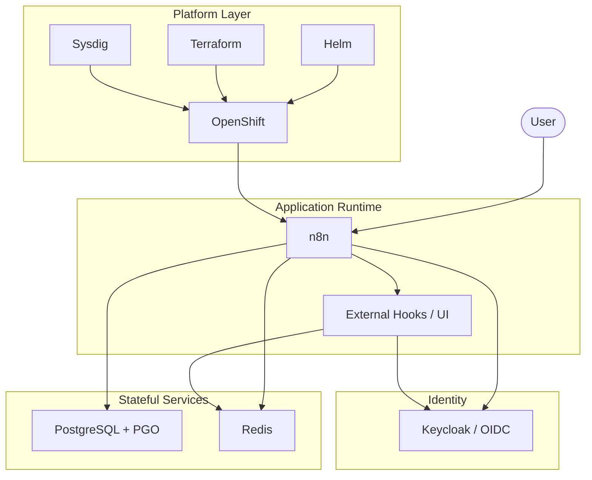

# Technologies Overview

This repository is built around a small set of core platform technologies that work together to deliver the Common Hosted Workflow service.

At a high level:

- **OpenShift** is the runtime platform.
- **Helm** is the deployment composition layer.
- **n8n** is the workflow runtime.
- **PostgreSQL with PGO** is the primary persistence layer.
- **Redis** supports queue execution and authentication/session state.
- **Keycloak and OIDC** provide the authentication model.
- **Terraform** provisions selected infrastructure outside the Helm path.
- **Sysdig** provides monitoring and alerting.

## Stack View

## How To Read This Section

The pages in this section are ordered from platform foundation to supporting tooling:

1. **OpenShift**: where the platform runs
2. **Helm**: how deployments are composed
3. **n8n**: the core workflow runtime
4. **PostgreSQL & PGO**: durable data layer and database operations model
5. **Redis**: queue and session/state support
6. **Keycloak & OIDC**: authentication model
7. **Terraform**: infrastructure-as-code for selected resources
8. **Sysdig**: monitoring and alerting

## Related Sections

- For hosting and runtime topology, see [Platform Architecture](../platform/high-level-architecture.md).
- For deployment and promotion mechanics, see [CI/CD Overview](../ci-cd/overview.md).
- For Gold/GoldDR continuity and backups, see the `Platform` section.
