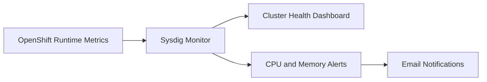

# Sysdig

Sysdig is the monitoring and alerting platform used in this repository for infrastructure-level operational visibility.

In this project, Sysdig is not used as an application deployment tool. It is used as an **operations observability service** to surface cluster health signals and notify operators when resource conditions cross defined thresholds.

## Monitoring Flow

## Why This Project Uses Sysdig

This platform runs on OpenShift and hosts multi-environment workflow workloads. That makes continuous visibility into runtime health a platform concern, not just an application concern.

The repository uses Sysdig to provide:

- a shared dashboard for environment-level cluster health
- alerting on sustained high CPU utilization
- alerting on sustained high memory utilization
- email notifications to the configured operational recipients

At an architectural level, Sysdig fills the gap between deployment automation and runtime operations:

- GitHub Actions and Helm deliver the platform
- Sysdig monitors whether the running platform is healthy after delivery

## What This Repository Provisions In Sysdig

The Terraform configuration under `terraform/sysdig` currently provisions Sysdig Monitor resources for the `b0c13b` footprint.

The module creates:

- a dashboard named `b0c13b Cluster Health`
- an email notification channel
- a high CPU Prometheus-style alert
- a high memory Prometheus-style alert

The dashboard includes panels for:

- CPU utilization
- memory usage
- network throughput

The alerts are configured with a 5-minute evaluation window and notify the configured email recipients.

## How It Is Provisioned

Provisioning is managed with Terraform, not manually through the Sysdig UI.

The entry point is:

- `terraform/sysdig/b0c13b/main.tf`

That environment uses the shared Terraform module in:

- `terraform/sysdig/_module`

The module is responsible for defining the reusable Sysdig resources, while the environment layer provides values such as alert recipients and thresholds.

## Terraform Design

The current Terraform design has two layers:

| Layer                      | Purpose                                                                                  |
| -------------------------- | ---------------------------------------------------------------------------------------- |
| `terraform/sysdig/_module` | reusable Sysdig dashboard, notification channel, and alert definitions                   |
| `terraform/sysdig/b0c13b`  | environment-specific instantiation, provider config, backend config, and variable wiring |

This separation keeps the Sysdig resource model reusable while still allowing per-environment customization.

## State And Credentials

The Sysdig Terraform state is stored using the Kubernetes backend:

- namespace: `b0c13b-tools`
- secret suffix: `sysdig-state`

The Sysdig provider authenticates with:

- `TF_VAR_sysdig_monitor_api_token`

Alert recipients are passed through:

- `TF_VAR_alert_email_recipients`

This keeps secrets out of the repository and aligns provisioning with the GitHub Actions environment model.

## Delivery Automation

Sysdig provisioning is automated through the GitHub Actions workflow:

- `.github/workflows/sysdig-terraform.yml`

The workflow behavior is:

- on pull requests touching `terraform/sysdig/**`: run `terraform plan`
- on pushes to `main` touching `terraform/sysdig/**`: run `terraform apply`
- on manual dispatch: allow either `plan` or `apply`

The workflow also posts the Terraform plan back to the pull request, which makes Sysdig monitoring changes reviewable before they are applied.

## Current Scope

The current repository implementation is intentionally small and focused.

It provisions:

- baseline resource health monitoring
- baseline email-based alerting

It does not currently provision, in this repository at least:

- complex service maps
- incident routing integrations beyond email
- large policy libraries
- broad multi-environment Sysdig stacks beyond the current Terraform entry point

## Key Source Files

- `terraform/sysdig/b0c13b/main.tf`
- `terraform/sysdig/b0c13b/config.tf`
- `terraform/sysdig/_module/main.tf`
- `terraform/sysdig/_module/variables.tf`
- `terraform/sysdig/_module/outputs.tf`
- `.github/workflows/sysdig-terraform.yml`
